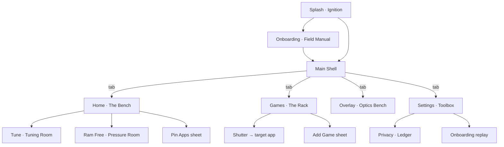

Here's a complete ground-up redesign — a new design language I've built specifically for ApexCore called **IRONWORK**: a hand-machined instrument kit aesthetic. It throws out both the old "Precision Instrument" neon look and the current Zen Organic glass style in favor of something that genuinely looks hand-crafted: engraved metal plates, cream paper inserts, rubber stamps, brass hardware, riso-print misregistration, and mechanical feedback everywhere.

Save this as `plan/T12-ironwork-design.md` (or `DESIGN.md` in the repo root):

````markdown
# ApexCore — IRONWORK Design Specification

| | |
|---|---|
| **Doc No.** | AC-DS-004 · REV D |
| **Supersedes** | Precision Instrument (rev 2) · Zen Organic (rev 3) |
| **Applies to** | All screens, dialogs, overlays, icon, motion, haptics |
| **Status** | READY FOR IMPLEMENTATION |

> Every phone is a machine. Most apps are stickers slapped on it.
> ApexCore is the tool kit that should have come in the box —
> machined, stamped, and finished by hand.

---

## 0. Document Map

1. [Concept](#1-concept--the-instrument-kit)
2. [Foundations](#2-foundations) — color, type, grid, texture, icons, voice
3. [Component Library](#3-component-library)
4. [Motion System](#4-motion-system)
5. [Haptics System](#5-haptics-system)
6. [Gesture System](#6-gesture-system)
7. [Page Redesigns](#7-page-redesigns) — all 12 surfaces
8. [States & Error Playbook](#8-states--error-playbook)
9. [Accessibility](#9-accessibility)
10. [Theming](#10-theming--graphite--vellum)
11. [Implementation Notes](#11-implementation-notes)
12. [Asset Checklist](#12-asset-production-checklist)
13. [Migration Map](#13-migration-map-old--new)
14. [QA Pass Criteria](#14-qa-pass-criteria)

---

## 1. Concept — The Instrument Kit

### 1.1 One line

**ApexCore looks like a field-grade machinist's kit that happens to live inside your phone** — pressure gauges, engraved plates, rubber stamps, brass fittings, and a paper field manual. Dark anodized metal for the machine, warm bone paper for the human parts.

### 1.2 Why this direction

- **Anti-RGB.** Game boosters all look like 2012 gaming peripherals. IRONWORK looks like a Fluke multimeter and a Braun record player had a child. Nobody confuses it with "gamer bloatware."
- **Anti-generic-glass.** Frosted glass cards are the 2023 default. We use *materials with memory*: metal that's been engraved, paper that's been stamped, brass that's been turned on a lathe.
- **Anti-fake.** Every visual element maps to a real measurement. The dial is RAM pressure. The ticks are real scale marks. The stamps are real state transitions. Nothing is decorative-only.
- **Hand-crafted, by system.** The "hand" is expressed through *misregistration, rotation, grain, and serial numbers* — imperfections applied consistently, so it feels like one craftsperson made every screen, not like random noise.

### 1.3 The material world

| Material | Represents | Where it appears |
|---|---|---|
| **Anvil (charcoal metal)** | The machine / system | App canvas, dark plates, gauges |
| **Bone (cream paper)** | The operator / results | Result cards, onboarding, privacy, slips |
| **Signal Orange** | Active load, heat, used resources | Pressure arcs, CTAs, warnings |
| **Phosphor Green** | Freed, ready, OK | LEDs, freed arcs, ready stamps |
| **Brass** | Mechanical hardware | Nav indicator, pivots, screws, pin toggles |
| **Ink (warm black)** | Text on paper | Everything printed on bone |

### 1.4 The five hallmarks

Every screen must contain at least three of these, or it isn't IRONWORK:

1. **The Dial** — circular pressure gauges with real needles. No pie charts, no rings of bars.
2. **The Scale** — ruler-like tick measurement for every linear value. No plain progress bars.
3. **The Stamp** — rotated, slightly grainy rubber-stamp status labels that physically *slam* in.
4. **The Plate** — cards as engraved metal or stamped paper, with hairline insets, occasional corner screws, and a serial footer.
5. **The Clack** — every state change is confirmed mechanically: a haptic tick, a spring settle, a needle overshoot. Nothing snaps silently.

### 1.5 Hand-crafted rules (how the "hand" is applied)

1. **Misregistration, once per composition.** Exactly one element per screen gets the riso offset treatment (orange ghost behind ink text). Never two.
2. **Rotation is a spice.** Stamps rotate −3°. Nothing else rotates except during physics.
3. **Serial everything.** Every screen footer carries `PLATE nn · SCREEN · S/N xxxx · REV x`. The S/N is generated per-install from a device hash — every user owns a *numbered unit*.
4. **Hairlines breathe.** Rules and tick rows have intentional gaps where they cross text. Lines never collide with labels.
5. **Grain, not gradient.** Zero gradients anywhere. Depth comes from a 4% noise grain, hard 1dp print shadows, and inset strokes.
6. **One ceremony at a time.** Only a single >400ms animation may run per screen (the Purge, the Launch shutter). Everything else is ≤320ms.
7. **Numbers are monospaced.** Always. Data never appears in a proportional face.
8. **The gauge sleeps honestly.** When not elevated, needles park below zero at the rest stop — a real unpowered instrument, not a fake zero.

### 1.6 What we never do

- Neon cyan, purple gradients, RGB anything, dragons, robot fonts.
- Glassmorphism on primary surfaces (blur only in the floating HUD).
- Exclamation marks in copy. Ever.
- Skeleton loaders (we use the gauge-sweep needle instead).
- Full-width pulsing "optimizer" animations that fake activity.

---

## 2. Foundations

### 2.1 Color — Graphite mode (default dark)

| Token | Hex | Role |
|---|---|---|
| `anvil.950` | `#0B0C0D` | Deepest recess: search slots, nav groove, tube interiors |
| `anvil.900` | `#101113` | App canvas |
| `anvil.800` | `#17191C` | Raised surfaces |
| `anvil.700` | `#1F2226` | Dark plates (EngravedPlate) |
| `anvil.600` | `#2B2F34` | Engraved hairlines, minor ticks |
| `anvil.500` | `#3A3F45` | Major ticks, dividers, groove walls |
| `bone.50` | `#F5F0E4` | Paper highlight (pressed paper) |
| `bone.100` | `#EAE3D2` | Paper plates; **primary text on dark** |
| `bone.300` | `#CFC6AE` | Secondary text, tick numerals |
| `bone.500` | `#A29880` | Tertiary text, disabled, empty ticks |
| `ink.900` | `#201C16` | Text on paper |
| `ink.600` | `#4A4436` | Secondary text on paper |
| `signal.500` | `#FF5A1F` | Primary accent: CTA fill, pressure arc, active load |
| `signal.300` | `#FF8A50` | Signal on paper surfaces |
| `signal.700` | `#B23A0F` | Pressed CTA |
| `phosphor.400` | `#7FE060` | Ready / freed / OK. LEDs and stamps |
| `ember.500` | `#F5402C` | Critical: throttle, blocked, failure |
| `brass.400` | `#D9A75A` | Hardware: nav block, pivots, screws, pin toggles |
| `scrim` | `#000000` @ 64% + grain | Sheet/dialog scrim |

**Contrast audit:** `bone.100`/`anvil.900` ≈ 13.2:1 · `ink.900`/`bone.100` ≈ 13.8:1 · `signal.500`/`anvil.900` ≈ 5.1:1 (large/bold text and graphics only) · `phosphor.400`/`anvil.900` ≈ 9.9:1.

**LED semantics (universal):**

| State | Appearance |
|---|---|
| Ready | `phosphor.400`, solid, 6dp dot |
| Checking / probing | `signal.500`, 1200ms fade pulse |
| Blocked / missing | `ember.500`, double-blink (150ms on, 100ms off, ×2, 1s pause) |
| Live / running | `phosphor.400`, 2000ms breathe 70→100% |

**The riso recipe (signature text treatment):**

```
1. Draw the text in signal.500, offset (+1.5dp, +1dp)  — the ghost layer
2. Draw the same text in ink.900 (on paper) or bone.100 (on dark) on top
3. Apply the grain mask to the ghost layer only
```
Used for: the wordmark, one hero label per screen, and result-card headers.

**The engraving recipe (dark surfaces):**

```
1. Draw text in anvil.950 at (+0dp, +1dp), alpha 40%   — shadow
2. Draw text in bone.300 on top                        — cut
```
Used for: section headers, plate captions, tick numerals.

### 2.2 Typography

Three families, aggressively subset. **No Inter.**

| Family | Weights | Role |
|---|---|---|
| **Archivo** (variable, or static 500/700/900) | 500 UI · 700 titles · 900 display | Everything human: titles, labels, body, buttons |
| **IBM Plex Mono** | 400/500/600 | Everything numeric: readouts, serials, kickers, packages |
| **Caveat** | 700 | Onboarding margin notes only (handwriting) |

**Type scale:**

| Token | Face | Size/Line | Tracking | Case | Use |
|---|---|---|---|---|---|
| `display` | Archivo 900 | 34/38sp | +0.01em | UPPER | Screen titles, wordmark |
| `title` | Archivo 700 | 22/26sp | +0.01em | Upper | Card headers |
| `label` | Archivo 700 | 13/16sp | +0.08em | UPPER | Buttons, section labels |
| `body` | Archivo 500 | 15/22sp | 0 | Sentence | Descriptions |
| `caption` | Archivo 500 | 12/16sp | +0.02em | Sentence | Helper text |
| `mono-lg` | Plex 600 | 40/40sp | +0.02em | UPPER | Odometer, hero readouts |
| `mono` | Plex 500 | 15/18sp | +0.04em | UPPER | Data, tickers, statuses |
| `mono-sm` | Plex 400 | 11/14sp | +0.06em | UPPER | Serials, kickers, packages |
| `hand` | Caveat 700 | 18/20sp | 0 | Sentence | Margin notes (onboarding) |

**Rules:** numerals are always Plex Mono (tabular by nature) · kickers are `mono-sm` with a middle-dot format `01 · PURGE ENGINE` · never mix two accent treatments in one text block.

### 2.3 Layout grid

- **Base unit:** 4dp. Scale: 4 · 8 · 12 · 16 · 20 · 24 · 32 · 48.
- **Screen margins:** 20dp sides.
- **Plate padding:** 16dp.
- **Section rhythm:** 32dp between plates, 48dp between sections.
- **Plate stack:** single column, max content width 480dp (tablet: centered, gauges scale 1.15×).
- **Edge-to-edge:** content draws behind system bars. Bridge plate pads by status-bar inset; Gear selector pads by nav-bar inset. Top hairline sits *under* the status bar.

### 2.4 Shape

| Token | Value | Use |
|---|---|---|
| `radius.plate` | 4dp | All plates and cards — machined, crisp |
| `radius.chamfer` | 10dp @ 45° top-right cut | **Primary CTAs only** (signature silhouette) |
| `radius.slot` | 2dp | Search slots, insets |
| `radius.stamp` | 2dp | Stamp labels |
| `full` | 999dp | LEDs, pivots only |

**Chamfer shape spec** — the single most recognizable silhouette in the app:

```
      radius 4dp            45° cut, 10dp
  ╭─────────────────────╲
  │                      ╲
  │   PRIMARY LABEL       │
  │                       │
  ╰───────────────────────╯
```

### 2.5 Texture

| Asset | Spec | Application |
|---|---|---|
| **Grain tile** | 128×128 PNG, monochrome noise, ~2KB | Tiled at **4% alpha** over every surface; `BlendMode.MULTIPLY` on paper, `SCREEN`-tint on dark. Applied to the whole screen once, plus on stamps at 12% |
| **Stitch line** | Vector: 4dp dash / 3dp gap, 1.5dp stroke, `ink.600` | Onboarding binding edge, paper slips |
| **Screw** | 4dp brass circle, 1dp ink cross-slot, engraved shadow | Max 2 plates per screen ("structural" plates only: Bridge, section headers) |
| **Hairline** | 1dp `anvil.600` (or `ink.600` on paper) | Plate insets, dividers — with gaps at label crossings |

### 2.6 Iconography — "Instrument Glyphs"

Custom 24dp grid, **2dp stroke**, no fills, square caps — and the signature detail: **every stroke terminates in a small tick crossbar** (a 3dp perpendicular serif), like a measured dimension line on a technical drawing. Instantly recognizable, impossible to confuse with Material icons.

| Glyph | Concept | Shape notes |
|---|---|---|
| Home | Gauge | Circle + needle at 45° + tick terminals |
| Games | Cartridge | Rounded rect with notch + top tick label |
| Overlay | Rail | Vertical line + 3 short data ticks branching |
| Settings | Caliper | Two opposing L-jaws + adjustment screw dot |
| Boost | Bolt-in-plate | Chamfered square + zigzag |
| Pin | Tag | Luggage tag outline + brass dot |
| Tune | Allen key | Hex-L silhouette |
| RAM | Tube | Vertical tube + level tick |
| Defrost | Snow doodle | Hand-drawn asterisk, 6 arms, uneven |
| Back | Left tick | Arrow with oversized tick tail |
| Search | Loupe | Circle + handle, tick terminal |
| Close | X-ticks | Two crossing strokes with tick ends |

**Doodles** (vector, 1.5dp stroke, hand-drawn wiggle ±1dp noise, `ink.600` or `signal.300`): arrow (curved), star, underline squiggle, circle-annotation, "!" flag. Used on onboarding and empty states only.

### 2.7 Copy & voice

Workshop tone: terse, confident, mechanical. Rules:

- Statuses are `mono`, uppercase, middle-dot separated: `FROZEN 12 APPS · FREED 1.4 GB`
- Buttons are single verbs: `BOOST` `PIN` `LAUNCH` `HOLD` `RELEASE` `DEFROST` `GRANT`
- Every screen ends with a serial footer: `PLATE 03 · GAMES · S/N 3F-0042 · REV C`
- Figure numbers on explanations: `FIG. 02 — PRESSURE TEST`
- Never "Oops!", never "!", never "Amazing!"

---

## 3. Component Library

Each component: anatomy → states → motion → haptics.

### 3.1 EngravedPlate (dark card)

```
  ╭──●───────────────────●──╮      ● screw (4dp brass) — optional
  │ ╭─────────────────────╮ │      1dp hairline inset, anvil.600
  │ │  CONTENT            │ │      fill: anvil.700
  │ ╰─────────────────────╯ │      radius 4dp
  ├── PLATE 03 · REV C ─────┤      footer hairline + mono-sm serial
  ╰─────────────────────────╯
```
- **Pressed:** scale 0.98, fill darkens to `anvil.800` (inset feel), 140ms.
- Screws appear only on Bridge and top-of-screen structural plates.

### 3.2 PaperPlate (bone card)

- Fill `bone.100`, radius 4dp, grain 5%.
- **Print shadow:** hard 1dp `ink.900`@35% offset + 8dp soft blur — letterpress.
- Optional top edge: deckle (irregular 2dp bite) for "work order" cards.
- Header uses the riso treatment (once per screen).

### 3.3 ChamferButton

- Height 56dp (primary) / 44dp (secondary). Fill `signal.500`, text `ink.900`, label `label` token.
- Chamfer cut top-right 10dp @ 45°. Secondary variant: 2dp `bone.300` outline, transparent fill.
- **Idle micro-detail:** a 1dp `signal.300` inner top hairline (catch-light).
- **Press:** scale 0.97 + fill → `signal.700`, 120ms `spring.machined`. Haptic: `CONFIRM` on down.
- **Busy:** barber-pole — 45° `ink.900`@20% stripes scrolling at 30dp/s under the label.

### 3.4 StampLabel

```
  ╔═════════════╗   outer 2dp border + inner 1dp inset 3dp
  ║  F R O Z E N║   Archivo 900, tracking 0.1em
  ╚═════════════╝   grain mask 12%, rotate −3°
```
- **Vocabulary & colors:** `READY`/`OK`/`LIVE` phosphor · `PINNED`/`FROZEN` brass · `BLOCKED`/`THROTTLED` ember · `CHECKING` signal.
- **Landing animation (the thunk):** scale 1.6 → 0.94 → 1.0, rotation −8° → −3°, 260ms, `spring.stamp`. Haptic: `EFFECT_HEAVY_CLICK`.
- **Pulsing variant** (SESSION ACTIVE): opacity 1 ↔ 0.6, 1200ms loop.
- TalkBack: reads as `"<text>, status"` regardless of decoration.

### 3.5 InstrumentDial

The hero component. Drawn on `Canvas` (`drawWithCache`), never Views.

```
            100
         ╱    │    ╲
      75 ─╷    │    ╷─
          │   ╱│╲   │        needle: bone blade, brass pivot,
      50 ──┤    ●    ├──     counterweight tail
          │   ╲│╱   │        arc: signal.500 = used pressure
      25 ─╵    │    ╷─      ember.500 segment if > 85%
         ╲    │    ╱        phosphor.400 arc = freed headroom
            0 ⌐              rest stop at −6° (needle parks
       RAM 4.6 / 7.4 GB      here when de-energized)
```

| Spec | Value |
|---|---|
| Diameter | 240dp default · 96dp `MiniDial` (swap, secondary gauges) |
| Ticks | 64 minor (1×6dp `anvil.500`), every 8th major (2×10dp `bone.300`) |
| Numerals | 0/25/50/75/100 in `mono-sm` `bone.300`, offset outside ring |
| Needle | Bone blade, 3dp tapering to 1dp, 30% length counterweight, 8dp brass pivot w/ 2dp ink center |
| Value motion | `spring.needle` — visible overshoot, settles like a real galvanometer |
| Idle life | ±0.3° drift, 4s period (only when data is live) |
| A11y | `contentDescription` = `"RAM pressure 62 percent"`, announced on ≥5% change |

**Signature behavior — the Ignition Sweep:** when the gauge first mounts (or a backend re-detects), the needle sweeps 0 → 100 → rest over 700ms with three soft `CLOCK_TICK`s at 25/50/75. Like a car dashboard at start-up. Reduced-motion: fade to value.

### 3.6 PressureScale (linear ruler)

Replaces all progress bars.

```
  0    1    2    3    4    5    6    7
  │....│....│....│....│█████████▶     │   filled portion:
  └─────┴─────┴─────┴───── marker     signal.500, 8dp tall,
  SWAP 299 MB / 1.0 GB     (brass)   minor ticks every 5%
```
- Marker: 10dp brass flag, slides with `spring.drawer`; haptic `CONTEXT_CLICK` when crossing a major tick.
- Fill never animates as a bar — it animates as the **marker being pushed** (fill follows marker).

### 3.7 ThermometerStrip

```
  30   35   40   45   50   55   60 °C
  │····│····│····│╱╱╱╱│╱╱╱╱│╱╱╱╱│   ╱ = throttle zone hairlines (ember)
      ▲BATT 32°      ▲CPU 41°
```
- Two needles (battery, CPU) as small brass/blue flags on one shared 10dp scale.
- Zone >45°C: hairlines turn ember, CPU flag pulses, ticker appends `· THROTTLING`.

### 3.8 TickerLine (status)

```
  ● READY TO PURGE BLOAT · 14 PROCESSES AWAKE          ▸▸
```
- LED (3.8) + `mono` text. If overflow: marquee scroll 24dp/s, 2s dwell at edges.
- State change: text crossfades 160ms; LED re-blinks per new state.

### 3.9 ToolRow

```
  ╭──────────────────────────────────────────╮
  │ ╭────╮  TUNE          2 AVAILABLE    ▸   │  64dp tall
  │ │ ⚙  │  Game optimisation               │  icon in 40dp
  │ ╰────╯  composable per session          │  engraved slot
  ╰──────────────────────────────────────────╯
```
- Press: slot insets (fill `anvil.950`), row scale 0.985, 120ms. Haptic `VIRTUAL_KEY`.
- Long-press: lifts (scale 1.02 + shadow), context sheet after 400ms. Haptic `LONG_PRESS`.

### 3.10 MachinedToggle & MachinedSegment

**Toggle (settings, tune rows):**
```
   off:  ╭───────────╮        on:  ╭───────────╮
         │ ○         │             │         ● │
         ╰───────────╯             ╰───────────╯
          track anvil.600           track phosphor.400 @30%
                                     knob brass w/ ink ring
```
- Knob travels with `spring.machined` and **wobbles** 2 frames on arrival (rotationZ ±3°, 60ms). Haptic: `CONFIRM` on, `CONTEXT_CLICK` off. Unavailable state: knob `bone.500`, no motion, LED-ember on label.

**Segment (GAMES / ALL APPS, theme, HUD size):** a groove (`anvil.950`, 2dp inset) with a brass block that slides between stations; station labels engraved, active label ink-filled. Block travel `spring.block` + `CLOCK_TICK` on settle.

### 3.11 GearSelector (bottom nav)

```
  ╞═══════════════════════════════════════════╡  ← groove hairline
        ◆         ▄▄▄▄                        │
      [ ⬡ ]     [ ▣ ]      [ │ ]     [ ⚙ ]    │  icons: Instrument Glyphs
      HOME      GAMES      HUD      TOOLS     │  label only on active
                ╰brass╯                        │
  ╞═══════════════════════════════════════════╡
```
- Height 64dp + gesture inset. Brass indicator block (44×4dp) slides under active icon, `spring.block`, `CLOCK_TICK` on settle.
- Active icon lifts 1dp, label fades in 120ms.
- Tabs slide horizontally + fade, 240ms `ease.wind`, RTL-aware.

### 3.12 BridgePlate (top bar)

```
  ╭──●───────────────────────────────────●──╮
  │ ⬢ APEXCORE   MK·II      ● SHIZUKU  ▾   │
  ╰─────────────────────────────────────────╯
```
- Wordmark small + `MK·II` mono tag + backend chip: LED + backend name + caret. Chip opens the backend dropdown (bottom sheet) with per-backend readiness LEDs — same data as Settings.
- Screws: yes (structural plate).

### 3.13 SerialFooter

`mono-sm` `bone.500`, centered: `PLATE 01 · HOME · S/N 3F-0042 · REV C`. S/N generated once per install from `Settings.Secure.ANDROID_ID` hash → `XX-NNNN`. Appears on every screen's last scroll position.

### 3.14 BenchSheet (bottom sheet)

All dialogs become bottom sheets. Handle: 32×4dp brass bar. Drag-to-dismiss with velocity fling; **predictive back scrubs the dismiss** (sheet scales down 1.0→0.92 and scrim fades with gesture progress — see §6.1). Scrim: `scrim` + grain.

### 3.15 OdometerCounter

`mono-lg` digits where each digit is a vertical column of 0–9 that rolls to the target with `spring.drawer`, staggered 30ms per digit (right to left). Settle haptic: `CONTEXT_CLICK` on the final digit. Used for `+1.4 GB` freed, durations, counters.

### 3.16 ShavingsParticles

The purge debris. 4–6dp **parallelograms** (metal shavings), not squares or circles. Each has position, velocity, angular velocity; gravity 2400dp/s², bounce 0.15, one floor bounce allowed, fade after bounce. Spawned from dial arc segments. Drawn in the same Canvas as the dial. Hard cap 220 particles.

### 3.17 SearchSlot & IndexRail

- **SearchSlot:** inset field, `anvil.950` fill, `radius.slot`, 1dp inner top shadow, loupe glyph, `mono` placeholder `SEARCH PACKAGES…`. Focus: 1dp `brass.400` hairline + LED on.
- **IndexRail** (pickers): right-edge alphabet scrubber. Dragging fires `KEYBOARD_TAP` per letter crossing and jumps the list. 16dp wide hit area, letters `mono-sm`.

---

## 4. Motion System

### 4.1 Principles

1. **Mass & friction.** Everything that moves has implied weight. Nothing teleports; nothing bounces like jelly.
2. **One ceremony.** Per screen, one animation may exceed 400ms. It earns attention; everything else stays ≤320ms.
3. **Physics over timelines** where a spring exists; timelines only for choreographed ceremonies (Purge, Shutter).
4. **Mechanical honesty.** A needle overshoots; a stamp slams; a switch clacks. Motion should *sound* like the haptic it pairs with.

### 4.2 Spring tokens (Compose)

| Token | stiffness | dampingRatio | Use |
|---|---|---|---|
| `spring.machined` | 1500f | 0.9f | Buttons, knobs, plates |
| `spring.drawer` | 380f | 0.85f | Sheets, markers, page settle |
| `spring.needle` | 320f | 0.62f | Gauges (visible overshoot) |
| `spring.stamp` | 700f | 0.68f | Stamp landings |
| `spring.block` | 480f | 0.8f | Nav indicator, segments |

### 4.3 Easings & durations

- `ease.wind` = `CubicBezierEasing(0.2f, 0.7f, 0.3f, 1.0f)` — entrances
- `ease.slam` = `CubicBezierEasing(0.7f, 0f, 0.84f, 0f)` — falling shavings
- `FastOutSlowIn` — standard transitions
- Duration scale: **80** tick · **140** micro · **220** standard · **320** scene (sheet, tab) · **520** shutter · **1400** purge ceremony.

### 4.4 Reduced motion

In-app setting **MECHANICAL MOTION: FULL / REDUCED** (default FULL; auto-REDUCED if system animator scale = 0).

| Full | Reduced |
|---|---|
| Ignition sweep | Fade to value |
| Shavings physics + stamp slam | Stamp fades in at −3°, no particles |
| Odometer rolls | Number crossfade |
| Shutter launch | 200ms dim → launch |
| Marquee ticker | Truncate with `…` |
| Needle springs | Linear 150ms tracking of value |

---

## 5. Haptics System

### 5.1 Strategy

- Zero permissions: everything via `View.performHapticFeedback` / `HapticFeedbackConstants`, plus `VibrationEffect` compositions on API 29/30+ where allowed by the system.
- **One haptic grammar.** Small things tick; confirmations click; landings thud; errors reject. Users should be able to "read" the UI with their eyes closed.
- **Battery rule (unchanged from previous spec, still true):** no haptic fires more than once per 80ms; drag gestures tick on threshold crossings, not continuously.

### 5.2 Master map

| Event | Constant / Effect | API | Fallback (<API) |
|---|---|---|---|
| Carousel page settle | `CLOCK_TICK` | 21+ | `KEYBOARD_TAP` |
| GearSelector tab settle | `CLOCK_TICK` | 21+ | `KEYBOARD_TAP` |
| Segment block settle | `CLOCK_TICK` | 21+ | `KEYBOARD_TAP` |
| IndexRail letter crossing | `KEYBOARD_TAP` | 3+ | — |
| Toggle ON | `CONFIRM` | 30+ | `VIRTUAL_KEY` |
| Toggle OFF | `CONTEXT_CLICK` | 23+ | `VIRTUAL_KEY` |
| Row tap | `VIRTUAL_KEY` | 3+ | — |
| Row long-press menu | `LONG_PRESS` | 3+ | — |
| Stamp landing | `EFFECT_HEAVY_CLICK` (VibrationEffect) | 29+ | `LONG_PRESS` |
| Purge complete | Composition: `EFFECT_HEAVY_CLICK` → 90ms → `EFFECT_CLICK` | 30+ | `LONG_PRESS` + `VIRTUAL_KEY` |
| Freeze blocked / error | `REJECT` | 30+ | `LONG_PRESS` |
| Pull-to-purge crossing threshold | `CLOCK_TICK` | 21+ | `KEYBOARD_TAP` |
| PressureScale major tick crossing | `CONTEXT_CLICK` | 23+ | `KEYBOARD_TAP` |
| Odometer final digit settle | `CONTEXT_CLICK` | 23+ | — |
| HUD rail snap to zone | `CLOCK_TICK` | 21+ | — |
| Ignition sweep ticks (×3) | `CLOCK_TICK` | 21+ | — |
| Sheet dismiss (fling) | `CONTEXT_CLICK` | 23+ | — |

### 5.3 Helper (single source of truth)

```kotlin
object Clack {
    private val view get() = // cached app-window decor view
    fun tick()  = view.performHapticFeedback(HapticFeedbackConstants.CLOCK_TICK)
    fun on()    = view.performHapticFeedback(
        if (Build.VERSION.SDK_INT >= 30) HapticFeedbackConstants.CONFIRM
        else HapticFeedbackConstants.VIRTUAL_KEY)
    fun off()   = view.performHapticFeedback(HapticFeedbackConstants.CONTEXT_CLICK)
    fun thud()  = if (Build.VERSION.SDK_INT >= 29)
        view.vibrate(VibrationEffect.createPredefined(VibrationEffect.EFFECT_HEAVY_CLICK))
        else view.performHapticFeedback(HapticFeedbackConstants.LONG_PRESS)
    fun no()    = view.performHapticFeedback(
        if (Build.VERSION.SDK_INT >= 30) HapticFeedbackConstants.REJECT
        else HapticFeedbackConstants.LONG_PRESS)
}
```

---

## 6. Gesture System

### 6.1 Android system-level (all opt-in)

| Gesture | Behavior |
|---|---|
| **Predictive back** (`android:enableOnBackInvokedCallback="true"`) | Back scrubs the current transition: sheets scale 1.0→0.92 and scrim fades *with the finger*; commit = dismiss, cancel = spring back. Full-screen overlays slide down proportionally. On Ram Free with a live session, back scrub reveals a paper slip: `END SESSION?` — commit cancels. |
| **Edge-to-edge + stretch overscroll** | Content draws behind bars; keep Android 12+ stretch overscroll everywhere (no glow). |
| **Back-gesture exclusion** | HUD rail's left-edge drag region registers a system gesture-exclusion rect (minimal width, only while dragging). |
| **Keyboard / DPAD nav** | All rows, toggles, and dial focusable with visible brass focus ring (2dp, 4dp offset). |

### 6.2 In-app gesture map

| Gesture | Where | Action | Feedback |
|---|---|---|---|
| **Pull-to-purge** | Home, from top of scroll (120dp, resisted) | Winds needle to max while pulling; release past threshold = BOOST | Threshold: `CLOCK_TICK`; release: `CONFIRM`; not elevated: bounce-back + `REJECT` + elevation slip |
| **Two-finger horizontal swipe** | Games list | Toggles GAMES ↔ ALL APPS segment | `KEYBOARD_TAP` + brass block slide |
| **Drag cartridge down** (≥80dp, resisted) | Games active card | Card tilts (rotationZ to 8°), release → eject confirm sheet (REMOVE / KEEP) | Ticks during drag, `GESTURE_END` on release |
| **Long-press dial** | Home | Copy RAM/SWAP stats to clipboard; stamp toast `COPIED` | `CONFIRM` |
| **Double-tap ticker** | Home | Collapse/expand ticker to LED-only | `VIRTUAL_KEY` |
| **Long-press any card/row** | Everywhere | Context sheet (launch / pin / remove / copy) | `LONG_PRESS` |
| **Drag-to-dismiss + fling** | All sheets | Dismiss | Velocity-aware; `CONTEXT_CLICK` on fling out |
| **Alphabet scrub** | Picker sheets | Jump list | `KEYBOARD_TAP` per letter |
| **HUD rail drag** | Overlay | Magnetic snap to 4 zones on edge | `CLOCK_TICK` per zone |
| **Double-tap HUD rail** | In-game | Expand/collapse | `VIRTUAL_KEY` |
| **Pull-to-reprobe** | Tune (from top) | Re-run capability probe | Needle sweep + ticks |

---

## 7. Page Redesigns

### 7.0 Navigation flow



---

### 7.1 Splash — "Ignition"

**File:** `ui/splash/SplashScreen.kt` (behavior unchanged, visual replaced)

```
┌────────────────────────────┐
│                            │
│          ╭────╮            │
│          │ ⬡◉ │  ← mark    │
│          ╰────╯            │
│        A P E X C O R E     │  riso wordmark
│   FIELD-GRADE INSTRUMENTS  │  mono-sm
│                            │
│        MK·II               │
└────────────────────────────┘
```

**Sequence (550ms, then route):**

| ms | Event |
|---|---|
| 0–120 | Grain fades to 4%; plate scales 0.96→1 (`spring.machined`) |
| 80–480 | Needle inside the mark sweeps 0→100→45° (mini ignition) |
| 120–360 | Wordmark letters rise 8dp, 24ms stagger; riso ghost settles from +4dp to +1.5dp |
| 360–550 | Tagline + `MK·II` fade in |
| 550 | Route to Onboarding or Main (no fade-out cut — next screen's entrance takes over) |

Reduced motion: single 200ms fade of the finished composition.

---

### 7.2 Onboarding — "The Field Manual"

**File:** `ui/onboarding/OnboardingScreen.kt` · 5 pages (cover + 4 figures)

**The twist:** the app is dark metal; the manual is **paper**. Onboarding runs entirely on `bone.50` with ink illustrations, a stitched binding on the left edge, and handwritten margin notes. You read the paper manual, *then* you enter the machine.

```
┌│──────────────────────────────┐   │ = stitched binding (4dp margin)
┌│ FIELD MANUAL · 02/05   SKIP→ │
││                              │
││  ╭ FIG. 01 ────────────╮     │   figure frame: corner ticks,
││  │  (ink line-art:      │    │   1.5dp ink strokes
││  │   exploded dial,     │    │
││  │   falling shavings,  │    │
││  │   curved arrows)     │    │
││  ╰──────────────────────╯    │
││                              │
││  01 · PURGE ENGINE           │   mono-sm kicker
││  Focus Resources for Gaming  │   title
││  ApexCore deep-freezes back- │   body
││  ground apps and hands the   │
││  reclaimed RAM to your game. │
││           ~ wind it up! ←──╮ │   Caveat margin note + doodle arrow
││                         │  │ │
││        ╭───────────────╲ │  │ │
││        │   CONTINUE      ╲│  │ │  chamfer CTA, ink on signal
││        ╰──────────────────╯  │ │
││  ▮▯▯▯▯  ruler-tick pager     │
└│──────────────────────────────┘
```

**Pages:**

| # | Kicker | Title | FIG. artwork (ink line-art) | Margin note |
|---|---|---|---|---|
| 0 | — (cover) | ApexCore | Wordmark + small dial doodle, star doodles | "hello, operator." |
| 1 | `01 · PURGE ENGINE` | Focus Resources for Gaming | Exploded dial, shavings mid-fall, arrows | `~ wind it up!` |
| 2 | `02 · PERFORMANCE HUD` | Live On-Screen Telemetry | Phone outline, brass rail, expanding data column | `~ it hides when idle` |
| 3 | `03 · MEMORY TOOLKIT` | App Pins & Safe Reclaim | Luggage tag + key + capped gauge tube | `~ pin what you love` |
| 4 | `04 · SYSTEM ACCESS` | Elevate Your Control | Two keys: skeleton key (Shizuku) + Allen key (Root) | `~ pick your key` |

**Page 4 — the Key Selector** (replaces two option cards):

```
│  ╭ SHIZUKU ──────────── READY╮   stamp (phosphor) on ready
│  │  ⚿ skeleton key glyph      │
│  │  ● Connected · wireless    │   LED + mono status
│  │  ╭─────────╲               │
│  │  │ USE SHIZUKU ╲           │   chamfer (or CONFIGURE/CHECKING)
│  │  ╰─────────────            │
│  ╰────────────────────────────╯
│  ╭ ROOT ──────────────────╮
│  │  ⚙ Allen key glyph       │   no stamp until granted
│  │  ◌ su not granted        │
│  │  [ GRANT ROOT ]          │
│  ╰──────────────────────────╯
│  You can change this later in Settings.
```

**Pager behavior:**
- Horizontal pager, page parallax: figure moves at 0.6×, margin doodles at 0.3×, background grain static — creates paper depth.
- `CLOCK_TICK` per page settle. Ruler-tick pager: 5 ticks, active tick fills ink.
- Page 4 CTA: `ENTER THE WORKSHOP` (finishes onboarding). Back arrow (ink) on pages 1–4; replay mode shows close instead of skip.
- Selecting a ready key: `READY` stamp **slams** onto the card (`spring.stamp` + heavy click), pref written, frameworks synced, then finish.
- SKIP: top-right `mono` text, slides out right on use.

---

### 7.3 Shell — Bridge + Gear Selector

**Files:** `ui/shell/ZenTopBar.kt` → `BridgePlate`, `ZenBottomNav.kt` → `GearSelector`

- **BridgePlate** (§3.12): screws, wordmark, `MK·II`, backend chip w/ LED + dropdown sheet (Shizuku / Root readiness, select or configure). Backend switch: needle re-sweep on Home + `CONFIRM`.
- **GearSelector** (§3.11).
- **Tab transitions:** slide+fade 240ms `ease.wind`.
- **Full-screen overlays** (Tune, Ram Free, Privacy): slide up from bottom, 320ms, Bridge/Gear fade out; predictive back scrubs the slide-down.

---

### 7.4 Home — "The Bench"

**File:** `ui/home/HomeScreen.kt` — default tab.

```
┌────────────────────────────────────────┐
│ ⬢ APEXCORE  MK·II      ● SHIZUKU  ▾   │ Bridge
├────────────────────────────────────────┤
│ ● READY TO PURGE BLOAT · 14 AWAKE      │ Ticker
│                                        │
│              ╭─────────╮               │
│            ╱   RAM 62%   ╲             │
│           │    ◜ ◉ ◝      │            │ InstrumentDial
│            ╲   4.6/7.4GB ╱             │ (240dp)
│              ╰─────────╯               │
│   SWAP ◜◝ 299MB/1.0GB    (mini dial)   │
│                                        │
│   ┏━━━━━━━━━━━━━━━━━━━━━╲             │
│   ┃  ▐▌ BOOST · DEEP FREEZE ╲          │ ChamferButton
│   ┗━━━━━━━━━━━━━━━━━━━━━━━             │
│                                        │
│   ╭─[TUNE]── Game optimisation ──▸╮    │ ToolRows
│   │          2 available on kernel │    │
│   ├─[PIN ]── Protect apps ────────┤    │
│   │          0 pinned              │    │
│   ╰─[RAM ]── Pressure room ───────╯    │
│                                        │
│   30─35─40─45─50─55─60°C               │ ThermometerStrip
│     ▲BATT 32°      ▲CPU 41°            │
│                                        │
│   PLATE 01 · HOME · S/N 3F-0042 · REV C│
╰────────────────────────────────────────╯
```

**States:**

| Backend | State | Dial | Ticker | Extra |
|---|---|---|---|---|
| Elevated | Idle | Live, phosphor headroom arc | `● READY TO PURGE BLOAT · N AWAKE` | — |
| Not elevated | Idle | **De-energized**: needle parked at rest stop (−6°), ticks `bone.500`, no arcs | `◌ CONNECT SHIZUKU OR ROOT FOR DEEP FREEZE` (amber pulse LED) | **ElevationSlip** paper banner slides from top (320ms): title `ELEVATION REQUIRED`, two mini key buttons → Setup sheet |
| Any | Boosting | Needle hunting, signal arc shimmering | `● PURGING BACKGROUND PROCESSES…` phosphor breathe | Button in barber-pole busy mode |
| Any | Result | Settled at new value | Per `lastResult` (below) | **Work Order card** |

**Work Order** (replaces `UnifiedResultCard`): PaperPlate with deckle top edge. Header: riso `PURGE COMPLETE` + phosphor `FROZEN 12` stamp. Stat rows `mono`: `FREED SIZE +1.4 GB` with sub-line `RAM +1.1 · SWAP +0.3`, `PURGED APPS 12`, `DURATION 2.4 S`, `SKIPPED 2 (1 FAILED)`. Footer chamfer `PURGE AGAIN`. **Tap anywhere: card flips** (rotateX 90°→0° content swap, 320ms) back to idle.

**Ticker result strings:** `FROZEN 12 APPS · FREED 1.4 GB` · `ALREADY OPTIMIZED` · `SYSTEM FULLY OPTIMIZED` · `FREEZE BLOCKED — CONNECT SHIZUKU OR ROOT` (ember LED, `REJECT` haptic, 2× 8dp horizontal shake on the banner).

**The Purge ceremony (1400ms)** — the app's signature moment:

| ms | Property | Spec |
|---|---|---|
| 0–120 | Button depress | scaleY 0.95, fill → `signal.700`; `CONFIRM` |
| 0–180 | Dial wind-up | Needle rotates **+12% clockwise** (tension) via `spring.needle` |
| 180–500 | Shaving burst | Orange arc segments detach → `ShavingsParticles` (gravity, one bounce, `ease.slam`); heavy click at 180ms |
| 250–500 | Stamp | `FROZEN 12` stamp slams over the dial (scale 1.6→1, rot −8°→−3°) |
| 400–1000 | Needle release | Swings down to new pressure with overshoot; phosphor headroom arc grows behind it |
| 600–1400 | Odometer | `+1.4 GB` `mono-lg` odometer rolls center-screen, holds 400ms, then **shrinks and flies into the Work Order card** (shared-element: scale + translate, 320ms) |
| 1400 | Done | Work Order slides up 16dp + fade; `EFFECT_HEAVY_CLICK`→90ms→`EFFECT_CLICK` |

**Gestures:** pull-to-purge (§6.2) · long-press dial → copy stats · double-tap ticker → collapse.

---

### 7.5 Games — "The Rack"

**File:** `games/GamesScreen.kt`

```
┌────────────────────────────────────────┐
│ ⬢ APEXCORE  MK·II      ● SHIZUKU  ▾   │
├────────────────────────────────────────┤
│ ╭ [⌕ SEARCH PACKAGES…──────────╮       │
│ ╰──────────────────────────────╯       │
│   [+ ADD]                      [◫ PIN] │
│   ╭ GAMES ───╮                        │
│   │  ▄▄▄▄    │  ALL APPS   ← machined │
│   ╰──────────╯       segment          │
│                                        │
│    ╭──────╮  ╭──────────────╮ ╭──────╮ │
│    │ prev │  │   ╭──╮       │ │ next │ │  pager w/ depth:
│    │ .35α │  │   │ ◉ │ lens │ │ .35α │ │  adjacent scale .8,
│    ╰──────╯  │   ╰──╯       │ ╰──────╯ │  α .4, arc path
│                │  SAMBAS3    │          │
│                │  com.zenith…│          │
│                │  DEMAND ▮▮▯ LOW        │
│                │ ╭─────────╲ │          │
│                │ │ALLOCATE & ╲│          │
│                │ │  LAUNCH    │          │
│                │ ╰────────────╯          │
│   drag card ↓ to eject                  │
│   PLATE 03 · GAMES · S/N 3F-0042        │
╰────────────────────────────────────────┘
```

**Anatomy:**
- **Lens:** app icon inside a circular frame with a 2dp brass ring — like an optic. Icon color auto-extracted tints a faint backing wash behind the lens (solid, no gradient).
- **Demand meter:** 3 tick cells `▮▮▯` + `mono` label LOW/MED/HIGH (from historical usage).
- **Adjacent cards:** scale 0.8, alpha 0.4, travel on a subtle **parabolic arc** (dip 8dp mid-swipe). API 31+: `RenderEffect` 4dp blur on adjacents.
- **Carousel motion:** `spring.drawer` settle, `CLOCK_TICK` per page, arc path while dragging.
- **Segment:** GAMES (from `GameManager`) / ALL APPS (async load; loading state = mini-dial needle spin, **never a skeleton**). Two-finger swipe toggles.

**Interactions:**
- Tap card body → becomes active (if not already). 
- Long-press card → context sheet: `LAUNCH` / `PIN` / `REMOVE` (`LONG_PRESS`).
- **Drag down on active card** → tilt + eject sheet (§6.2). REMOVE unregisters from `GameManager`.
- `+ ADD` → Add Game sheet (§7.11). `◫ PIN` → Pin sheet.

**The Launch — "Shutter" (520ms):**

| ms | Event |
|---|---|
| 0 | `ALLOCATE & LAUNCH` pressed → `CONFIRM` |
| 0–160 | Two anvil plates (with engraved grid hairlines) close from top & bottom like a hydraulic press, 40ms stagger |
| 160 | Plates meet: full-screen `anvil.900`, **heavy click**, 60ms hold |
| 160–240 | Freeze broadcast fires (`FreezeFramework`), tiny brass progress ticks run across the seam |
| 240–520 | Plates part vertically (iris open); target app surfaces beneath |
| 520 | Overlay HUD rail attaches to edge |

**Empty states:** library empty → engraved plate `NO ITEMS FOUND` + doodle arrow pointing at `SCAN FOR GAMES` chamfer. Search no match → `∅ NO MATCH · CHECK SPELLING` `mono` centered.

---

### 7.6 Overlay — "Optics Bench"

**File:** `ui/overlay/OverlayScreen.kt`

```
┌────────────────────────────────────────┐
│ OPTICS                                 │
│ Configure the in-game telemetry rail.  │
│                                        │
│ ╭ PERMISSION ──────────── READY ╮      │
│ │ ● ApexCore may draw over      │      │
│ │   other apps.                 │      │
│ │ [ GRANT PERMISSION ]  (when   │      │
│ │  missing: ACTION REQUIRED     │      │
│ │  stamp, ember LED)            │      │
│ ╰───────────────────────────────╯      │
│                                        │
│ ╭ PREVIEW ──────────────────────╮      │
│ │ ╎drag me╎ ← live rail preview │      │  dashed "bench window";
│ │   144 FPS                     │      │  real HUD widget runs
│ │   ∿∿∿  RAM                    │      │  inside the card —
│ │   ▂▄▆█ CPU                    │      │  drag it to feel the
│ │ ╎      ╎                      │      │  magnet snap
│ │ PREVIEW   [ ◉ ON  /  ○ OFF ]  │      │  machined toggle
│ ╰───────────────────────────────╯      │
│                                        │
│ ╭ FIT                                                 │
│ │ SIZE     [ S │ M │ L ]   machined segment           │
│ │ OPACITY  ├────●──────────┤  ruler slider 40–100%    │
│ │ EDGE     [ LEFT │ RIGHT ] machined segment          │
│ ╰───────────────────────────────╯      │
│ PLATE 05 · OPTICS · S/N 3F-0042        │
╰────────────────────────────────────────┘
```

- Permission granted → `READY` stamp + phosphor LED; missing → `ACTION REQUIRED` ember stamp + `GRANT PERMISSION` chamfer → `ACTION_MANAGE_OVERLAY_PERMISSION`.
- START/STOP is now a **machined toggle** wired to `GameOverlayService` preview (`CONFIRM`/`CONTEXT_CLICK` haptics).
- **Live preview:** a real HUD rail instance constrained to the dashed window. Drag it — it snaps to window edges with `CLOCK_TICK`s. Double-tap to expand/collapse. This teaches the in-game gesture *before* the game.
- Service sync: poll `Settings.canDrawOverlays` + running state; stale pref cleanup unchanged.
- New persisted prefs: `hud_size`, `hud_opacity`, `hud_edge` (consumed by `GameOverlayService`).

---

### 7.7 Settings — "The Toolbox"

**File:** `ui/settings/SettingsScreen.kt`

```
┌────────────────────────────────────────┐
│ TOOLBOX                                │
│ Appearance, access, and about          │
│                                        │
│ APPEARANCE ───────────────────────     │  engraved section
│ ╭ THEME ──────────────────────╮        │  header w/ FIG no.
│ │ [ SYSTEM │ VELLUM │ GRAPHITE ]       │  machined segment
│ │  match · paper · metal      │        │
│ ╰─────────────────────────────╯        │
│ ╭ PAPER INSERTS ────────── [◉]╮        │  (was "Light tank
│ │ Bone surfaces in light mode │        │  glass"; same pref
│ ╰─────────────────────────────╯        │  key)
│ ACCESS ────────────────────────        │
│ ╭ RUNNING MODE ───────────────╮        │
│ │ ● SHIZUKU · FPS PRIVILEGED  │        │  + GPU vendor,
│ │   preferred: SHIZUKU        │        │    PrivilegeMode
│ │   S/N 3F-0042 · MK·II       │        │    (unchanged data)
│ ╰─────────────────────────────╯        │
│  ACCESS DIAGNOSTICS                     │
│  ● SHIZUKU   Ready        [ CHECK ]    │  LED rows; CHECK
│  ◌ ROOT      Not granted  [ GRANT ]    │  re-probes with
│                                         │  needle sweep
│ LEGAL ─────────────────────────        │
│  Privacy Policy — the Ledger        ▸  │
│ ABOUT ─────────────────────────        │
│ ╭ APEXCORE ⬢ ─────────────────╮        │
│ │ v1.4 · S/N 3F-0042          │        │
│ │ MACHINED IN 1.2 MB          │        │  ← no ads, no
│ │ NO ADS · NO TRACKING        │        │    tracking, said
│ ╰─────────────────────────────╯        │    like a machinist
│  App Tour — replay the Manual       ▸  │
│ PLATE 06 · TOOLBOX · S/N 3F-0042       │
╰────────────────────────────────────────┘
```

- Diagnostics rows: LED + name + status + action chamfer-small. `CHECK` runs probe with a 700ms needle-sweep in place of a spinner.
- Theme = `MachinedSegment` (SYSTEM/VELLUM/GRAPHITE). Toggling preview crossfades 220ms.
- App Tour row → Onboarding replay (paper, close instead of skip).

---

### 7.8 Tune — "Tuning Room" (full-screen)

**File:** `ui/tune/TuneScreen.kt`

```
┌────────────────────────────────────────┐
│ ←  TUNING ROOM              [↻ PROBE]  │  ↻ spins a needle
│                                        │  sweep while probing
│ Real kernel & session tuning.          │
│ ╭ SESSION ACTIVE ╮ ← pulsing stamp     │  + elapsed mono
│ │ 04:12          │   when live         │  timer when active
│ ╰────────────────╯                     │
│  GPU ──────────── 2 AVAILABLE          │  drawer-pull header
│  ╭ Sustained perf mode ─────── [◉]╮    │  w/ count badge
│  │ hold clocks during session    │    │
│  ├ Disable frame skipping ───── [ ]┤   │  unavailable rows:
│  │ not present on kernel          │    │  LED-ember label,
│  ╰───────────────────────────────╯    │  toggle locked
│  CPU ──────────── 3 AVAILABLE          │
│  …                                     │
│ ┌ PAPER SLIP ────────────────────┐    │
│ │ Applies when you launch from    │    │  fine print on
│ │ ApexCore. Restored on exit.     │    │  paper strip
│ │ Does not disable thermal        │    │
│ │ protections.                    │    │
│ └─────────────────────────────────┘   │
│ PLATE 07 · TUNE · S/N 3F-0042          │
╰────────────────────────────────────────┘
```

- Sections sorted by available count desc (unchanged logic, `TuneManager.setIntent`).
- Every toggle: clack + `CONFIRM`/`CONTEXT_CLICK`; intent writes instantly.
- Unavailable option: row de-energized (like the not-elevated dial), mono reason, locked toggle.
- Live session: top strip shows `LIVE · 6 APPLIED · 04:12` phosphor LED; back gesture scrubs a `END SESSION?` slip (predictive back).
- Pull-to-reprobe from top (96dp): needle sweep + tick ×3.

---

### 7.9 Ram Free — "Pressure Room" (full-screen)

**File:** `ram/RamFreeScreen.kt`

```
┌────────────────────────────────────────┐
│ ←  PRESSURE ROOM            [STANDARD ▾]│  mode dropdown
│                                        │
│  ║│          ║  ▲                      │  vertical tube
│  ║│ 62% RAM  ║  │                      │  manometer (12dp
│  ║│████████  ║  │                      │  tube, mercury =
│  ║│████████  ║  │ 4.6/7.4 GB           │  signal.500, marks
│  ║│          ║                         │  every 10%)
│  ║│ 30% SWAP ║                         │
│  ║│██        ║  0.3/1.0 GB             │
│                                        │
│  STATE RAILWAY                         │
│  ●─────●─────○─────○─────○             │  PreFreeze→Filling
│  PRE   FILL  HOLD  REL   DONE          │  →Holding→Releasing
│      [▄▄] brass carriage slides        │  →Done; stations
│                                        │  light phosphor
│  RESULT  +1.2 GB RECLAIMED (mono)      │  when passed
│                                        │
│  PRE-FREEZE BEFORE FILL   [◉]          │
│  ╭──────────────╲                      │
│  │ START PRESSURE ╲                     │  label morphs:
│  │     TEST        │                    │  START→HOLD→
│  ╰─────────────────╯                    │  RELEASE→CANCEL
│ PLATE 08 · PRESSURE · S/N 3F-0042      │
╰────────────────────────────────────────┘
```

- Gauge/pressure data from `getSystemMemStats`, 1s refresh (readout rows beneath tube, `mono`).
- **State railway:** brass carriage slides station→station (`spring.drawer`), each arrival = `CLOCK_TICK` + station label stamp-swap (160ms crossfade). Passed stations fill phosphor.
- Mode dropdown: each `RamFillMode` listed with readiness LED.
- Action button state machine: START (signal) → HOLD (brass fill) → RELEASE (ink outline) → CANCEL during run. Haptics per §5.2.
- Keep-screen-on while running; cancel on pause/back (predictive back shows `END SESSION?` slip first).

---

### 7.10 Privacy — "The Ledger" (full-screen)

**File:** `ui/legal/PrivacyPolicyScreen.kt`

- Full-screen **paper**: `bone.50`, ink text, grain 5%. Top: ink back arrow + `THE LEDGER` + stamp `PRINTED OFFLINE · NO NETWORK` (rotated −3°, brass ink).
- Markdown rendering (unchanged pipeline): `#` → Archivo 900 ink; `##` with engraved hairline; paragraphs body 15/24; **bullets** with brass tick markers; `code` in mono on 1dp ink outline chips; code *blocks* as **dark anvil plates inset into the paper** (beautiful inversion); tables as mono rows with hairline columns; links in `signal.300` with the **hand-drawn underline squiggle**; LaTeX pills unchanged, restyled as engraved chips.
- Scroll: paper is the only scrollable surface with stretch overscroll.
- This page is the proof of the design system: paper + ink + metal + one orange accent, zero glass.

---

### 7.11 Dialogs → BenchSheets

All three dialogs become **bottom sheets** (§3.14): handle, drag-dismiss, predictive-back scrub, grain scrim.

**Setup sheet — "Key Selector"** (was `SetupDialog`; same probing every 1200ms, same pref writes and framework sync):
- Title stamp `SYSTEM ACCESS` + one-line description.
- The two **key cards** from Onboarding page 4 (identical anatomy — one component, two usages). Selecting a ready key: `READY` stamp slam, `CONFIRM`, dismiss on success.
- First-launch trigger logic unchanged (`setup_shown_v1`).

**Pin Apps sheet** (was `WhitelistPickerDialog`):
- Header `PIN APPS` + mono subtitle `PINNED APPS ARE NEVER FROZEN · 3 PINNED`.
- SearchSlot + list rows: lens-framed icon, name, `mono-sm` package, trailing **brass pin toggle** (luggage-tag metaphor). Toggle: clack + `CONFIRM`.
- IndexRail alphabet scrubber on the right.
- `DONE` chamfer (label shows count when ≥1 changed: `DONE · 3`).

**Add Game sheet** (was `AddGamePickerDialog`):
- Same anatomy, multi-select. Selected rows get a brass `▮` cell filled + count on CTA: `ADD 3`. Confirm: stamps `ADDED 3` slam over the sheet before dismiss (240ms).

---

### 7.12 Floating HUD — "Phantom Rail"

**File:** `games/GameOverlayService.kt` (service logic unchanged; visuals + gesture layer redesigned)

```
collapsed (left edge):      expanded:
▏                            ▐  144 ▌  FPS   mono-lg phosphor
▏ 2dp brass filament         ▐ ∿∿∿ ▌  RAM    ink sparkline on
▏ (12dp hit area)            ▐ ▂▄▆█▌  CPU    8 brass bars
                             ▐  ❄  ▌  DEFROST stamp-button
```

- **Collapsed:** 2dp `brass.400` line, subtle 8% glow (the only glow in the app). Pulse grammar: stable FPS → 2s brass breathe; frame drops/throttle → ember pulse (800ms loop). Hit area 12dp wide (visual stays 2dp).
- **Expand (350ms, `FastOutSlowIn`):** line thickens to 16dp (100ms) → smoked-glass column slides in (`RenderEffect` blur 16f; <API 31 fallback `#CC101113`) → FPS, sparkline, CPU equalizer stagger in 50ms apart. Haptic `VIRTUAL_KEY`.
- **Data:** FPS (500ms), RAM 60s sparkline (bone-on-dark inside a 1dp hairline frame), CPU 8-segment bars (heights spring-animated).
- **DEFROST node:** hand-drawn snow doodle in a stamp outline. Tap: unfreezes background apps, stamp `DEFROSTED` phosphor flashes across the rail (600ms), `CONFIRM` haptic.
- **Drag:** vertical, **magnetic snap to 4 zones** (25/50/75% height) with `CLOCK_TICK` per zone; registers a minimal gesture-exclusion rect while dragging.
- **Auto-minimize:** 5s idle → reverse expand (fade 100ms, shrink 150ms).
- Long-press rail → mini settings strip (opacity ±, size S/M/L) — 2 toggles + close tick.
- Window flags unchanged (`TYPE_APPLICATION_OVERLAY`, not focusable); the rail is excluded from TalkBack (decorative to the game).

---

### 7.13 App Icon — "The Gauge"

- **Foreground (adaptive, 66/108 safe zone):** chamfered anvil plate (`anvil.800`, top-right 45° cut), 64 engraved dial ticks in `bone.300`, one bold `signal.500` needle at 45° up-right, 8dp brass pivot with ink center, faint grain.
- **Background:** solid `anvil.900`.
- **Monochrome layer:** ticks + needle in white (themed icons).
- **Play Store 512px:** adds a `MK·II` mono etching bottom-left and slightly deeper grain.
- Meaning shift from the old Monolith: same idea ("cutting through the system"), now stated as an instrument rather than an object.

**Wordmark:** `APEXCORE` Archivo 900 caps, riso ghost offset, `MK·II` mono tag. Tagline: `FIELD-GRADE PERFORMANCE INSTRUMENTS`.

---

## 8. States & Error Playbook

| Situation | Treatment |
|---|---|
| Not elevated | De-energized gauges (needle at rest stop), amber LED ticker, ElevationSlip paper banner |
| Probing / checking | Amber LED pulse + gauge sweep; **never skeletons** |
| Freeze blocked | Ember stamp `FREEZE BLOCKED`, `REJECT` haptic, banner shake (2×8dp, 180ms) |
| Error (any) | Paper **Error Slip**: `mono` details, `RETRY` chamfer-small; auto-dismiss 6s on success paths |
| Empty library | Engraved plate + doodle arrow + `SCAN FOR GAMES` |
| Empty search | `∅ NO MATCH · CHECK SPELLING` mono centered |
| Option unavailable (Tune) | De-energized row + mono reason + locked toggle |
| Thermal (>45°C CPU) | ThermometerStrip ember zone + ticker `· THROTTLING` + HUD rail ember pulse |
| Overlay killed externally | Overlay tab LED → ember on next poll; stale pref cleanup (existing logic) |

---

## 9. Accessibility

- **Contrast:** body text ≥ 7:1 everywhere (see §2.1 audit). Signal orange only for ≥15sp bold or graphics.
- **Targets:** ≥ 48dp. ToolRows 64dp. Rail hit area 12dp (visual 2dp).
- **TalkBack:** gauges expose live values via `semantics { contentDescription }`, throttled to 5% steps; stamps read as `"<text>, status"`; ticker is `liveRegion = polite`; doodles and grain are `invisibleToUser`.
- **Never color-only:** every state pairs color with text, stamp, or LED-blink pattern (color-blind safe).
- **Focus:** brass focus ring 2dp @ 4dp offset on all interactive elements; full DPAD/keyboard order follows visual order.
- **Reduced motion:** §4.4; additionally honored automatically when system animator scale = 0.
- **Dynamic type:** scales to 1.3× — dials shrink gracefully (they're graphics, not text); all text tokens use `sp`.
- **Haptics ≠ only channel:** every haptic co-occurs with a visual or audible-equivalent state change.

---

## 10. Theming — Graphite & Vellum

One theme engine, two finishes:

| Layer | GRAPHITE (dark) | VELLUM (light) |
|---|---|---|
| Canvas | `anvil.900` + grain | `bone.50` + grain (multiply) |
| Plates | `anvil.700` engraved | `bone.100` paper w/ print shadow |
| Data readouts | bone text on anvil | **ink plates** — dark `#201C16` plates with bone mono text (black instrument on paper) |
| Accents | `signal.500` / `phosphor.400` | `signal.500` / `phosphor.600 #3E9B2E` (darkened for paper) |
| Hardware | brass on dark | brass + ink outlines |
| Gauges | Engraved dark | Ink-on-paper dials (blueprint style) |

- `SYSTEM` follows `isSystemInDarkTheme()`. **Paper Inserts** toggle (Settings) switches paper surfaces on in Graphite mode / off in Vellum — the old "light tank glass" pref, re-keyed visually, same storage key.
- Theme change: 220ms crossfade, gauges needle-sweep once.

---

## 11. Implementation Notes

### 11.1 Compose recipes

**Chamfer shape:**
```kotlin
val ChamferShape = GenericShape { size, _ ->
    val c = 4.dp.toPx(); val cut = 10.dp.toPx()
    moveTo(c, 0f); lineTo(size.width - cut, 0f); lineTo(size.width, cut)
    lineTo(size.width, size.height - c)
    quadraticTo(size.width, size.height, size.width - c, size.height)
    lineTo(c, size.height)
    quadraticTo(0f, size.height, 0f, size.height - c)
    lineTo(0f, c); quadraticTo(0f, 0f, c, 0f); close()
}
```

**Grain paint (one bitmap, whole app):**
```kotlin
fun grainPaint(alpha: Float = 0.04f): Paint = Paint().apply {
    shader = BitmapShader(grainTile, Shader.TileMode.REPEAT, Shader.TileMode.REPEAT)
    this.alpha = (alpha * 255).toInt()
}
// draw once per screen root via Modifier.drawWithCache { onDrawBehind { drawRect(paint) } }
```

**Dial perf:** precompute all 64 tick geometries in `drawWithCache`; the needle angle is a single `Animatable`/`animateFloatAsState` — the draw lambda allocates nothing. Redraw only when angle delta > 0.2°. Target 60fps during ceremonies; jank budget < 1%.

**Particles:** fixed `FloatArray` pool (220 × 6 floats), updated in a `withFrameNanos` loop that self-terminates when all particles are dead — no per-frame allocation, no running loop at idle.

**Odometer:** each digit = `Box` with a 10-item `Column` offset by `graphicsLayer { translationY = -index * digitHeight }` animated per-digit with `spring.drawer`, 30ms stagger.

**Predictive back:** `android:enableOnBackInvokedCallback="true"`; sheets observe `OnBackPressedCallback` + `onBackProgressed` → scale 1.0→0.92 & scrim alpha proportional; commit/cancel springs back.

**Edge-to-edge:** `enableEdgeToEdge()`; Bridge pads `WindowInsets.statusBars`, Gear pads `navigationBars`; IME animates with `WindowInsetsAnimationCompat` for SearchSlot.

### 11.2 Fonts & APK budget

| Asset | Est. size |
|---|---|
| Archivo 500/700/900 (subset, latin) | ~120 KB |
| IBM Plex Mono 400/600 (subset) | ~70 KB |
| Caveat 700 (subset — onboarding only) | ~25 KB |
| Grain PNG | ~2 KB |
| Glyphs + doodles + figures (vector paths in code) | ~0 KB |
| **Total added** | **≤ 220 KB** |

Subset with `pyftsubset --unicodes=U+0020-007E,U+00B0,U+00B7,U+2014`. APK ceiling stays **≤ 1.5 MB**. No physics engine, no Lottie, no icon font.

### 11.3 Behavior parity (do not break)

All functional contracts are preserved: `AppStage` routing, onboarding flag, backend pref writes + `FreezeFramework`/`FpsStack` sync, probe loops (1200ms), `GameManager`/`GameLauncher`/launch-freeze ordering, `RamFillerManager` state machine, `TuneManager.setIntent`, privacy markdown pipeline, overlay service triggers, keep-screen-on and cancel-on-pause behavior. This document changes **presentation and interaction only** — with three additive features: HUD size/opacity/edge prefs, pull-to-purge, and predictive back.

---

## 12. Asset Production Checklist

- [ ] Grain tile 128×128 (monochrome noise, seamless)
- [ ] Stamp grain mask (coarser, for stamp labels)
- [ ] Instrument Glyph set — 20 glyphs @ 24dp, 2dp stroke, tick terminals
- [ ] Doodle set — arrow, star, underline squiggle, circle-note, "!" flag (vector paths)
- [ ] Onboarding FIG.01–04 ink illustrations (vector, 1.5dp strokes)
- [ ] Two key glyphs (skeleton key, Allen key)
- [ ] App icon: adaptive fg/bg/mono + Play Store 512 + splash mark
- [ ] Serial generator util (ANDROID_ID → `XX-NNNN`)
- [ ] Vellum variants of dial + railway (ink-on-paper)
- [ ] Deckle edge path for Work Order card

---

## 13. Migration Map (old → new)

| Current (Zen Organic) | IRONWORK |
|---|---|
| `MemoryLeafPair` | `ManometerPair` (InstrumentDial + MiniDial) |
| `PebbleButton` | `ChamferBoostButton` |
| `StatusPebble` + status text | `TickerLine` (LedDot + marquee) |
| `ShizukuConnectBanner` | `ElevationSlip` (paper banner) |
| `UnifiedResultCard` | `WorkOrderCard` (flip-back PaperPlate) |
| `GlassCard` | `EngravedPlate` / `PaperPlate` |
| `ZenTopBar` | `BridgePlate` |
| `ZenBottomNav` | `GearSelector` |
| `ThemeSegmentedControl` | `MachinedSegment` |
| `RamPressureGauge` | `TubeManometer` + `StateRailway` |
| `ProgressGlassCard` / `RamFillProgressSection` | `StateRailway` |
| `DiagnosticRow` | `LedRow` |
| `ZenDialog` + `SetupDialog` | `BenchSheet` + Key cards |
| `WhitelistPickerDialog` / `AddGamePickerDialog` | Picker sheets (+ IndexRail) |
| `DeviceThermalCard` | `ThermometerStrip` |
| Purge sonogram shatter | Shavings particles + odometer + stamp |
| Topographic launch sweep | Shutter press |
| Snowflake HUD node | DEFROST stamp node |

---

## 14. QA Pass Criteria

A build passes the "bench test" when:

- [ ] Cold start → Home shows the ignition needle sweep exactly once (not on recomposition)
- [ ] Purge: shavings bounce once, stamp slams, odometer rolls, final haptic is the two-stage composition — all within 1400ms, 60fps
- [ ] Every toggle audibly-and-tactilely clacks; every tab/segment ticks
- [ ] Pull-to-purge works with resistance, threshold tick, and bounce-back + `REJECT` when not elevated
- [ ] Predictive back scrubs: sheets scale, Tune/Ram Free show `END SESSION?` slip, cancel springs back
- [ ] Cartridge drag-down tilts the card and opens eject confirm
- [ ] Two-finger swipe flips GAMES/ALL APPS; carousel ticks per page; adjacents blur on API 31+
- [ ] HUD rail snaps to 4 zones with ticks; auto-minimizes in 5s; pulses ember on injected thermal event
- [ ] Vellum mode: data readouts render as ink plates; no contrast regression
- [ ] Reduced motion: no particles, no sweep, no odometer roll — values still correct
- [ ] TalkBack reads gauge values, stamps as statuses, ticker as polite live region
- [ ] APK ≤ 1.5 MB; cold start ≤ 900ms to first Home frame
- [ ] Exactly one riso-treated element per screen; zero gradients anywhere; serial footer on every screen

---

*End of document. File under AC-DS-004. Wash your hands; the shavings get everywhere.*
````

A few notes on the decisions I made:

**Why this beats the previous two designs:** The old "Precision Instrument" doc was strong conceptually but visually generic (cyan/orange neon). Zen Organic (your current build) is clean but looks like a thousand other glassmorphic apps. IRONWORK is *nobody else's* app — the moment you see a cream paper card slammed with a rotated rubber stamp on charcoal metal, you know exactly which app it is.

**The three things that make it feel hand-crafted:** riso misregistration (one offset ghost per screen), per-install serial numbers (every user owns a "numbered unit"), and mechanical imperfection applied *by system* — stamps at −3°, needle overshoot, switch wobble, grain everywhere.

**Gesture/haptics coverage:** pull-to-purge, two-finger segment flip, cartridge drag-to-eject, alphabet scrubber, magnetic HUD snap zones, and full predictive-back scrubbing (including the "END SESSION?" slip on Tune/Ram Free) — all mapped to exact `HapticFeedbackConstants` with API-level fallbacks since your minSdk is 24.

**Engineering-safe:** §11.3 explicitly locks all functional contracts (backend probing, freeze ordering, state machines, prefs) so this is a pure presentation-layer swap with three additive features, and the APK budget math keeps you under 1.5MB.

Want me to follow up with the Compose implementation for any specific component (the `InstrumentDial` Canvas code and the Shavings particle system are the two trickiest)?
