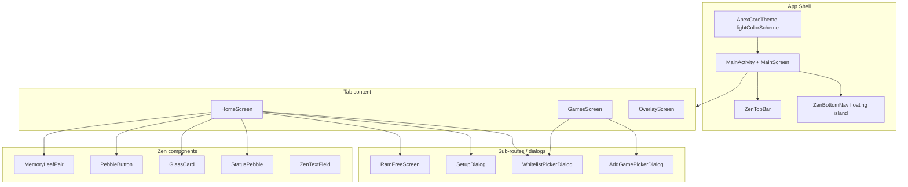
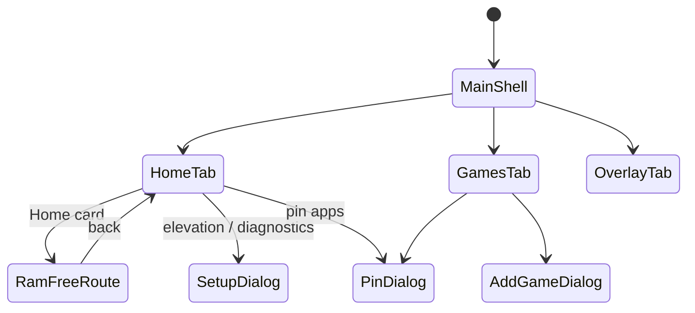

# ApexCore Full UI Redesign: "Zen Organic"

| Field | Value |
|-------|-------|
| **Document** | Design Spec — Zen Organic redesign |
| **Author** | TBD |
| **Date** | 2026-08-03 |
| **Status** | Draft (rev 3 — solid-glass normative; review Issue 1 addressed) |
| **Package** | `com.ivarna.apexcore` |
| **Workspace** | `/home/abhaybyte/repos/apexcore` |
| **Audience** | Senior Android / Compose engineers |

---

## Overview

ApexCore is a Jetpack Compose Android app for elevated deep freeze / RAM purge (Shizuku or Root), a game launcher with pre-launch freeze, a floating performance HUD overlay, and a RAM Free (memory filler) flow. The current UI is a dark **cryo/tech** theme (`Color.kt`: matte carbon `#0A0B0D`, electric cyan `#00E5FF`, cadmium orange `#FF6B00`) with Space Grotesk / Inter / JetBrains Mono, hard metal buttons, and ASCII affordances (`→`, `←`, `●`, `✓`). It feels aggressive and high-friction relative to the product’s calm “free resources for focus” value.

This redesign replaces the visual system end-to-end with **Zen Organic**: a light, nature-inspired palette (water, leaves, river pebbles), **Plus Jakarta Sans**, organic shapes, liquid-wave memory gauges, a pebble Purge button, and a floating glass bottom nav. Backend freeze, Shizuku/Root, Games, Overlay, and RAM Free **logic stay unchanged**; only presentation, tokens, icons, logo, and screen composition move. Functional flows and Play-compliance surfaces (privacy link, elevation honesty, no deceptive claims) must not regress.

---

## Background & Motivation

### Current state (verified in tree)

| Area | Location | Notes |
|------|----------|--------|
| Theme | `app/src/main/kotlin/com/ivarna/apexcore/ui/theme/{Color,Theme,Type}.kt` | **Dark only** via `darkColorScheme`; legacy token names (`BgDark`, `AccentPrimary`, …) |
| Fonts | `Type.kt` + `res/values/font_certs.xml` | Google Fonts provider: Space Grotesk, Inter, JetBrains Mono |
| Shell | `MainActivity.kt` (~1624 lines) | `MainScreen`, `HomeScreen`, `MainActionCard`, `UnifiedResultCard`, `OverlayScreen`, `NavBarItem`, diagnostics, backend dropdown |
| Memory UI | `ui/components/Sonogram.kt` | `SimpleMemoryDisplay` — linear RAM/SWAP bars; params include unused `state: State` |
| Games | `games/GamesScreen.kt` (~800 lines) | Search, GAMES/ALL APPS, pager, ALLOCATE & LAUNCH, pin, add picker |
| RAM Free | `ram/RamFreeScreen.kt` (~833 lines) | Circular gauge, mode UI, FREE RAM CTA; ASCII back `←` |
| Setup | `SetupDialog.kt` | Elevation setup; CTA with `→`; `PRIVACY_POLICY_URL` + `openPrivacyPolicy()` |
| Icons | Material Filled **icons-core** only | `Home`, `PlayArrow`, `Settings`, `Lock` — **no** `material-icons-extended` |
| Logo | `res/drawable/ic_app_logo.png`, `ic_launcher.png` (~763KB each); store + fastlane icons/screenshots/promo (see Logo checklist) |
| minSdk | **24** (`app/build.gradle.kts`) | Adaptive icons only API 26+; v1 glass is solid (no backdrop blur) on all APIs |
| Compose | BOM `2024.11.00`, Material3, `ui-text-google-fonts` | No Lottie, no graphics-shapes today |
| XML theme | `res/values/themes.xml` | Parent `android:Theme.Material.NoActionBar`, `windowBackground` `#FF0D0D0D` |

### Pain points

1. **Aggressive cryo aesthetic** conflicts with “calm focus / free memory” product intent.
2. **Hardcoded theme colors** on nearly every surface (`BgDark`, `AccentPrimary`, …) instead of `MaterialTheme.colorScheme` — redesign requires both token rewrite and call-site migration.
3. **ASCII / emoji-like glyphs** (`→` on Home cards and Setup CTA, `←` on RAM Free back, `●` status bullets, `✓` freed chip) are not accessible and violate the new icon policy.
4. **`MainActivity.kt` is a monolith** — hard to review, test, and restyle per screen.
5. **Legacy design docs** (`docs/design.md` Precision Instrument, `docs/redesign-plan.md` glass/bento dark) are superseded by this Zen Organic brief; implementers must treat **this document** as authoritative for visual work. PR9 adds a one-line supersession banner to both legacy docs.
6. **T10c compliance branch** is ship-critical: privacy link on Home, elevation-gated freeze, honest copy. Redesign must not regress these (see **Compliance copy lock**).

---

## Goals & Non-Goals

### Goals

1. Implement **Zen Organic** tokens (colors, type, spacing, radii) exactly as specified below.
2. Restyle **all user-facing Compose screens** listed in the inventory; keep flows identical.
3. Replace memory bars with **Memory Leaves** (liquid wave fill); purge CTA with **Pebble Button**.
4. Floating **glass island bottom nav** (~90% width); Material vector icons only (no emojis/ASCII).
5. Ship a **new logo** (vector preferred) and replace every launcher / in-app / store listing reference.
6. Switch fonts to **Plus Jakarta Sans** (UI); drop Space Grotesk / Inter as UI defaults; mono only if truly needed for technical labels (prefer Jakarta label styles).
7. Extract large UI surfaces out of `MainActivity.kt` into focused files for maintainability.
8. Light theme first (v1); light status/nav bars; soft sage bloom shadows — no pure black, no neon cyan/orange primaries.

### Non-Goals

- Changing freeze backends, `FreezeFramework`, Shizuku/Root detection semantics, or RAM filler algorithms.
- Inventing a fourth product tab that does not map to an existing surface (see Key Decisions — nav mapping).
- Full dual dark/light theme parity in v1 (tokens may include inverse for later; ship light-only).
- Rewriting HUD **gameplay overlay** into a fully organic redesign if it reduces legibility on arbitrary game backgrounds — apply soft token updates, keep high-contrast rail (see Overlay section).
- Pulling Lottie or game engines for hero motion.
- Compliance-breaking copy (do not reintroduce accessibility freeze claims; keep privacy discoverable).
- Pixel-perfect recreation of HTML mock without adapting to Compose constraints (minSdk 24; no free true backdrop blur in Compose).
- Adding `material-icons-extended` (rejected for v1 — see KD-4).
- True frosted **backdrop** blur (blur content *behind* the nav/card) in v1 — requires capture pipelines or libraries (e.g. Haze); out of scope.

---

## Key Decisions

| # | Decision | Rationale |
|---|----------|-----------|
| **KD-1** | **Light theme only for v1 redesign** | Design system is light-first; dual theme doubles QA and risks half-migrated dark paths. Inverse tokens defined for future dark, but `ApexCoreTheme` ships `lightColorScheme` only. |
| **KD-2** | **3-tab nav retained; RAM Free stays a Home sub-route** | Current `Tab { HOME, GAMES, OVERLAY }` and `showRamFree` overlay pattern work. A 4th tab would dilute product focus and force shell redesign of `AnimatedContent`. RAM Free iconography lives on Home entry card + spa/water metaphors, not a new tab. |
| **KD-3** | **Nav icon set + labels** | HOME → curated `ic_nav_home_eco` (Eco); GAMES → `ic_nav_games_vintage` (FilterVintage); OVERLAY → `ic_nav_overlay_layers` (Layers). **Nav label stays “Boost”** (owner decision 2026-08-03); Games / Overlay unchanged. Purge action on Home remains “Purge Engine”. |
| **KD-4** | **Icons: curated Material Symbols XML only — no `material-icons-extended`** | Verified: icons-core has Add, ArrowBack/Forward (AutoMirrored), CheckCircle, Home, KeyboardArrowRight, Lock, PlayArrow, Search, Settings, Warning — **not** Eco, FilterVintage, Layers, WaterDrop, Spa, PushPin, CleanHands. Brand icons ship as `res/drawable/ic_*.xml`. Load via `ImageVector.vectorResource(id)` so component APIs stay `ImageVector`. Core icons keep `Icons.Filled.*` / `Icons.AutoMirrored.Filled.*`. **Do not** write bare `Icons.Outlined.Eco` — it will not compile. |
| **KD-5** | **No `graphics-shapes` in v1** | Leaf shape via concrete `GenericShape` / `Path` below is enough. |
| **KD-6** | **No Lottie** | Waves, pebble press, nav bounce are pure Compose animation. |
| **KD-7** | **Solid glass is the normative v1 path (all API levels)** | “Glass” = semi-transparent `surfaceContainer` + 1dp `outlineVariant` border + optional primary-tinted bloom shadow — **same on API 24–34+**. Do **not** apply `RenderEffect.createBlurEffect` to the panel layer: that blurs the panel’s own pixels, not content behind it, and is not true glassmorphism. True backdrop blur is a future experiment only (see Soft glass helper). |
| **KD-8** | **PR1 landing strategy = Option B (tokens without flipping theme default on release)** | Add `ZenColors` + `ZenLightColorScheme` + type + Dimens on the feature branch. **Do not** switch `ApexCoreTheme` to light / delete cryo call sites until PR1b (or the first screen PR that also does full `BgDark`/`AccentPrimary` grep replace for that surface). **Never merge a half-light shell alone to a release branch.** Prefer one coherent light shell cut (PR1b = full call-site migration of theme chrome + all screens to scheme tokens) rather than aliased “BgDark = light mint” which looks broken. See PR Plan. |
| **KD-9** | **Plus Jakarta Sans for all UI text including metrics** | Explicit `Font(..., weight = Light/Normal/Medium/Bold)` entries **required**. Drop JetBrains Mono as default metric face. If Light body fails contrast QA on device, fall body to **Medium (500)** for `bodyMedium` only. |
| **KD-10** | **Soft copy, locked compliance meanings** | Marketing polish OK for non-compliance strings; **Compliance copy lock** strings/meanings are non-negotiable (exact or approved equivalent). |
| **KD-11** | **Split `MainActivity.kt` early; package `com.ivarna.apexcore.ui.*` in one shot** | PR2 jumps straight to `com.ivarna.apexcore.ui.shell` / `ui.home` / `ui.overlay` / `ui.components` with import updates in the same PR — avoid double-move (same package first, re-package later). |
| **KD-12** | **Logo: vector adaptive icon + pre-26 PNG mipmap fallbacks** | Adaptive `mipmap-anydpi-v26` alone is insufficient for minSdk 24. Ship density PNG/XML fallbacks for API 24–25. |
| **KD-13** | **In-game HUD: soft restyle, contrast-first** | Use semi-transparent `inverseSurface` / sage accents; do not force full light cards on games. |
| **KD-14** | **Privacy Policy link remains on Home + Setup** | T10c; restyle only. Keep `openPrivacyPolicy` + `PRIVACY_POLICY_URL` publicly importable (e.g. stay in `SetupDialog.kt` or move to `ui/Privacy.kt`). |
| **KD-15** | **`MemoryLeafPair` drop-in + concrete leaf geometry** | Exact signature parity strategy documented; Teardrop/Diamond `GenericShape` code is normative for v1. |

---

## Proposed Design

### Brand philosophy

Minimalism + tactile softness. Asymmetric fluid forms (water droplets, river pebbles, foliage). **Tonal layering** over hard shadows. Soft bloom shadows tinted sage/primary at **5–8% opacity**. Bottom nav is a **floating island** (~90% width), not edge-to-edge. No pure black; no neon cyan/orange as primary accents.

### Architecture (UI layering)



### Navigation / shell structure



**Bottom nav (v1):** 3 items only (KD-2).

| Tab enum | Label | Icon resource / source | Screen |
|----------|-------|------------------------|--------|
| `Tab.HOME` | Home | `ZenIcons.HomeEco` ← `R.drawable.ic_nav_home_eco` | `HomeScreen` |
| `Tab.GAMES` | Games | `ZenIcons.GamesVintage` ← `R.drawable.ic_nav_games_vintage` | `GamesScreen` |
| `Tab.OVERLAY` | Overlay | `ZenIcons.OverlayLayers` ← `R.drawable.ic_nav_overlay_layers` | `OverlayScreen` |

**RAM Free:** remains `showRamFree = true` full-screen route inside `MainScreen` (hides top bar + bottom nav as today). Entry: Home glass card with water-drop icon, not a nav tab.

### Visual system — spacing & radii

| Token | Value | Compose |
|-------|-------|---------|
| base | 8px | `8.dp` |
| container-padding | 24px | `24.dp` |
| element-gap | 16px | `16.dp` |
| section-margin | 40px | `40.dp` |
| rounded-sm | 0.25rem ≈ 4dp | `4.dp` |
| rounded-DEFAULT | 0.5rem ≈ 8dp | `8.dp` |
| rounded-md | 0.75rem ≈ 12dp | `12.dp` |
| rounded-lg | 1rem ≈ 16dp | `16.dp` |
| rounded-xl | 1.5rem ≈ 24dp | `24.dp` |
| rounded-full | 9999px | `CircleShape` / `50` |
| pebble | asymmetric ~32dp+ | custom `RoundedCornerShape` or `GenericShape` |
| leaf | teardrop / diamond | normative `GenericShape` below |

Recommend `object ZenDimens` in `ui/theme/Dimens.kt`.

### Soft glass helper (normative v1 — solid glass, all APIs)

**Normative definition of “glass” for Zen Organic v1:** tonal frosted *look* via alpha fill + border + soft bloom — **not** OS backdrop blur. Compose has no built-in free backdrop blur; applying `RenderEffect.createBlurEffect` to the same graphics layer as the fill only softens/fuzzes **that layer’s own pixels** (self-blur). That is incorrect as a glassmorphism implementation and must not ship as the PR3/PR4 path.

```kotlin
/**
 * Normative v1 glass surface. Use for ZenBottomNav island, GlassCard, dialog chrome.
 * Same behavior on minSdk 24 through current target — no API branch required.
 */
fun Modifier.zenGlassBackground(
    shape: Shape = RoundedCornerShape(50),
    fill: Color, // typically colorScheme.surfaceContainer.copy(alpha = 0.88f..0.94f)
    borderColor: Color, // typically colorScheme.outlineVariant.copy(alpha = 0.6f)
    borderWidth: Dp = 1.dp
): Modifier = this
    .clip(shape)
    .background(fill)
    .border(borderWidth, borderColor, shape)
// Prefer chaining .zenBloom(shape) for floating island (nav), not black elevation.
```

**Recommended fills:**

| Surface | Fill | Border | Shadow |
|---------|------|--------|--------|
| Bottom nav island | `surfaceContainer` @ ~0.92 alpha, or `surfaceContainerLowest` @ ~0.90 | `outlineVariant` @ 0.6 | `zenBloom` (primary 6–8% alpha) |
| GlassCard / dialogs | `surfaceContainerLowest` @ 0.85–0.95 or solid `surfaceContainerLowest` | `outlineVariant` | light bloom or none |
| Entry rows | `surfaceContainerLow` / lowest | optional 1dp | none |

**Acceptance (PR3 / Q14):** Nav and glass cards look correct on **API 24 and API 31+** with solid glass — no crash, no empty backdrop, no self-blurred mushy text/icons. Q14 is **solid-glass correctness**, not blur capability.

#### Non-normative (future / experiment only — do not implement in v1)

True frosted glass that blurs *content behind* the island requires extra infrastructure (e.g. background capture, `BackdropFilter`-style pipelines, or libraries such as Haze). If explored later:

- Do **not** treat `Modifier.graphicsLayer { renderEffect = RenderEffect.createBlurEffect(...) }` on the glass panel itself as “backdrop glass” — that is self-blur.
- Any experiment must be feature-flagged, off by default, and validated on mid-tier devices for jank/overdraw.
- Out of scope for PR3–PR9.

### Soft bloom shadow (Compose)

Prefer multi-layer tonal elevation over black drop shadows. On Compose BOM 2024.11, `Modifier.shadow` supports tinted ambient/spot; if behavior is insufficient, draw soft radial `Brush` under the control (existing `MainActionCard` pattern):

```kotlin
fun Modifier.zenBloom(
    shape: Shape,
    color: Color = ZenColors.primary
): Modifier = this.shadow(
    elevation = 12.dp,
    shape = shape,
    ambientColor = color.copy(alpha = 0.08f),
    spotColor = color.copy(alpha = 0.06f)
)
```

### Background atmosphere (Home)

Behind content, two large soft radial orbs (Canvas gradients — not blur-dependent):

- Primary container `#008376` at ~8–12% alpha, top-leading
- Secondary container `#ffd87c` at ~6–10% alpha, bottom-trailing

---

## Full Token Mapping

### Color.kt — authoritative hex → Compose

Replace contents of `app/src/main/kotlin/com/ivarna/apexcore/ui/theme/Color.kt` (on the PR that flips the theme — see PR1b):

```kotlin
package com.ivarna.apexcore.ui.theme

import androidx.compose.ui.graphics.Color

object ZenColors {
    // Surfaces
    val surface = Color(0xFFF3FAFF)
    val background = Color(0xFFF3FAFF)
    val surfaceBright = Color(0xFFF3FAFF)
    val surfaceDim = Color(0xFFBEDFEF)
    val surfaceContainerLowest = Color(0xFFFFFFFF)
    val surfaceContainerLow = Color(0xFFE6F6FF)
    val surfaceContainer = Color(0xFFD8F2FF)
    val surfaceContainerHigh = Color(0xFFCCEDFE)
    val surfaceContainerHighest = Color(0xFFC6E8F8)
    val surfaceVariant = Color(0xFFC6E8F8)

    val onSurface = Color(0xFF001F29)
    val onBackground = Color(0xFF001F29)
    val onSurfaceVariant = Color(0xFF3D4947)
    val inverseSurface = Color(0xFF123441)
    val inverseOnSurface = Color(0xFFDFF4FF)
    val outline = Color(0xFF6D7A77)
    val outlineVariant = Color(0xFFBCC9C6)
    val surfaceTint = Color(0xFF006A60)

    // Primary (sage teal)
    val primary = Color(0xFF00685D)
    val onPrimary = Color(0xFFFFFFFF)
    val primaryContainer = Color(0xFF008376)
    val onPrimaryContainer = Color(0xFFF4FFFB)
    val inversePrimary = Color(0xFF6FD8C8)

    // Secondary (warm gold)
    val secondary = Color(0xFF765A05)
    val onSecondary = Color(0xFFFFFFFF)
    val secondaryContainer = Color(0xFFFFD87C)
    val onSecondaryContainer = Color(0xFF795D08)

    // Tertiary (earth)
    val tertiary = Color(0xFF8B4C11)
    val onTertiary = Color(0xFFFFFFFF)
    val tertiaryContainer = Color(0xFFA96428)
    val onTertiaryContainer = Color(0xFFFFFBFF)

    // Error
    val error = Color(0xFFBA1A1A)
    val onError = Color(0xFFFFFFFF)
    val errorContainer = Color(0xFFFFDAD6)
    val onErrorContainer = Color(0xFF93000A)

    // Fixed
    val primaryFixed = Color(0xFF8CF5E4)
    val primaryFixedDim = Color(0xFF6FD8C8)
    val onPrimaryFixed = Color(0xFF00201C)
    val onPrimaryFixedVariant = Color(0xFF005048)
    val secondaryFixed = Color(0xFFFFDF96)
    val secondaryFixedDim = Color(0xFFE7C268)
    val onSecondaryFixed = Color(0xFF251A00)
    val onSecondaryFixedVariant = Color(0xFF5A4400)
    val tertiaryFixed = Color(0xFFFFDCC4)
    val tertiaryFixedDim = Color(0xFFFFB780)
    val onTertiaryFixed = Color(0xFF2F1400)
    val onTertiaryFixedVariant = Color(0xFF6F3800)

    // Semantic app aliases (non-M3)
    val statusActive = primary          // solid sage pebble
    val statusInactive = Color(0xFF7A9590) // muted grey-teal
    val leafRamFill = primaryContainer
    val leafSwapFill = tertiary
    val bloom = primary.copy(alpha = 0.08f)
}
```

### Material3 ColorScheme mapping (`Theme.kt`)

```kotlin
private val ZenLightColorScheme = lightColorScheme(
    primary = ZenColors.primary,
    onPrimary = ZenColors.onPrimary,
    primaryContainer = ZenColors.primaryContainer,
    onPrimaryContainer = ZenColors.onPrimaryContainer,
    inversePrimary = ZenColors.inversePrimary,
    secondary = ZenColors.secondary,
    onSecondary = ZenColors.onSecondary,
    secondaryContainer = ZenColors.secondaryContainer,
    onSecondaryContainer = ZenColors.onSecondaryContainer,
    tertiary = ZenColors.tertiary,
    onTertiary = ZenColors.onTertiary,
    tertiaryContainer = ZenColors.tertiaryContainer,
    onTertiaryContainer = ZenColors.onTertiaryContainer,
    error = ZenColors.error,
    onError = ZenColors.onError,
    errorContainer = ZenColors.errorContainer,
    onErrorContainer = ZenColors.onErrorContainer,
    background = ZenColors.background,
    onBackground = ZenColors.onBackground,
    surface = ZenColors.surface,
    onSurface = ZenColors.onSurface,
    surfaceVariant = ZenColors.surfaceVariant,
    onSurfaceVariant = ZenColors.onSurfaceVariant,
    surfaceTint = ZenColors.surfaceTint,
    inverseSurface = ZenColors.inverseSurface,
    inverseOnSurface = ZenColors.inverseOnSurface,
    outline = ZenColors.outline,
    outlineVariant = ZenColors.outlineVariant,
    surfaceBright = ZenColors.surfaceBright,
    surfaceDim = ZenColors.surfaceDim,
    surfaceContainer = ZenColors.surfaceContainer,
    surfaceContainerHigh = ZenColors.surfaceContainerHigh,
    surfaceContainerHighest = ZenColors.surfaceContainerHighest,
    surfaceContainerLow = ZenColors.surfaceContainerLow,
    surfaceContainerLowest = ZenColors.surfaceContainerLowest,
)
```

**System bars (Compose SideEffect, when light theme is active):**

```kotlin
isAppearanceLightStatusBars = true
isAppearanceLightNavigationBars = true
window.statusBarColor = Color.Transparent.toArgb()
window.navigationBarColor = Color.Transparent.toArgb()
// Note: statusBarColor/navigationBarColor window APIs are deprecated on newer SDKs;
// fine for this minSdk/target stack; edge-to-edge already uses WindowCompat.
```

### XML theme (PR1b — same cut as light theme flip)

Current: `android:Theme.Material.NoActionBar` + `#FF0D0D0D`. Without XML update, cold start flashes dark before Compose.

**`res/values/themes.xml`:**

```xml
<?xml version="1.0" encoding="utf-8"?>
<resources>
    <style name="Theme.App" parent="android:Theme.Material.Light.NoActionBar">
        <item name="android:windowBackground">#FFF3FAFF</item>
        <item name="android:statusBarColor">@android:color/transparent</item>
        <item name="android:navigationBarColor">@android:color/transparent</item>
        <item name="android:windowLightStatusBar">true</item>
    </style>
</resources>
```

**`res/values-v27/themes.xml`** (light nav bar icons API 27+):

```xml
<?xml version="1.0" encoding="utf-8"?>
<resources>
    <style name="Theme.App" parent="android:Theme.Material.Light.NoActionBar">
        <item name="android:windowBackground">#FFF3FAFF</item>
        <item name="android:statusBarColor">@android:color/transparent</item>
        <item name="android:navigationBarColor">@android:color/transparent</item>
        <item name="android:windowLightStatusBar">true</item>
        <item name="android:windowLightNavigationBar">true</item>
    </style>
</resources>
```

### Legacy token retirement map

| Old token | New usage |
|-----------|-----------|
| `BgDark` | `colorScheme.background` |
| `SurfaceCard` | `colorScheme.surfaceContainerLowest` or `surfaceContainer` |
| `SurfaceGlass` | frosted card: `surfaceContainer.copy(alpha=0.72f)` + border |
| `BorderGlass` | `colorScheme.outlineVariant` |
| `AccentPrimary` | `colorScheme.primary` / `primaryContainer` |
| `AccentSecondary` | `colorScheme.primary` or `surfaceTint` |
| `AccentSuccess` | `colorScheme.primary` (active/success) |
| `AccentWarning` | `colorScheme.secondary` / `tertiary` for caution |
| `TextTitle` | `colorScheme.onSurface` |
| `TextBody` | `colorScheme.onSurfaceVariant` |
| `TextMuted` | `colorScheme.onSurfaceVariant` @ ~0.72 alpha or `outline` |

**Do not** leave permanent aliases `val BgDark = ZenColors.background` on main after the theme flip — that invites half-migrated call sites. During PR1b, replace call sites and **delete** cryo vals in the same PR.

**Caution tone:** cadmium orange is out. Elevation/caution → secondary (gold) or tertiary (earth). Reserve **error** for true failures and strongly blocked states if contrast requires it.

### Typography (`Type.kt`)

**Required** — register each weight explicitly (not optional). Current Space Grotesk/Inter only register one default weight, which makes Light/Bold unreliable for Jakarta:

```kotlin
val provider = GoogleFont.Provider(
    providerAuthority = "com.google.android.gms.fonts",
    providerPackage = "com.google.android.gms",
    certificates = R.array.com_google_android_gms_fonts_certs
)

val PlusJakartaSans = FontFamily(
    Font(
        googleFont = GoogleFont("Plus Jakarta Sans"),
        fontProvider = provider,
        weight = FontWeight.Light   // 300
    ),
    Font(
        googleFont = GoogleFont("Plus Jakarta Sans"),
        fontProvider = provider,
        weight = FontWeight.Normal  // 400
    ),
    Font(
        googleFont = GoogleFont("Plus Jakarta Sans"),
        fontProvider = provider,
        weight = FontWeight.Medium  // 500
    ),
    Font(
        googleFont = GoogleFont("Plus Jakarta Sans"),
        fontProvider = provider,
        weight = FontWeight.Bold    // 700
    )
)
// Offline / no GMS: GoogleFont provider soft-fails → platform sans. Acceptable.
// Remove SpaceGrotesk / Inter / JetBrainsMono after call-site migration.
```

| Spec name | Size | Weight | Line height | Letter spacing | Material3 slot |
|-----------|------|--------|-------------|----------------|----------------|
| headline-lg | 32sp | 300 | 40sp | -0.02em | `headlineLarge` (tablet / large) |
| headline-lg-mobile | 28sp | 300 | 36sp | -0.02em | `headlineLarge` default on phone |
| headline-md | 24sp | 500 | 32sp | 0 | `headlineMedium` |
| body-lg | 18sp | 300 | 28sp | 0 | `bodyLarge` |
| body-md | 16sp | 300 | 24sp | 0 | `bodyMedium` (QA: bump to 500 if Light fails contrast) |
| label-bold | 14sp | 700 | 20sp | 0.05em | `labelLarge` + data metrics |
| label-sm | 12sp | 500 | 16sp | 0 | `labelSmall` |

```kotlin
val ApexTypography = Typography(
    headlineLarge = TextStyle(
        fontFamily = PlusJakartaSans,
        fontWeight = FontWeight.Light,
        fontSize = 28.sp,
        lineHeight = 36.sp,
        letterSpacing = (-0.02).em
    ),
    headlineMedium = TextStyle(
        fontFamily = PlusJakartaSans,
        fontWeight = FontWeight.Medium,
        fontSize = 24.sp,
        lineHeight = 32.sp
    ),
    bodyLarge = TextStyle(
        fontFamily = PlusJakartaSans,
        fontWeight = FontWeight.Light,
        fontSize = 18.sp,
        lineHeight = 28.sp
    ),
    bodyMedium = TextStyle(
        fontFamily = PlusJakartaSans,
        fontWeight = FontWeight.Light,
        fontSize = 16.sp,
        lineHeight = 24.sp
    ),
    labelLarge = TextStyle(
        fontFamily = PlusJakartaSans,
        fontWeight = FontWeight.Bold,
        fontSize = 14.sp,
        lineHeight = 20.sp,
        letterSpacing = 0.05.em
    ),
    labelSmall = TextStyle(
        fontFamily = PlusJakartaSans,
        fontWeight = FontWeight.Medium,
        fontSize = 12.sp,
        lineHeight = 16.sp
    )
)
```

---

## Icon system (authoritative — KD-4)

### Loading pattern

```kotlin
// ui/theme/ZenIcons.kt
object ZenIcons {
    // Curated Material Symbols → vector drawables (not in icons-core)
    val HomeEco: ImageVector
        @Composable get() = ImageVector.vectorResource(R.drawable.ic_nav_home_eco)
    val GamesVintage: ImageVector
        @Composable get() = ImageVector.vectorResource(R.drawable.ic_nav_games_vintage)
    val OverlayLayers: ImageVector
        @Composable get() = ImageVector.vectorResource(R.drawable.ic_nav_overlay_layers)
    val WaterDrop: ImageVector
        @Composable get() = ImageVector.vectorResource(R.drawable.ic_water_drop)
    val Spa: ImageVector
        @Composable get() = ImageVector.vectorResource(R.drawable.ic_spa)
    val PushPin: ImageVector
        @Composable get() = ImageVector.vectorResource(R.drawable.ic_push_pin)
    val CleanHands: ImageVector
        @Composable get() = ImageVector.vectorResource(R.drawable.ic_clean_hands)
    // Prefer @Composable accessors or remember(vectorResource) at call sites.

    // icons-core (no extra dep) — use directly:
    // Icons.Filled.Add, Search, CheckCircle, Warning, Settings, Home, PlayArrow, Lock
    // Icons.AutoMirrored.Filled.ArrowBack, ArrowForward, KeyboardArrowRight
}
```

**Component APIs accept `ImageVector`.** Call sites:

```kotlin
// Brand icon
Icon(imageVector = ImageVector.vectorResource(R.drawable.ic_nav_home_eco), ...)
// Core icon
Icon(imageVector = Icons.AutoMirrored.Filled.KeyboardArrowRight, ...)
```

**Forbidden:** `Icons.Outlined.Eco`, `Icons.Outlined.FilterVintage`, `Icons.Default.WaterDrop` without extended dependency — **will not compile**.

### PR3 vector inventory (authoritative file list)

Add under `app/src/main/res/drawable/` (Material Symbols export, 24dp viewport, `fillColor` black — tinted in Compose):

| Resource | Material Symbol name | Used for |
|----------|----------------------|----------|
| `ic_nav_home_eco.xml` | eco | Nav HOME |
| `ic_nav_games_vintage.xml` | filter_vintage | Nav GAMES |
| `ic_nav_overlay_layers.xml` | layers | Nav OVERLAY |
| `ic_water_drop.xml` | water_drop | RAM Free entry, purge glyph option |
| `ic_spa.xml` | spa | Top bar accent optional, brand |
| `ic_push_pin.xml` | push_pin | Pin apps (Games + Home) |
| `ic_clean_hands.xml` | clean_hands | Optional purge glyph alt |
| `ic_stat_apex.xml` | (custom mono silhouette) | Notification small icon (white) |
| `ic_app_logo.xml` | (custom brand) | In-app top bar (PR8 may refine) |

**icons-core only (no XML):** Add, Search, CheckCircle, Warning, ArrowBack, ArrowForward, KeyboardArrowRight, KeyboardArrowDown (backend chip optional chevron).

---

## Component Inventory (Compose signatures)

New package: `com.ivarna.apexcore.ui.components` (and `ui.shell`, `ui.home` per KD-11).

### 1. MemoryLeaf / MemoryLeafPair + drop-in wrapper

**Current call site** (`HomeScreen` → `SimpleMemoryDisplay` in `Sonogram.kt`):

```kotlin
fun SimpleMemoryDisplay(
    ramUsedKb: Long,
    ramTotalKb: Long,
    swapUsedKb: Long,
    swapTotalKb: Long,
    state: State,                 // present today; unused in body
    isPurgeAnimActive: Boolean,
    actualFreedMb: Float,
    freedRamText: String,
    onPurgeAnimComplete: () -> Unit,
    modifier: Modifier = Modifier
)
```

**Replacement (target API):**

```kotlin
@Composable
fun MemoryLeafPair(
    ramUsedKb: Long,
    ramTotalKb: Long,
    swapUsedKb: Long,
    swapTotalKb: Long,
    isPurgeAnimActive: Boolean,
    actualFreedMb: Float,
    freedRamText: String,
    onPurgeAnimComplete: () -> Unit,
    modifier: Modifier = Modifier,
    // state intentionally omitted — unused by visual logic; purge pulse uses isPurgeAnimActive
)

@Composable
fun MemoryLeaf(
    label: String,
    usedKb: Long,
    totalKb: Long,
    fillColor: Color,
    waveColor: Color,
    size: Dp,
    shape: LeafShape = LeafShape.Teardrop,
    isPulsing: Boolean = false,
    modifier: Modifier = Modifier
)

enum class LeafShape { Teardrop, Diamond }
```

**Drop-in wrapper (one PR, then delete after Home migrates):**

```kotlin
@Composable
fun SimpleMemoryDisplay(
    ramUsedKb: Long,
    ramTotalKb: Long,
    swapUsedKb: Long,
    swapTotalKb: Long,
    state: State, // retained for binary/source compatibility; unused
    isPurgeAnimActive: Boolean,
    actualFreedMb: Float,
    freedRamText: String,
    onPurgeAnimComplete: () -> Unit,
    modifier: Modifier = Modifier
) {
    MemoryLeafPair(
        ramUsedKb = ramUsedKb,
        ramTotalKb = ramTotalKb,
        swapUsedKb = swapUsedKb,
        swapTotalKb = swapTotalKb,
        isPurgeAnimActive = isPurgeAnimActive,
        actualFreedMb = actualFreedMb,
        freedRamText = freedRamText,
        onPurgeAnimComplete = onPurgeAnimComplete,
        modifier = modifier
    )
}
```

**Completion contract (normative — matches `Sonogram.kt` today):**

```kotlin
LaunchedEffect(isPurgeAnimActive, actualFreedMb, freedRamText) {
    if (isPurgeAnimActive && actualFreedMb >= 0f && freedRamText.isNotEmpty()) {
        delay(1200) // hold freed result 1.2s
        onPurgeAnimComplete()
    }
}
```

**Layout:** centered asymmetric pair — RAM leaf larger (**168.dp**), SWAP smaller (**112.dp**), SWAP offset `x = 28.dp`, `y = 36.dp` relative to RAM center. Fill height = usage fraction. Label + **bold** MB under each leaf.

**Wave fill:** clip to leaf path; sine wave with max **40 path samples** (hard acceptance cap — see Observability); phase via `rememberInfiniteTransition` 3200ms linear.

#### Normative leaf shapes (v1 — implementers must not invent alternate heroes)

```kotlin
/** Teardrop: pointed tip top-left-ish, bulbous base — RAM default */
val TeardropLeafShape = GenericShape { size, _ ->
    val w = size.width
    val h = size.height
    // Tip at top-center, widen through mid, round bottom — organic leaf-drop
    moveTo(w * 0.50f, h * 0.02f)
    cubicTo(w * 0.72f, h * 0.18f, w * 0.95f, h * 0.42f, w * 0.88f, h * 0.68f)
    cubicTo(w * 0.82f, h * 0.92f, w * 0.62f, h * 0.98f, w * 0.50f, h * 0.96f)
    cubicTo(w * 0.38f, h * 0.98f, w * 0.18f, h * 0.92f, w * 0.12f, h * 0.68f)
    cubicTo(w * 0.05f, h * 0.42f, w * 0.28f, h * 0.18f, w * 0.50f, h * 0.02f)
    close()
}

/** Diamond / rounded kite — SWAP default (slightly more angular) */
val DiamondLeafShape = GenericShape { size, _ ->
    val w = size.width
    val h = size.height
    moveTo(w * 0.50f, h * 0.04f)
    cubicTo(w * 0.70f, h * 0.22f, w * 0.92f, h * 0.40f, w * 0.92f, h * 0.55f)
    cubicTo(w * 0.92f, h * 0.72f, w * 0.70f, h * 0.90f, w * 0.50f, h * 0.96f)
    cubicTo(w * 0.30f, h * 0.90f, w * 0.08f, h * 0.72f, w * 0.08f, h * 0.55f)
    cubicTo(w * 0.08f, h * 0.40f, w * 0.30f, h * 0.22f, w * 0.50f, h * 0.04f)
    close()
}
```

If a designer later supplies SVG, convert to Compose `Path` and replace these constants in one PR — until then these coordinates are the product leaf.

### 2. PebbleButton (Purge Engine)

Replaces brushed-metal `MainActionCard`.

```kotlin
@Composable
fun PebbleButton(
    state: com.ivarna.apexcore.ui.shell.State, // AppNav State enum
    title: String = "Purge Engine",
    subtitle: String = "Clear background bloat", // soft; does NOT claim force-stop without elevation
    onClick: () -> Unit,
    modifier: Modifier = Modifier
)
```

- Shape: `RoundedCornerShape(32.dp)` (pebble-like)
- Fill: soft vertical `primary` → `primaryContainer`
- Icon: `ImageVector.vectorResource(R.drawable.ic_water_drop)` or `ic_spa` (not Canvas lightning)
- Press: sink `translationY` 4–6dp + scale 0.98; Material3 ripple recolored to `primary`
- BOOSTING: shimmer border via infiniteTransition
- **RESULT is not shown here** — parent `AnimatedContent` swaps to `UnifiedResultCard` when `state == RESULT` (unchanged)

**RESULT click-to-reset (preserved):** when `state == RESULT`, Home’s `onBoostClick` sets IDLE and clears `freedRamText` (existing early return in `MainScreen`) — result card click still uses that path. Documented acceptance for PR4.

### 3. StatusPebble

```kotlin
@Composable
fun StatusPebble(
    active: Boolean?,
    modifier: Modifier = Modifier,
    size: Dp = 12.dp
)
```

- `true` → solid `ZenColors.statusActive` (primary)
- `false` → `ZenColors.statusInactive`
- `null` → outline pulse

**Diagnostics status text colors (not only the pebble):**

| Status | Label | Color |
|--------|-------|-------|
| true | `ACTIVE` | `colorScheme.primary` |
| false | `INACTIVE` | `ZenColors.statusInactive` |
| null | `CHECKING…` | `colorScheme.outline` |

### 4. GlassCard

```kotlin
@Composable
fun GlassCard(
    onClick: (() -> Unit)? = null,
    modifier: Modifier = Modifier,
    content: @Composable ColumnScope.() -> Unit
)
```

Implements **normative solid glass** via `Modifier.zenGlassBackground` (fill + border ± bloom). No `RenderEffect` / no API branch.

### 5. UnifiedResultCard (restyle)

```kotlin
@Composable
fun UnifiedResultCard(
    lastResult: FreezeResult?,
    onClick: () -> Unit
)
```

Icons: `Icons.Filled.CheckCircle` (success), `Icons.Filled.Warning` (blocked). Stats FREED SIZE / PURGED APPS / DURATION / SKIPPED unchanged semantically. **Titles for blocked/complete locked in Compliance copy lock.**

### 6. ZenBottomNav + ZenNavItem

```kotlin
@Composable
fun ZenBottomNav(
    currentTab: Tab,
    onTabSelected: (Tab) -> Unit,
    modifier: Modifier = Modifier
)

@Composable
fun ZenNavItem(
    label: String,
    icon: ImageVector,
    selectedIcon: ImageVector = icon,
    isActive: Boolean,
    onClick: () -> Unit
)
```

- Island: `fillMaxWidth(0.9f)` centered + `navigationBarsPadding` + 12.dp bottom
- Active: `primaryContainer` circle + spring bounce

### 7. ZenTopBar

```kotlin
@Composable
fun ZenTopBar(
    backendChip: @Composable () -> Unit,
    modifier: Modifier = Modifier
)
```

- Logo: `painterResource(R.drawable.ic_app_logo)` contentDescription **`"Apex Core"`** (today: `"App Icon"` in `MainActivity.kt` ~185 — must change)
- Title: “Apex Core” in `primary`, Light weight

### 8. ZenTextField

```kotlin
@Composable
fun ZenTextField(
    value: String,
    onValueChange: (String) -> Unit,
    placeholder: String,
    modifier: Modifier = Modifier,
    leadingIcon: ImageVector? = Icons.Filled.Search
)
```

- Soft fill, no full border; center-growing primary underline on focus
- **Scope:** Games search, AddGame picker search, Whitelist picker search (replace `BasicTextField` chrome)

### 9. ShizukuConnectBanner / ZenEntryRow

Keep banner signature; CTA uses `Icons.AutoMirrored.Filled.ArrowForward` — **never** `"→"`.

```kotlin
@Composable
fun ZenEntryRow(
    title: String,
    subtitle: String,
    icon: ImageVector,
    enabled: Boolean,
    onClick: () -> Unit,
    modifier: Modifier = Modifier
)
```

Trailing: `Icons.AutoMirrored.Filled.KeyboardArrowRight`.

### 10. GlobalBackendDropdown (restyle guidance)

- Chip text: SETUP / SHIZUKU / ROOT (logic unchanged)
- Optional trailing chevron: `Icons.Filled.KeyboardArrowDown` (icons-core)
- Colors: elevated → `primary` container tint; setup needed → `secondary` / tertiary caution (not cadmium)
- No new product backend modes

---

## Animation Specs

| Interaction | Property | Spec | Notes |
|-------------|----------|------|-------|
| Leaf wave phase | continuous | `tween(2800–3600ms, LinearEasing)`, infinite | 2 layers; **≤40 samples/path** |
| Leaf fill change | progress | `tween(600, EaseInOutCubic)` | |
| Leaf purge pulse | alpha / amp | `infiniteRepeatable(tween(500), Reverse)` while optimizing | Soft |
| Freed chip hold | visibility | **`delay(1200)` then `onPurgeAnimComplete`** | Component contract |
| Pebble press | y, scale | `spring(dampingRatio=0.65f, stiffness=400f)` | y=+6dp, scale=0.98 |
| Pebble idle breath | scale 1–1.02 | `tween(1800, FastOutSlowIn), Reverse` | IDLE only |
| Result card enter | fade + slideY | `fadeIn(400)` | |
| StatItem stagger | alpha + y | delays 100/150/200/250ms | Keep |
| Nav bounce | icon scale | `spring(dampingRatio=0.45f, stiffness=300f)` | |
| TextField underline | width | `tween(220, FastOutSlowIn)` | From center |
| Tab page change | horizontal | existing `AnimatedContent` | |

**Haptics:** preserve Games pager `CLOCK_TICK`; optional light haptic on Purge complete only.

---

## Per-Screen Wireframes

### Home (`HomeScreen`)

1. Shell top bar: logo + “Apex Core” + backend chip  
2. Atmosphere orbs  
3. `MemoryLeafPair` (RAM 168dp teardrop, SWAP 112dp diamond offset)  
4. Status line: StatusPebble + text (**no `●` character**); meanings per Compliance lock  
5. `ShizukuConnectBanner` if not elevated  
6. `PebbleButton` **or** `UnifiedResultCard` via `AnimatedContent(state)`  
7. `ZenEntryRow` RAM Free (`ic_water_drop`)  
8. `ZenEntryRow` Pin Apps (`ic_push_pin`)  
9. section-margin  
10. Glass System Diagnostics (StatusPebbles + ACTIVE/INACTIVE text colors)  
11. **`PRIVACY POLICY`** underlined text button → `openPrivacyPolicy` — required  
12. Spacer for floating nav (~88dp)

**State machine (preserved):** IDLE/BOOSTING → Pebble; RESULT → UnifiedResultCard; RESULT click → IDLE + clear freed text; purge without ready → Setup.

### Games (`GamesScreen`)

1. `ZenTextField` + Search leading icon  
2. Add (`Icons.Filled.Add`), Pin (`ic_push_pin`)  
3. Segmented GAMES | ALL APPS  
4. Pager cards glass  
5. CTA “Allocate & Launch” pebble-style  
6. Dialogs: `ZenTextField` search fields  

### Overlay settings (`OverlayScreen`)

1. Title + subtitle  
2. Glass permission card + StatusPebble; GRANT uses primary button; optional `Icons.Filled.Settings` or open-in-settings affordance  
3. START / STOP TEST HUD — filled / outline; icons `PlayArrow` / stop via text or core icons  
4. No ASCII  

### RAM Free (`RamFreeScreen`)

1. Back: `Icons.AutoMirrored.Filled.ArrowBack` (replace `←`)  
2. Gauge restyle + bold readouts  
3. Soft mode controls  
4. Primary CTA “Free RAM”  

### Setup (`SetupDialog`)

1. Soft scrim (`inverseSurface` @ ~40%)  
2. Glass dialog card  
3. Option cards; CTA + `ArrowForward` (replace `→`)  
4. **PRIVACY POLICY** chip retained  

### In-game HUD (`OverlayContent`)

- Rail: sage / `inversePrimary` healthy; tertiary when throttling  
- Expanded: `inverseSurface` high-alpha panel  
- **Boost control:** replace lightning Canvas with `ic_water_drop` or soft primary pill labeled per compliance toasts (do not invent new freeze path)  
- Toast strings locked  

---

## Compliance copy lock (non-negotiable)

Restyle may adjust typography/color/casing polish **only where noted**. Meanings and these strings are **acceptance criteria for PR4 / PR6 / PR7**. Do **not** reintroduce Accessibility as a product freeze path.

| ID | Surface | Exact / required string or meaning | Source today |
|----|---------|--------------------------------------|--------------|
| C1 | Home privacy | Label **`PRIVACY POLICY`** (underline OK); opens policy | `HomeScreen` ~546 |
| C2 | Setup privacy | Label **`PRIVACY POLICY`** chip | `SetupDialog` ~143 |
| C3 | Privacy URL | `PRIVACY_POLICY_URL` = `https://github.com/abhay-byte/apexcore/blob/main/docs/privacy-policy.md` | `SetupDialog.kt` |
| C4 | Privacy API | Keep **`openPrivacyPolicy(context)`** public/importable from Home | `SetupDialog.kt` ~276 |
| C5 | Banner title | **`ELEVATION REQUIRED`** | `ShizukuConnectBanner` |
| C6 | Banner headline | **`Connect Shizuku or Root for deep freeze`** | same |
| C7 | Banner body meaning | Deep freeze / force-stop needs elevation; no elevation ⇒ apps cannot be force-stopped on modern Android | same ~601 |
| C8 | Banner CTA meaning | Connect Shizuku / Root (icon instead of `→`) | ~609 |
| C9 | Home IDLE not elevated | Connect Shizuku or Root for deep freeze | status line |
| C10 | Home RESULT blocked | Freeze blocked — connect Shizuku or Root | status / result |
| C11 | Result title blocked | **`FREEZE BLOCKED`** | `UnifiedResultCard` |
| C12 | Result subtitle blocked | **`Connect Shizuku or Root for deep freeze`** | same |
| C13 | Result already optimized | **`Already optimized`** | same |
| C14 | Setup header body | **`Deep freeze (BOOST) requires Shizuku or Root access.`** (BOOST word may become Purge in soft pass only if meaning preserved — prefer keep BOOST here for honesty with product action) | SetupDialog ~89 |
| C15 | HUD toast blocked | **`BOOST needs Shizuku or Root — open setup`** | `GameOverlayService` |
| C16 | HUD toast optimized | **`Already optimized`** | same |
| C17 | Gating | No `freezeAll` when not ready — open Setup instead | `MainScreen` onBoostClick |
| C18 | A11y | No Accessibility product path / claims in UI copy | T10c |

**Pebble soft copy (allowed defaults, not compliance-critical):**

- Title: `Purge Engine`
- Subtitle: `Clear background bloat` — does **not** claim elevated force-stop succeeded without backend

---

## Icon Mapping Table

| Location / current | Current | Replacement |
|--------------------|---------|-------------|
| Nav HOME | `Icons.Default.Home` | `ImageVector.vectorResource(R.drawable.ic_nav_home_eco)` |
| Nav GAMES | `Icons.Default.PlayArrow` | `R.drawable.ic_nav_games_vintage` |
| Nav OVERLAY | `Icons.Default.Settings` | `R.drawable.ic_nav_overlay_layers` |
| Top bar logo | `ic_app_logo` PNG, CD `"App Icon"` | Vector logo; CD **`"Apex Core"`** |
| Top bar brand | “APEX CORE” bold caps | “Apex Core” light primary |
| Home RAM Free | Text `→` | `ic_water_drop` + `Icons.AutoMirrored.Filled.KeyboardArrowRight` |
| Home Pin | Text `→` | `ic_push_pin` + chevron |
| Shizuku CTA | `… →` | Text + `Icons.AutoMirrored.Filled.ArrowForward` |
| Setup CTA | `cta + "  →"` | Text + `ArrowForward` |
| RAM Free back | Text `←` | `Icons.AutoMirrored.Filled.ArrowBack` |
| Diagnostics pebble | 8dp circle | `StatusPebble` |
| Diagnostics text | ACTIVE/INACTIVE colors | primary / statusInactive / outline |
| Result success | Canvas check | `Icons.Filled.CheckCircle` |
| Result blocked | Canvas `!` | `Icons.Filled.Warning` |
| Games add | Text `+` | `Icons.Filled.Add` |
| Games pin | `Icons.Default.Lock` | `R.drawable.ic_push_pin` |
| Games search | no leading icon | `Icons.Filled.Search` via ZenTextField |
| Dialog search | BasicTextField bare | ZenTextField + Search |
| Purge glyph | Canvas lightning | `R.drawable.ic_water_drop` or `ic_spa` |
| Freed chip | `✓ FREED` | `Icons.Filled.Check` / CheckCircle + “Freed …” |
| Status lines | `●` prefix | StatusPebble or none |
| Backend chip | text only | optional `KeyboardArrowDown` |
| Overlay GRANT | text | primary button; optional Settings |
| Overlay Start/Stop | text | optional `PlayArrow` + stop |
| HUD boost control | lightning Canvas | soft pill + `ic_water_drop` (PR7) |
| Notification | `android.R.drawable.ic_menu_view` | `ic_stat_apex` |

---

## Logo Generation & Replacement Checklist

### Concept

Soft leaf + water drop monogram / spa stone, sage on mint. Avoid cube monolith and neon cyan beam.

### Full asset inventory (verified paths)

| Asset | Path | PR | Action |
|-------|------|----|--------|
| In-app mark | `app/src/main/res/drawable/ic_app_logo.xml` (vector) | PR8 | Create; remove heavy PNG usage |
| In-app PNG (legacy) | `app/src/main/res/drawable/ic_app_logo.png` | PR8 | Delete after vector ships |
| Launcher PNG (legacy) | `app/src/main/res/drawable/ic_launcher.png` | PR8 | Stop using; delete |
| Adaptive icon | `res/mipmap-anydpi-v26/ic_launcher.xml` + foreground/background layers | PR8 | **Create** |
| Round adaptive | `res/mipmap-anydpi-v26/ic_launcher_round.xml` | PR8 | **Create** (even if `android:roundIcon` optional — add both) |
| Pre-API-26 fallbacks | `mipmap-mdpi/hdpi/xhdpi/xxhdpi/xxxhdpi/ic_launcher.png` (and `_round`) | PR8 | **Required** for minSdk 24–25 |
| Manifest `android:icon` | `AndroidManifest.xml` currently `@drawable/ic_launcher` | PR8 | → `@mipmap/ic_launcher` |
| Manifest `android:roundIcon` | **not present today** | PR8 | Add `@mipmap/ic_launcher_round` |
| Notification | `drawable/ic_stat_apex.xml` | PR7/PR8 | White silhouette |
| Store icon | `docs/storelisting/icon.png` | PR8 | 512×512 export |
| Store feature graphic | `docs/storelisting/featureGraphic.png` | PR8 | Restyle optional but list; update if cryo-branded |
| Store marketing stills | `docs/storelisting/img/*.png` (9 files: boost_*, games_*, hud_*, setup_*) | **PR9** | After UI freeze |
| Store phone screenshots | `docs/storelisting/phoneScreenshots/1_title.png` … `8_summary.png` | **PR9** | After UI freeze |
| Store demos | `docs/storelisting/apexcore_demo.mp4`, `apexcore_fgs_demo.mp4` | Later / optional | Not blocking code |
| Fastlane icon | `fastlane/metadata/android/en-US/images/icon.png` | PR8 | 512×512 |
| Fastlane feature graphic | `fastlane/metadata/android/en-US/images/featureGraphic.png` (~114KB exists) | PR8 | Replace with Zen brand |
| Fastlane promo banner | `fastlane/metadata/android/en-US/images/promo_banner.png` (~2.4MB cryo) | PR8 | Replace with Zen brand |
| Fastlane phone screenshots | `fastlane/.../images/phoneScreenshots/1_title.png` … `8_summary.png` | **PR9** | Mirror store screenshots |

### Acceptance

- [ ] API 24–25 shows density mipmap (not missing icon)
- [ ] API 26+ adaptive + round
- [ ] Top bar contentDescription `"Apex Core"`
- [ ] No cryo cyan cube remaining in launcher/store icons (PR8)
- [ ] PNG size reduced vs 2×763KB drawables
- [ ] Screenshots/promo in PR9, not blocking app binary merge if PR8 icons done

---

## API / Interface Changes

**No backend API changes.**

| Symbol | Change |
|--------|--------|
| `ApexCoreTheme` | Light scheme when PR1b flips; light system bars + XML theme |
| `Typography` | Plus Jakarta Sans explicit weights |
| `Tab` display labels | Home / Games / Overlay |
| `SimpleMemoryDisplay` | Wrapper → `MemoryLeafPair`; then remove wrapper |
| `MainActionCard` | → `PebbleButton` |
| `NavBarItem` | → `ZenNavItem` |
| Cryo color vals | Deleted in PR1b with call-site replace |
| `State` / `Tab` | Move to `com.ivarna.apexcore.ui.shell.AppNav` |
| `openPrivacyPolicy` | Keep public; package `SetupDialog.kt` or `ui/Privacy.kt` |

---

## Data Model Changes

**None.** Prefs keys, whitelist, game list, freeze results unchanged.

---

## File Extraction Plan

| New file | Contents |
|----------|----------|
| `ui/shell/AppNav.kt` | `enum class State`, `enum class Tab` — **update all consumers** including `ui/components/Sonogram.kt` (`import com.ivarna.apexcore.State` → shell) and any tests |
| `ui/shell/MainScreen.kt` | `MainScreen`, dialogs host, purge orchestration |
| `ui/shell/ZenTopBar.kt` | Top bar |
| `ui/shell/ZenBottomNav.kt` | Nav island |
| `ui/home/HomeScreen.kt` | Home |
| `ui/home/PebbleButton.kt` | Purge CTA |
| `ui/home/UnifiedResultCard.kt` | Result + StatItem |
| `ui/home/SystemDiagnosticsCard.kt` | Diagnostics |
| `ui/home/ShizukuConnectBanner.kt` | Banner |
| `ui/home/GlobalBackendDropdown.kt` | Backend chip |
| `ui/overlay/OverlayScreen.kt` | Settings overlay tab |
| `ui/components/MemoryLeaf.kt` | Leaves (+ temporary `SimpleMemoryDisplay` wrapper) |
| `ui/components/GlassCard.kt` | Glass |
| `ui/components/ZenTextField.kt` | Inputs |
| `ui/components/StatusPebble.kt` | Status |
| `ui/theme/Dimens.kt` | Spacing |
| `ui/theme/ZenIcons.kt` | Optional icon accessors |
| `ui/Privacy.kt` (optional) | `PRIVACY_POLICY_URL` + `openPrivacyPolicy` if moved from SetupDialog |
| `MainActivity.kt` | Activity only |
| Games / RAM / Setup | Stay under `games/`, `ram/`, root package; restyle in place |

**Package preference (KD-11):** `com.ivarna.apexcore.ui.*` immediately in PR2 — one import churn.

**Dead code:** `FreedTextAnimationOverlay` (defined ~620 MainActivity, **never called**) — delete in PR2 or PR9.

---

## Dependency Decisions

| Library | Decision | Rationale |
|---------|----------|-----------|
| Compose animation (BOM) | Keep | Waves, springs |
| `ui-text-google-fonts` | Keep | Plus Jakarta |
| `material-icons-extended` | **Do not add (v1)** | KD-4 curated XML |
| `graphics-shapes` | Defer | Normative GenericShape enough |
| Lottie | Do not add | KD-6 |

No `build.gradle.kts` icon dependency change required for the preferred path.

---

## Security & Privacy Considerations

| Topic | Handling |
|-------|----------|
| T10c / Play | Compliance copy lock; privacy discoverable on Home |
| Elevation honesty | Banner + blocked result + setup gating |
| Permissions | UI only; no new permissions |
| A11y claims | Forbidden in product copy |
| HUD FGS | Restyle + notification icon; toast honesty locked |

---

## Observability

| Signal | How |
|--------|-----|
| Theme debt | CI/local grep after PR1b: `AccentPrimary|BgDark|SpaceGrotesk|JetBrainsMono|TextTitle` → zero |
| Leaf jank | **Hard:** ≤40 wave samples; pause infiniteTransition when offscreen if needed |
| Font offline | Soft-fail to platform sans |
| Build | Each PR: `./gradlew :app:assembleDebug` + unit tests (freeze layer ~30 tests must stay green) |

---

## Rollout Plan

1. Feature branch `ui/zen-organic` (coordinate with T10c).  
2. **PR1a** adds tokens without flipping default theme on release; **PR1b** flips light theme + full call-site color migration + XML themes — **do not merge PR1a alone to release**.  
3. Sequential PR stack below; no remote feature flag.  
4. QA: API 24 / 28 / 31 / 34 + appendix smoke.  
5. Rollback: revert stack; never leave half-migrated light aliases on main.  
6. Store screenshots PR9 after UI freeze.

---

## Risk Register

| ID | Risk | Severity | Mitigation |
|----|------|----------|------------|
| R1 | Engineer implements self-blur as “glass” via RenderEffect on panel | Medium | KD-7: solid glass only; no RenderEffect on glass layers in v1 |
| R2 | Google Fonts offline | Medium | Platform sans fallback |
| R3 | Extended icons APK bloat | Low | Not adding extended |
| R4 | Leaf Canvas jank | Medium | ≤40 samples hard cap |
| R5 | Light HUD unreadable | High | KD-13 inverse glass |
| R6 | Incomplete color migration | High | PR1b full replace; grep gate |
| R7 | Merge conflict T10c | Medium | Extract early; small PRs |
| R8 | Secondary gold contrast | Medium | Use onSecondaryContainer pairs |
| R9 | Large PNG logos | Low | Vector + mipmap density set |
| R10 | Soft copy weakens freeze honesty | Medium | Compliance copy lock |
| R11 | Double package churn | Low | KD-11 one-shot `ui.*` |
| R12 | PR1 transitional broken UI on main | High | Option B + no solo merge |
| R13 | Pre-26 launcher missing | Medium | Density mipmaps required PR8 |

---

## Alternatives Considered

### Alt A — Dark “Soft Night” Zen (dual theme day one)

Pros: night use. Cons: QA double. **Reject v1.**

### Alt B — Keep cryo structure, only recolor

Pros: speed. Cons: fails organic brand. **Reject.**

### Alt C — 4-tab IA (Home, RAM Free, Games, Overlay)

Pros: matches some mocks. Cons: dilutes focus; large shell rewrite. **Reject v1 (KD-2).**

### Alt D — Lottie hero waves

Pros: designer motion. Cons: assets + theming cost. **Reject.**

### Alt E — `material-icons-extended` for Eco/etc.

Pros: no XML curation. Cons: classpath/APK size; Eco etc. still need extended. **Reject v1** in favor of curated XML (KD-4). Revisit only if vector maintenance cost dominates.

---

## Open Questions

1. **Store screenshots timing** — PR9 after UI freeze (recommended).  
2. **Leaf SVG from design** — optional later; normative GenericShape ships without waiting.  
3. **HUD inverse dark-glass** — confirmed design default (KD-13); owner override only if desired.  
4. **Launcher label** — **Resolved:** `ApexCore` (owner 2026-08-03).  
5. **Package names mono** — default Jakarta; mono only if search legibility fails.  
6. **Nav label** — **Resolved:** keep **Boost** (owner 2026-08-03); Eco icon still applies.

---

## QA appendix (smoke — before merge PR4 and PR7)

Mapped to T10c / regression intent (`docs/review/regression-T10.md` + compliance):

| # | Case | PR gate |
|---|------|---------|
| Q1 | Cold start: windowBackground is light mint (no dark flash) | PR1b |
| Q2 | Home shows **PRIVACY POLICY**; opens correct URL | PR4 |
| Q3 | No elevation → purge opens Setup; no silent freeze | PR4 |
| Q4 | Banner **ELEVATION REQUIRED** visible when not elevated | PR4 |
| Q5 | Elevated purge → result card; blocked path shows **FREEZE BLOCKED** meaning | PR4 |
| Q6 | RESULT card click returns IDLE; purge again works | PR4 |
| Q7 | Memory leaves animate; freed hold ~1.2s then RESULT | PR4 |
| Q8 | Bottom nav 3 tabs only; RAM Free via Home card, hides nav | PR3/PR4 |
| Q9 | Games search + add + pin + launch still work | PR5 |
| Q10 | Overlay permission grant + start/stop test HUD | PR6a |
| Q11 | RAM Free back (vector) + cancel on leave | PR6b |
| Q12 | HUD toast: needs Shizuku/Root / Already optimized honesty | PR7 |
| Q13 | `./gradlew :app:assembleDebug` + unit tests green | every PR |
| Q14 | API 24 **and** 31+: solid-glass nav/cards visible, sharp icons/text (no self-blur) | PR3 |
| Q15 | No ASCII `→`/`←`/`●`/`✓` in user-visible UI | PR4–PR6 |

---

## References

- Code: `ui/theme/*`, `MainActivity.kt`, `ui/components/Sonogram.kt`, `games/GamesScreen.kt`, `ram/RamFreeScreen.kt`, `SetupDialog.kt`, `games/GameOverlayService.kt`  
- Build: `app/build.gradle.kts` (minSdk 24, BOM 2024.11.00)  
- Manifest: `android:icon="@drawable/ic_launcher"` today  
- Icons-core inventory: Add, Search, CheckCircle, Warning, AutoMirrored arrows, Home, PlayArrow, Settings, Lock — **not** Eco/FilterVintage/Layers/WaterDrop/PushPin  
- Compliance: `docs/plan/T10c-regression-play-compliance.md`, `docs/privacy-policy.md`, `docs/review/regression-T10.md`  
- Superseded visuals: `docs/design.md`, `docs/redesign-plan.md` (PR9 banner)  

---

## PR Plan

Incremental, independently reviewable. **Do not merge PR1a alone to a release branch.**

### PR1a — Design tokens (additive, cryo still default)

- **Title:** `ui(zen): add ZenColors, light ColorScheme, Plus Jakarta, Dimens (no default flip)`
- **Files:** `Color.kt` (add `ZenColors` beside cryo vals), `Theme.kt` (define `ZenLightColorScheme` but keep `ApexCoreTheme` on dark until PR1b), `Type.kt` (add Jakarta weights; keep old fonts temporarily), `Dimens.kt` new
- **Dependencies:** None
- **Description:** Additive only so feature branch can build new components against tokens without shipping broken light-on-dark call sites.
- **Acceptance:** assembleDebug green; app still looks cryo.

### PR1b — Light theme flip + full call-site color migration + XML chrome

- **Title:** `ui(zen): switch ApexCoreTheme to light; replace cryo tokens; themes.xml light splash`
- **Files:** all Compose UI files using `BgDark`/`AccentPrimary`/…; `Theme.kt`; `res/values/themes.xml`; `res/values-v27/themes.xml`; delete cryo vals
- **Dependencies:** PR1a; can combine with PR4 if branch isolation preferred — if combined, still one reviewable “theme flip” commit series
- **Description:** Coherent light shell. Grep gate: no `AccentPrimary|BgDark|SpaceGrotesk` left (fonts may complete in later PRs if still referenced).
- **Acceptance:** Q1, Q13; light status/nav bars; no dark splash flash.
- **Ship rule:** May merge to main only when UI is acceptable (ideally after PR3 chrome minimum). Prefer holding PR1b+PR3 together if main must stay shippable.

### PR2 — Extract UI modules from MainActivity

- **Title:** `refactor(ui): split MainActivity into ui.shell / ui.home / ui.overlay`
- **Files:** new `ui/*` packages; shrink `MainActivity.kt`; move `State`/`Tab` to `AppNav.kt`; update `Sonogram.kt` State import; keep `openPrivacyPolicy` importable; delete dead `FreedTextAnimationOverlay` optional
- **Dependencies:** Prefer after PR1a (tokens exist); can parallel on cryo
- **Description:** Move-only; package `com.ivarna.apexcore.ui.*` in one shot (KD-11).
- **Acceptance:** Q13; behavior unchanged.

### PR3 — Shared Zen components + curated icons + floating nav/top bar

- **Title:** `ui(zen): GlassCard, StatusPebble, ZenTextField, ZenBottomNav, Material Symbol vectors`
- **Files:** `ui/components/*`, `ui/shell/ZenBottomNav.kt`, `ZenTopBar.kt`, `res/drawable/ic_nav_*.xml`, `ic_water_drop.xml`, `ic_push_pin.xml`, `ic_spa.xml`, `ic_clean_hands.xml`; **no** icons-extended dep
- **Dependencies:** PR1a (tokens), PR2 (shell files)
- **Description:** Wire chrome only; icons via `vectorResource`. **Normative solid glass** (`zenGlassBackground` + bloom) on all APIs — do not add RenderEffect self-blur.
- **Acceptance:** Q8, Q14, Q13.

### PR4 — Memory Leaves + Pebble + Home restyle

- **Title:** `ui(zen): MemoryLeafPair, PebbleButton, HomeScreen Zen Organic`
- **Files:** `MemoryLeaf.kt`, Home files, diagnostics, banner, entry rows; requires PR1b light tokens on Home surfaces
- **Dependencies:** PR3, PR1b (or include Home color migration here if PR1b scoped shell-only — prefer PR1b full)
- **Description:** Full Home redesign; Compliance copy lock C1–C13, C17; SimpleMemoryDisplay wrapper then remove.
- **Acceptance:** Q2–Q7, Q15, Q13 + QA appendix PR4 set.

### PR5 — Games + dialogs restyle

- **Title:** `ui(zen): GamesScreen and pickers — soft surfaces, ZenTextField, Material icons`
- **Files:** `GamesScreen.kt`, `AddGamePickerDialog.kt`, `WhitelistPickerDialog.kt`
- **Dependencies:** PR3
- **Description:** Search leading Search icon; pin → push_pin; no logic change.
- **Acceptance:** Q9, Q13.

### PR6a — Overlay settings + Setup dialog

- **Title:** `ui(zen): OverlayScreen + SetupDialog light organic pass`
- **Files:** `ui/overlay/OverlayScreen.kt`, `SetupDialog.kt`
- **Dependencies:** PR3; PR1b for coherent light
- **Description:** Replace `→`; privacy chip C2–C4; setup honesty C14.
- **Acceptance:** Q10, C2–C4, C14, Q13.

### PR6b — RAM Free restyle

- **Title:** `ui(zen): RamFreeScreen light organic pass`
- **Files:** `ram/RamFreeScreen.kt`
- **Dependencies:** PR3, PR1b
- **Description:** ArrowBack; soft gauge/CTA; no filler algorithm change.
- **Acceptance:** Q11, Q13.

### PR7 — In-game HUD contrast restyle

- **Title:** `ui(zen): OverlayContent inverse glass + sage; notification icon`
- **Files:** `GameOverlayService.kt` (`OverlayContent`), `ic_stat_apex.xml`
- **Dependencies:** PR1a/PR1b colors available; may use scheme colors directly
- **Description:** KD-13; HUD boost control icon; toasts C15–C16.
- **Acceptance:** Q12, Q13.

### PR8 — Logo + adaptive + store/fastlane icons (not screenshots)

- **Title:** `brand(zen): logo vectors, adaptive+density launchers, store/fastlane icon+feature+promo`
- **Files:** mipmaps, `ic_app_logo.xml`, Manifest icon/roundIcon, delete heavy PNGs, `docs/storelisting/icon.png` + `featureGraphic.png`, `fastlane/.../icon.png`, `featureGraphic.png`, `promo_banner.png`
- **Dependencies:** Best after PR4 so top bar matches; can parallel earlier for assets
- **Description:** Full logo checklist PR8 rows; pre-26 mipmaps mandatory.
- **Acceptance:** Logo checklist PR8 items; API 24 icon visible.

### PR9 — Cleanup, legacy doc banners, screenshots

- **Title:** `chore(ui): remove dead aliases, supersede design.md, refresh screenshots`
- **Files:** residual greps; `docs/design.md` + `docs/redesign-plan.md` one-line Zen Organic supersession banners; `docs/storelisting/img/*`, `phoneScreenshots/*`, `fastlane/.../phoneScreenshots/*`
- **Dependencies:** PR4–PR8
- **Description:** Zero cryo tokens; marketing assets; note nav “Home” vs listing “boost” language alignment.
- **Acceptance:** grep clean; screenshots show Zen UI.

---

### Per-PR engineering checklist (all PRs)

- [ ] `./gradlew :app:assembleDebug` succeeds  
- [ ] Unit tests green (freeze-layer suite)  
- [ ] No new ASCII arrows/bullets in touched UI  
- [ ] No Accessibility product claims introduced  
- [ ] Manual smoke of touched flows on at least one device/API  

---

*End of design document — Zen Organic redesign for ApexCore (rev 3).*
