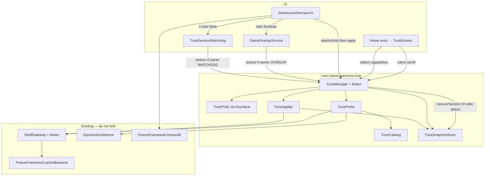

# T12 — Replace dummy Game Optimisation toggles with real kernel / game-boost logic

| Field | Value |
|-------|-------|
| **Document** | Design Spec — Real Game Optimisation |
| **ID** | T12 |
| **Type** | feature |
| **Priority** | P0 (Play policy — deceptive UI) |
| **Author** | TBD |
| **Date** | 2026-08-17 |
| **Status** | Draft (rev 4 — 36 options / 10 categories; see `T12-tune-options.md`) |
| **Package** | `com.ivarna.apexcore` |
| **Workspace** | `/home/abhaybyte/repos/apexcore` |
| **Target** | Android 16 / compileSdk 36 / targetSdk 36 / minSdk 24 |
| **Audience** | Senior Android / systems engineers who know ApexCore |
| **Branch (proposed)** | `T12-real-game-optimisation` |
| **Does not overwrite** | `docs/plan/` (this lives in `docs/plans/`) |

---

## Overview

`GameOptimisationToggles` in [`HomeScreen.kt`](../../app/src/main/kotlin/com/ivarna/apexcore/ui/home/HomeScreen.kt) is Play-policy **P0 deceptive UI**. Four switches persist to `dummy_opt_*` under SharedPreferences file `"apexcore"` and do nothing. The comment on the composable admits this: *“Dummy game optimisation toggles… no system side effects yet.”*

The Home banner text is **“Connect Shizuku or Root for deep freeze”** (`HomeScreen.kt` L130, L584–589). That sentence is about freeze, not these switches. The deceptive implication is **section visibility**: the four rows appear only after elevation (`isElevatedBackend`), so a reviewer reasonably believes Shizuku/Root makes the switches real. They do not.

This design replaces those dummies with a **capability-first, reversible, game-session kernel profile** implemented natively in ApexCore. It reuses ideas and **path catalogs** from three researched kernel-manager apps (Xtra Kernel Manager — **MIT**; RvKernel Manager — **GPL-3.0**; SmartPack Kernel Manager — **GPL**) but **does not copy Java** from any of them. Writes go through the existing [`ShellGateway`](../../app/src/main/kotlin/com/ivarna/apexcore/fps/privilege/ShellGateway.kt) / privilege model.

**User-visible catalog (rev 4):** **36 options in 10 categories**, not four switches. Full inventory: [`T12-tune-options.md`](T12-tune-options.md). Home shows one entry row; the tune page lists every option. A device lights only write-verified rows.

ApexCore stays a **game booster** (session-scoped, reversible). It does **not** ship undervolt, wakelock blockers, thermal disable, Magisk, or apply-on-boot.

**Chosen path (Play P0 option 3):** implement real, user-disclosed, reversible effects. Do not remove the section. Do not relabel “coming soon”.

---

## Background & Motivation

### Current state (verified in tree)

| Piece | Location | Reality |
|-------|----------|---------|
| Dummy toggles | `ui/home/HomeScreen.kt` `GameOptimisationToggles` | Shown only when `backendName == "Shizuku" \|\| "Root"` |
| Prefs keys | same file | `dummy_opt_gpu_render`, `dummy_opt_cpu_thread`, `dummy_opt_opengl`, `dummy_opt_kernel` |
| Labels | same file | GPU render / CPU threading / OpenGL / Kernel — copy implies system effect |
| Elevation banner | same file L130, L584–589 | Exact: *“Connect Shizuku or Root for deep freeze”* — freeze honesty, not tune |
| Home Purge (BOOST) | `ui/shell/MainScreen.kt` → `FreezeFramework.freezeAll` | Force-stop background apps. **Not** kernel tune. |
| Overlay BOOST | `games/GameOverlayService.kt` ~L424 | Same freeze, with protect set. **Not** kernel tune. |
| `BoostManager.kick` | `BoostManager.kt` | `killBackgroundProcesses` + `/proc/meminfo`. Dead-name collision. Unused by Home Purge. |
| Game launch | `games/GameLauncher.launch` | Freeze, `startActivity`, then `GameOverlayService.start` in try/catch. |
| Overlay `start()` | `GameOverlayService` companion L547–557 | **`if (!Settings.canDrawOverlays(context)) return`** — no service, no FGS. Comment “silently” means **skip**, not start. Returns `Unit`. |
| Test HUD | `ui/overlay/OverlayScreen.kt` L166 | `GameOverlayService.start(context, context.packageName)` — self-test HUD. `startExitWatcher` already skips self. Tune **must** too. |
| Overlay restart | `onStartCommand` L135 | `START_REDELIVER_INTENT` |
| Overlay exit | `startExitWatcher` L279 | Does **not** cancel the previous job. UsageStats poll 5 s; `isPackageOnTop` returns **true** on error (fail-open, keep overlay). |
| Privilege | `fps/privilege/{ShellGateway,PrivilegeTier,PrivilegePolicy,PrivilegeModeStore}` | T1 Root `su -c`, T2 Shizuku `newProcess`, T3 `sh -c`. `PrivilegeModeStore.label()` is `"Auto"` when preferred_backend is unset. Freeze chip names: `RootFreezeBackend.name = "Root"`, `ShizukuFreezeBackend.name = "Shizuku"`. |
| GPU detect | `fps/util/GpuVendorDetector` | `ADRENO` / `MALI` / `UNKNOWN`. `when (gpuVendor)` lives in **`SettingsScreen.kt`** HUD labels, not `DmaFenceFpsDataSource`. |
| Shell | `ShellExecutor.execute(command, useRoot)` | `listOf("su", "-c", command)` — **no extra argv, no env, unbounded `waitFor()`**. Shizuku `waitExit` is 8 s. |
| INTERNET | manifest | **None.** Keep it. No cloud profiles. |
| `lifecycle-process` | `app/build.gradle.kts` | **Not** a dependency. Do not assume `ProcessLifecycleOwner` unless we add it. |
| Tests | `app/src/test/java/…/freeze/` | JUnit4 + Mockito; `FreezeFramework.setResolverForTest` seam. |

Play policy source: [`docs/Play_Policy_Gaps_Not_Followed.md`](../Play_Policy_Gaps_Not_Followed.md) §1. Required fix chosen: implement real reversible effects.

Fastlane [`full_description.txt`](../../fastlane/metadata/android/en-US/full_description.txt) L9 already says *“Game optimisations — … tune game options”* while the switches are dummies. PR 5 **rewrites that line**, not only adds a paragraph.

### Pain points

1. Reviewers and users reasonably believe the four switches change GPU/CPU/kernel behaviour because they appear only after elevation.
2. There is no probe, no apply, no restore, and no honest “not on this kernel” state.
3. Naming collision: product “BOOST” = freeze. Kernel “boost” = sysfs. Must not merge these.
4. Overlay permission is optional. Launches without draw-over never start the FGS — any restore plan that assumes `onStartCommand` always runs is wrong.

### What the three research apps actually do (ideas only)

**Xtra Kernel Manager** (`/tmp/grok-1000/research/Xtra-Kernel-Manager`, **MIT** — still clean-room; do not vendor their Kotlin/Rust):

- `GameControlUseCase.performGameBoost()`: `setPerformanceMode("performance")` + thermal “Dynamic” + `enableMonsterMode()` + `drop_caches`/`am kill-all`.
- `enableMonsterMode()`: per-cpu `scaling_min_freq = cpuinfo_max_freq`, `scaling_governor=performance`, then kgsl `force_clk_on`, `gpuclk=max_gpuclk`, `throttling=0`, `force_bus_on`, `force_rail_on`.
- `disableMonsterMode()`: governor back to `schedutil`, force_* back to 0. **Does not restore original min/max freqs** — ApexCore must snapshot.
- `GPUControlUseCase.lockGPUFrequency` / `unlockGPUFrequency`: lock via devfreq min/max; unlock restores `msm-adreno-tz` or `simple_ondemand`; idle_timer lock=`0`, unlock=`80`.
- `ThermalControlUseCase`: Xiaomi-style `/sys/class/thermal/thermal_message/sconfig` with chmod 666 → write → chmod 444. Maps Dynamic=10, Extreme=2, Class 0=11.
- `SmartCPULocker`: snapshots `OriginalFreqConfig` then restores. **This is the restore pattern ApexCore should adopt.**
- `GameMonitorService` is an **AccessibilityService**. ApexCore **must not** copy this.
- `setGPURenderer` mutates `debug.hwui.renderer` and remounts `/vendor` / `/system`. **Out of scope.**
- Rust `gpu.rs` detects vendor via kgsl `gpuclk`, Mali `gpuinfo` / `clock` / `utilization`, and **`/dev/mali0`**. ApexCore **must not** open `/dev/mali0`. Those rust files do **not** list `devfreq/*/min_freq`.

**RvKernel Manager** (`/tmp/grok-1000/research/RvKernel-Manager`, **GPL-3.0** — research only, no Java copy):

- `SoCUtils.kt`: Snapdragon sysfs constants — `policyN/scaling_*`, kgsl `devfreq/governor`, `adrenoboost`, `min/max_pwrlevel`, `throttling`, `cpu_boost/input_boost_ms`.
- `BatteryUtils.THERMAL_SCONFIG` + `BatteryScreen.ThermalProfilesCard`: profile id **`"13"` = Gaming**. Also 0 default, 10 benchmark, 11 browser, 12 camera, 8 dialer, 14 streaming.
- `BatteryViewModel.updateThermalSconfig`: `Utils.setPermissions(644)` → write → `setPermissions(444)`.
- `kernel-profile-template/performance.sh`: CPU/GPU governor performance, `default_pwrlevel=0`, `throttling=0`, sconfig **10** (benchmark, not gaming). ApexCore prefers **13**.

**SmartPack Kernel Manager** (Kernel Adiutor fork, **GPL** — research only):

- `CPUBoost`: `/sys/module/cpu_boost/parameters/{cpu_boost,cpuboost_enable,input_boost_enabled,boost_ms,input_boost_ms,input_boost_freq,sched_boost_on_input}` + `/sys/module/msm_performance/parameters/touchboost`.
- `CPUInputBoost` (Sultanxda): `/sys/kernel/cpu_input_boost` and `/sys/module/cpu_input_boost/parameters`.
- `StuneBoost`: `/dev/stune/top-app/schedtune.boost` + `dynamic_stune_boost`.
- `Adrenoboost`: `/sys/class/kgsl/kgsl-3d0/devfreq/adrenoboost` (0–3).
- `DevfreqBoost`: `/sys/module/devfreq_boost/parameters/{input_boost_duration,msm_cpubw_boost_freq}`.
- `GPUFreq`: multi-vendor path maps (kgsl class, kgsl platform, OMAP, Tegra, PowerVR). **Does not** list Samsung `/sys/kernel/gpu/gpu_min_clock`.
- `GPUMisc`: `default_pwrlevel`, `throttling`.
- `MSMThermal`: `/sys/module/msm_thermal/parameters/enabled` — **full disable is dangerous; ApexCore will not write this**.
- `Spectrum`: `persist.spectrum.profile`. **Out of scope.**

### Platform notes (Android 16, verified / extended)

- AOSP Game Mode / `GAME` + `GAME_LOADING` ([source.android.com/docs/core/perf/boost](https://source.android.com/docs/core/perf/boost)): OEM Power HAL. No public 3P API to raise clocks for *another* package.
- Android 16 ADPF headroom APIs are for **the calling app**. Useless for boosting a launched game.
- Android 16 GPU syscall filtering: production SELinux blocks deprecated/dev Mali IOCTLs. **Do not open `/dev/mali0` or issue Mali IOCTLs.**
- MediaTek GED is typically mode `0440`. [`PrivilegeTier.SHIZUKU`](../../app/src/main/kotlin/com/ivarna/apexcore/fps/privilege/PrivilegeTier.kt) already documents: Shizuku **cannot** write GED. Fail closed.
- Linux `cpufreq` boost file `/sys/devices/system/cpu/cpufreq/boost` is optional.
- Play targetSdk 36 already set. Keep Home/settings resizable; do not lock orientation.

---

## Goals & Non-Goals

### Goals

1. Close Play P0: every visible switch either applies a **named, documented, reversible** action bundle or is **disabled with an honest, capability-dependent subtitle**.
2. Capability-first probe of a vendor catalog (Adreno, Mali/GED, Samsung community nodes, generic cpufreq). Apply only to discovered **write-verified** nodes under the **visible freeze backend**.
3. Snapshot-before-apply (insert-if-absent per path); restore on per-bundle OFF, session end, backend drop, process death (orphan), and overlay-less watchdog.
4. Apply **during an ApexCore game session**, not while the user sits on Home.
5. Privilege split: Root chmod-write-restore-perm; Shizuku only already-writable nodes; Standard no kernel writes.
6. Unit tests for probe, apply/restore invertibility, prefs deletion, fail-closed privilege, **and session lifecycle holes**.
7. Preserve freeze, whitelist, HUD FPS, RAM Free, Zen Organic, no-INTERNET, targetSdk 36, resizability.

### Non-Goals

- Becoming a full-time kernel manager: no undervolt, voltage tables, ZRAM resize, Spectrum, Magisk, Xposed, wakelock blocker, core offlining, apply-on-boot. **Session-scoped** I/O scheduler, TCP, VM, display, focus, and bypass-charge **are in scope** (rev 4 catalog).
- Apply-on-boot in v1.
- Per-game profile editor in v1.
- AOSP Game Mode / Power HAL / ADPF headroom as a boost mechanism.
- `debug.hwui.renderer`, `persist.sys.*`, vendor remount, ANGLE force, Mali IOCTLs, `/proc/ged` ioctl, `/dev/mali0`.
- Accessibility for game detection.
- Expanding `QUERY_ALL_PACKAGES` or adding INTERNET.
- Renaming Home Purge / overlay BOOST (freeze).
- Writing `/proc/sys/kernel/sched_util_clamp_min` (that sysctl is a **cap**, default 1024).
- Migrating dummy `true` values as consent for real writes.
- Adding `lifecycle-process` solely for the watchdog (UsageStats is enough).
- Touching `BoostManager` except a comment pointing at `tune/`.

---

## Key Decisions

| # | Decision | Rationale |
|---|----------|-----------|
| **KD-1** | New package is **`com.ivarna.apexcore.tune`**, facade **`TuneManager`**. | `BoostManager` already means `killBackgroundProcesses` + meminfo. Product “BOOST” already means freeze. “Tune” is the kernel/session profile. |
| **KD-2** | **No apply-on-boot in v1.** Toggles persist *intent*. Effects apply when a game session starts and restore when it ends. | Sitting on Home with min-freq locked cooks the SoC. Safer default. |
| **KD-3** | Intents are policy. **`setIntent` persists and returns immediately** (never blocks Main). If `sessionActive`, `scope.launch(IO) { applyBundle / restoreBundle }`. The switch **may lead the kernel by a beat**. Live OFF restores only that `TuneId`’s paths. Live ON applies that bundle. No session = persist only. | Home `Switch` is a non-suspend callback. One OFF must not undo the other three. |
| **KD-4** | **Replace OpenGL toggle** with **GPU keep-awake**. | No safe portable OpenGL hook on Android 16. Adjacent real feature: kgsl `force_*` + `idle_timer` + MTK `gx_game_mode` only. |
| **KD-5** | Thermal: prefer OEM **gaming sconfig `13`**. Fallback `10` only if `13` write-verify fails. **Never** write `msm_thermal/.../enabled`, kgsl `throttling=0`, `ged/gpu_dvfs_enable`, `gx_force_cpu_boost`, or `boost_gpu_enable`. | Constraint 8. GED force-max knobs are thermal-adjacent. |
| **KD-6** | **Raise floors, do not pin min=max and do not force `performance` as the only action.** GPU_FLOOR requires a **frequency-floor** node (`min_freq` / `min_gpuclk` / `min_clock_mhz` / mali `devfreq/min_freq`). `min_pwrlevel` alone does **not** enable the toggle (0 = fastest; that is a ceiling). Adreno boost = `2` (medium), not `3`. | Pinning max is Xtra Monster Mode. Pwrlevel-only would light a “frequency floor” switch that does not raise a floor. |
| **KD-7** | **Show the section only when the active backend is Shizuku or Root** (current gate). Inside the section, **each toggle is independently enabled** only if its bundle has ≥1 **write-verified** node. | Matches existing Home density. Deception was section visibility, not the freeze banner. |
| **KD-8** | Probe is **async, cached, non-blocking**. `refreshCapabilities()` launches IO and **returns immediately**. Budget **3500 ms wall** (rev 4). **Per-`TuneId` first** (one candidate each of 36), then fill. Cap **4** policy dirs. Batches of **6**. Per-node timeout **120 ms** via `ShellExecutor` `destroy()`. Root: writable only after write-verify, not “exists ⇒ writable”. | Vendor-primary-first would starve later categories. Assumed-writable Root lights toggles SELinux will reject. |
| **KD-9** | Snapshot is **per-session, persisted JSON**, keyed by **`Settings.Global.BOOT_COUNT` and `/proc/sys/kernel/random/boot_id`**. Persist **`tune_owner`**. `TuneManager.get()` **returns immediately**. First create starts **`recoverSession()` on `Dispatchers.IO`** after `FreezeFramework.init` + **`detect()`**. If orphan predicate → restore. Else if `tune_applied && bootMatch && GameOverlayService.isRunning` → **rehydrate** `sessionActive=true`, `owner=OVERLAY` (or persisted OVERLAY). `applyForSession` / `applyBundle` **await the same recover job + mutex** so apply cannot overtake recover. **No Main `runBlocking`.** | `ro.runtime.firstboot` survives reboot. Redelivered overlay must reconstruct owner/`activeBackend` or nobody restores and every write aborts. `get()` is called from composition and `onStartCommand` (Main). |
| **KD-10** | Writes go through **`ShellGateway.writePath`** built as a **charset-validated interpolated single `su -c` string** (today’s `ShellExecutor` has no extra argv). Root: chmod 644 → printf → verify → restore mode. Shizuku: no chmod. `ShellExecutor.execute(..., timeoutMs)` **destroy()**s on expiry. `ShellGateway` holds a **Mutex** so tune and the FPS daemon do not interleave `su`. | Positional `$1/$2` cannot be implemented. Hung `su` would pin Home on “Checking…”. |
| **KD-11** | **No new FGS.** Overlay FGS is restore owner **only when `start()` returns true**. **`TuneSessionWatchdog` is the primary restore owner** when draw-over is missing (normal path). | `start()` returns early if `!canDrawOverlays`. The “silently start FGS” story is false. |
| **KD-12** | Home Purge and overlay BOOST remain **freeze-only**. Tune is orthogonal. Overlay BOOST does **not** re-apply tune. | Avoid double-apply and name confusion. |
| **KD-13** | Clean-room path catalog. **Zero files copied.** Xtra is MIT (still do not vendor). RvKernel + SmartPack are GPL — no Java. Mali/Samsung extra paths are **community sysfs, probe-required**, not XKM/SP symbols. | Legal claim in rev 1 that Xtra is GPL-incompatible was false. |
| **KD-14** | **Do not migrate any `dummy_opt_*` trues.** One-shot in **PR 4 only**: delete the four dummy keys, leave `tune_*` at default **false**, set `tune_migrated_v1=true`. Users re-opt in under the new titles. PR 3 never reads dummy keys. | Dummy switches were documented no-ops. Migrating `true` is invalid consent (same rationale rev 1 used only for OpenGL). |
| **KD-15** | Failure UX is **inline** on Home. Session-start apply failure is a **short overlay Toast** only if overlay is up; otherwise a one-shot Home-next-resume subtitle, not a Snackbar. No cryo/tech copy. Titles **avoid the product word “BOOST”**. | Zen Organic. Overlay already toasts freeze results. |
| **KD-16** | `writeTier()` = `FreezeFramework.activeBackend.value?.name` mapped `"Root"` → `ROOT`, `"Shizuku"` → `SHIZUKU`, else abort. **Never** `PrivilegeModeStore.label()`. | Label is `"Auto"` when preferred_backend is unset even if the chip shows Root. AUTO silent `su` is dishonest. |
| **KD-17** | `startActivity` **first** (on success), then `applyForSession` on `Dispatchers.IO` with a **1500 ms** budget, or **2500 ms** if more than 4 intents are on. Overlay never blocks `onStartCommand`. IO `exitWatcher` restores **before** `stopSelf` with a **1500 ms** timeout. **`onDestroy` (Main):** if restore not already started, `scope.launch(IO)` and **do not wait**; leave `tune_applied=true` if the process dies mid-restore. | Apply-before-launch stalls start. 36 options need a longer apply budget when many are on. `Service.onDestroy` is Main — `runBlocking` is an ANR. |
| **KD-18** | **Delete** `/proc/sys/kernel/sched_util_clamp_min` from apply. Keep only `/dev/cpuctl/top-app/cpu.uclamp.min`. Document units: many kernels expose cgroup uclamp as **0–100** (percent); some as **0–1024**. Probe by reading current + `cpu.uclamp.max` if present; if current > 100 treat as 1024-scale and write `102` (~10%). | Writing sysctl `64` **caps** every task’s min util (kernel default **1024**). That is a throttle. |
| **KD-19** | **`applyForSession` / overlay apply is a no-op** if `pkg.isNullOrBlank()` or `pkg == applicationContext.packageName`. Only `GameLauncher` (or overlay **redeliver of a non-self `EXTRA_PKG`** after a real session) may apply. Overlay tab test HUD (`OverlayScreen.kt` L166) must not write sysfs. | Overlay tab starts the FGS with **self** package. Applying there cooks the device on Home/Overlay — the KD-2 ban. `startExitWatcher` already skips self. |
| **KD-20** | **36 options / 10 categories** replace the four mega-bundles. Catalog: [`T12-tune-options.md`](T12-tune-options.md). Home is one entry row; `TuneScreen` is the list. `CPU_FLOOR` mutexes little/big/prime. Old `KERNEL` splits into thermal + input options. All default **off**; no dummy-true migration. | User asked for as many real options as the researched managers expose. Four switches hid ~32 aliases. Honesty still requires per-option write-verify. |

---

## Proposed Design

### Architecture



`TuneManager` is a process singleton obtained like `FpsStack.get(context)` (manual composition root, no Hilt). It reuses `FpsStack.get(context).shellGateway` so there is **one** privilege/shell stack, now mutexed.

### Option catalog (rev 4 — replaces the four mega-bundles)

**Normative list:** [`T12-tune-options.md`](T12-tune-options.md) — **36 options, 10 categories**.

| Category | Options | Count |
|----------|---------|------:|
| GPU | frequency floor, keep-awake, Adreno level, governor, power floor, MTK game mode, Samsung min clock, Simple GPU | 8 |
| CPU and scheduling | all-cluster floor, little / big / prime floors, leave-powersave, uclamp, schedtune, prefer-idle | 8 |
| Touch and input | input boost, duration, touchboost, cpufreq boost, devfreq, sched-on-input, Sultan | 7 |
| Thermal | gaming sconfig `13` | 1 |
| Memory | swappiness, vfs_cache_pressure, dirty_ratio | 3 |
| Storage I/O | scheduler, read-ahead | 2 |
| Display | peak refresh, MIUI refresh mode | 2 |
| Focus | DND, hide heads-up, immersive | 3 |
| Charging | bypass charging in-game | 1 |
| Network | TCP congestion | 1 |
| **Total** | | **36** |

The old four dummy rows map to `GPU_FLOOR`, `CPU_FLOOR` (+ split CPU rows), `GPU_HOLD`, and `THERMAL_SCONFIG` + input category. Users re-opt in (KD-14).

An option is enabled only if it has ≥1 write-verified node (or a real Settings API for Focus/Display). A visual ON is persisted only when `setIntent` succeeds (capability true). Session apply 0/N **keeps** the intent for retry.

### Apply / restore sequence

```mermaid
sequenceDiagram
  actor User
  participant Home as HomeScreen
  participant TM as TuneManager
  participant Prefs as TunePrefs
  participant GL as GameLauncher
  participant FF as FreezeFramework
  participant Game as Game Activity
  participant Overlay as GameOverlayService
  participant WD as TuneSessionWatchdog
  participant Apply as TuneApplier
  participant SG as ShellGateway

  User->>Home: flip GPU frequency floor ON
  Home->>TM: setIntent(GPU_FLOOR, true)
  TM->>Prefs: tune_on_GPU_FLOOR=true
  Note over TM,Home: no sysfs write yet

  User->>GL: ALLOCATE AND LAUNCH
  GL->>FF: freezeAll(protect=game+self)
  FF-->>GL: FreezeResult
  GL->>Game: startActivity
  alt startActivity throws
    GL-->>User: LaunchResult.success=false
    Note over TM: apply never ran
  else startActivity ok
    GL->>Overlay: start() : Boolean
    alt canDrawOverlays
      Overlay-->>GL: true
      GL->>TM: owner = OVERLAY
    else no overlay permission
      Overlay-->>GL: false
      GL->>TM: owner = WATCHDOG
      TM->>WD: arm(gamePkg)
    end
    GL->>TM: applyForSession on IO budget 1500ms
    TM->>Apply: snapshot insert-if-absent
    Apply->>SG: writePath intended values
    SG-->>Apply: verify
    Apply-->>TM: Applied(n ok, m fail)
    GL-->>User: LaunchResult.success=true
  end

  alt owner OVERLAY
    Overlay->>Overlay: exitWatcher 5s IO
    Overlay->>TM: restoreSession before stopSelf
  else owner WATCHDOG
    WD->>WD: grace 8s then UsageStats 5s
    WD->>TM: restoreSession
  end
```



### Session recovery (process death / `START_REDELIVER_INTENT`)

`GameOverlayService.isRunning` is a **`companion object`** `@Volatile` flag (instance field is invisible to `TuneManager.get()`). Set `true` in `onCreate`, `false` at the end of `onDestroy`.

`TuneManager.get()` **returns immediately**. On first create it starts one `recoverJob` on `Dispatchers.IO`:

```
recoverSession():
  FreezeFramework.init(appCtx)
  if (FreezeFramework.activeBackend.value == null) FreezeFramework.detect()
  if (!tune_applied) return
  if (!bootMatch) { discard snapshot; return }
  if (inMemorySessionActive) return
  if (orphanPredicate):          // applied && bootMatch && !inMemory && !isRunning
    restoreSession()
    owner = NONE
    persist tune_owner=NONE
    return
  if (tune_applied && bootMatch && GameOverlayService.isRunning):
    sessionActive = true
    owner = OVERLAY               // or persisted owner if it is OVERLAY
    persist tune_owner=OVERLAY
    return                        // do NOT restore; overlay shutdown will
```

**`applyForSession` / `applyBundle` / `restoreSession` must `recoverJob.join()` then take the mutex.** Apply cannot overtake recover. No Main `runBlocking`.

**Single owner after recover.** `MainScreen` must **not** call `restoreSession()` itself.

| After LMK + overlay redeliver | What happens |
|-------------------------------|--------------|
| `onCreate` | companion `isRunning = true` |
| `get()` | recover sees overlay running → rehydrate `owner=OVERLAY`, `sessionActive=true`; **no** orphan restore |
| `onStartCommand` | `detect()` if `activeBackend == null`; if `EXTRA_PKG` is a **real game** (not self, not blank) set `owner=OVERLAY`, persist it, then idempotent `applyForSession` |
| `shutdown` | `owner==OVERLAY` → restore then `stopSelf` |

If recover skipped orphan because overlay was up, but `onStartCommand` never reconstructs owner, shutdown would no-op — that is why **overlay must set `owner=OVERLAY` itself**.

Unit tests: apply then `get()` again → zero restore writes; **new process, overlay running, `activeBackend` initially null → detect + no orphan + owner OVERLAY + restore on shutdown**.

### Session definition (v1)

A **game session** starts when `GameLauncher.launch`’s `startActivity` **succeeds** for a **non-self** package.

`applyForSession(pkg)` and the overlay apply path are a **no-op** when `pkg.isNullOrBlank()` or `pkg == applicationContext.packageName`. **Only** these may apply:

1. `GameLauncher` after a successful `startActivity` of a real game, or
2. Overlay **redeliver** of a **non-self** `EXTRA_PKG` after a real session (`START_REDELIVER_INTENT`).

The Overlay tab test HUD (`OverlayScreen.kt` L166: `start(context, context.packageName)`) must not write sysfs even if every `tune_*` intent is true. `startExitWatcher` already skips self; apply must match.

A session **ends** when the **restore owner** fires:

| Owner | When assigned | When it restores |
|-------|---------------|------------------|
| `OVERLAY` | `start()` returned **true**, **or** recover/redeliver rehydrated OVERLAY for a real game | IO `exitWatcher` → `restoreSession` (1500 ms) **before** `stopSelf`. `onDestroy`: fire-and-forget IO if restore not started. |
| `WATCHDOG` | `start()` returned **false**, **or** GameLauncher re-arm after FGS never came up | See algorithm below |
| `NONE` | Idle / after restore | — |

`TuneSessionOwner` is persisted as `tune_owner` and rehydrated on recover.

`setOwner(next)` always writes the in-memory enum **and** `tune_owner`. **Re-arming the watchdog sets `owner = WATCHDOG`** (if it stays `OVERLAY` while the FGS never comes up, the watchdog loop `while owner == WATCHDOG` never restores).

**`GameOverlayService.start()` contract (PR 3):**

```kotlin
fun start(context: Context, pkg: String): Boolean {
    if (!Settings.canDrawOverlays(context)) return false
    return try {
        // startForegroundService / startService as today
        true
    } catch (_: Throwable) {
        false
    }
}
```

**Watchdog algorithm (primary for overlay-less launches).** Owned by `TuneManager`, **not** a Service, **not** Accessibility, **no** `lifecycle-process` dependency.

```
arm(gamePkg):
  cancel previous watchdog job
  launch(Dispatchers.IO):
    delay(8000)                    // grace: ApexCore ON_STOP from startActivity must not restore
    unknownStreak = 0
    while sessionActive && owner == WATCHDOG:
      delay(5000)
      top = queryUsageStatsTop()   // null = unknown / empty / throw
      when:
        top == null        -> unknownStreak++; if unknownStreak >= 3: break
        top == gamePkg     -> unknownStreak = 0
        top == apexcorePkg -> break   // user is back in ApexCore
        else               -> break   // some other app
    restoreSession()
    owner = NONE
```

Fail **toward restore** after 3 consecutive UsageStats unknowns (≈15 s after grace). Do **not** copy overlay `isPackageOnTop` fail-true — that would leave sysfs dirty forever on the overlay-less path.

Overlay `isPackageOnTop` may stay fail-true (keeps HUD). That is overlay lifetime, not watchdog.

**Do not** restore on the first process `ON_STOP` of the launch itself. The 8 s grace covers that without `ProcessLifecycleOwner`.

If overlay start throws after returning true (FGS crash before `onCreate`): companion `isRunning` stays false; recover orphan-restores. Also: GameLauncher, if `start()` was true but apply then sees `!isRunning` after a short wait, **`setOwner(WATCHDOG)` and arm** the watchdog.

### Mid-session intent changes (KD-3)

`setIntent` is a **non-suspend** Home callback. It must **not** call `su` on Main.

```
setIntent(id, on):
  if (on && !capability(id).available) return false
  persist tune_* = on
  if (sessionActive) scope.launch(IO) {
    recoverJob.join()
    mutex.withLock { if (on) applyBundle(id) else restoreBundle(id) }
  }
  return true
```

The switch **may lead the kernel by a beat**. Do not `runBlocking`.

| User action during live session | Behaviour |
|---------------------------------|-----------|
| Flip one bundle OFF | Persist off; IO restores **only that `TuneId`’s paths**; drop them from snapshot; `sessionActive` stays true if any other bundle still applied |
| Flip one bundle ON | Persist on; IO `applyBundle(id)` (1500 ms); insert-if-absent snapshot |
| Flip last remaining bundle OFF | Persist; IO restore those paths; `sessionActive=false`; owner cancelled |
| `setIntent(true)` when capability is false | Return false; pref stays false; UI does not sit ON |

### Privilege write policy

| Tier | Detect | Read | Write |
|------|--------|------|-------|
| ROOT (T1) | `activeBackend.name == "Root"` | `cat` via `su -c` | chmod 644 → printf → verify → restore mode. Writable **only after** this write-verify of the **current** value during probe. |
| SHIZUKU (T2) | `activeBackend.name == "Shizuku"` | `cat` via `newProcess` | Write current-value test; no chmod. EACCES ⇒ not writable. |
| STANDARD (T3) | else | java `File` if `canRead()` | **Never.** |

`writeTier()` reads **`FreezeFramework.activeBackend.value?.name`**, never `PrivilegeModeStore.label()`. Overlay-first / recover paths must call **`FreezeFramework.detect()`** if `activeBackend` is null **before** any write (overlay `onCreate` today only calls `init()`, not `detect()`).

### Probe algorithm (must not block composition)

```
TuneProbe.refreshCapabilities():          // returns immediately
  scope.launch(Dispatchers.IO) { probe() }

probe():
  if cache valid (age < 60s) and backend fingerprint unchanged: emit cache; return
  emit probing=true (all switches disabled, subtitle "Checking this kernel…")
  vendor = GpuVendorDetector.detect(...)  // existing cache; do not extend enum
  deadline = now + 3500ms   // rev 4: 36 TuneIds

  // Phase 1 — one representative candidate per TuneId (see T12-tune-options.md)
  phase1 = firstExisting(each TuneId)
  probeNodes(phase1, deadline)

  // Phase 2 — fill, capped
  policies = discoverPolicies().take(4)
  extras = remaining catalog for vendor ∪ GENERIC, minus already probed
  probeNodes(extras.take(16 - probedCount), deadline)

probeNodes(list, deadline):
  for batch in list.chunked(4):           // 4 parallel, not 8
    if now > deadline: break
    async each with ShellExecutor timeoutMs=120:
      exists? read? write-verify current value at writeTier()?
    record TuneNodeState

capability(id).available = any write-verified node in that bundle
  AND (id != GPU_FLOOR || any write-verified node in groupId == "gpu_min")

cache + emit probing=false
```

Total probes ≤ 16. Phase 1 is at most 4. Policy discovery is capped at 4 cluster dirs (not 16 CPUs × 2 files).

`refreshCapabilities()` **must not** be called synchronously from `@Composable`. Home:

```kotlin
LaunchedEffect(isElevatedBackend, backendName) {
    if (isElevatedBackend) TuneManager.get(context).refreshCapabilities()
}
val caps by TuneManager.get(context).capabilities.collectAsState()
```

First paint uses last cache or probing subtitles.

### Value selection (concrete)

All numeric writes pick from the node’s **available** list at `availablePath`, converted with `valueKind`. Never write a frequency that is not in that list.

| `TuneValueKind` | Meaning | Example nodes |
|-----------------|---------|---------------|
| `FREQ_HZ` | Hertz | `devfreq/min_freq`, `min_gpuclk`, `gpu_available_frequencies` |
| `FREQ_KHZ` | Kilohertz | CPU `scaling_min_freq`, `scaling_available_frequencies` |
| `FREQ_MHZ` | Megahertz | `min_clock_mhz`, `freq_table_mhz` |
| `PWRLEVEL` | Adreno integer, 0 = fastest | `min_pwrlevel` (extra only) |
| `ENUM` | Short token | governors, `Y`/`N`/`1`/`0` |
| `RAW` | Digit string already in node units | `sconfig`, `idle_timer`, `adrenoboost` |

| Node family | Apply value | Restore |
|-------------|-------------|---------|
| CPU `scaling_min_freq` | median of `availablePath` (kHz), clamped ≤ current max | snapshot |
| CPU `scaling_governor` | only if current ∈ {`powersave`, `conservative`} → `schedutil` if listed | snapshot |
| GPU min (`groupId=gpu_min`) | ~60th percentile of `availablePath`, **same unit as path** | snapshot |
| GPU `min_pwrlevel` | extra only: `max(0, current - 2)` | snapshot |
| GPU `devfreq/governor` | only if current is `powersave` → `msm-adreno-tz` if listed else `simple_ondemand` | snapshot |
| `adrenoboost` | `2` | snapshot |
| `force_{clk,bus,rail}_on` | `1` | snapshot |
| `idle_timer` | `10000` if current < 10000 | snapshot |
| `sconfig` | `13`, else `10` if verify of 13 fails | snapshot |
| `cpufreq/boost` | `1` | snapshot |
| `input_boost_enabled` / `cpu_boost` | `1` or `Y` matching the node’s alphabet | snapshot |
| `input_boost_ms` | `max(current, 64)` capped at `128` | snapshot |
| `/dev/stune/top-app/schedtune.boost` | `10` if current < 10, cap 20 | snapshot |
| `/dev/cpuctl/top-app/cpu.uclamp.min` | see KD-18 (10% of scale) | snapshot |
| GED `gx_game_mode` | `1` | snapshot |

**Do not write:** `msm_thermal/**/enabled`, kgsl `throttling`, `ged/gpu_dvfs_enable`, `ged/gx_force_cpu_boost`, `ged/boost_gpu_enable`, `/proc/sys/kernel/sched_util_clamp_min`, `/proc/sys/kernel/sched_util_clamp_max`, `/dev/mali0`, `/proc/ged`.

`groupId`: apply writes **one** node per group (first write-verified). GPU_HOLD nodes use distinct groupIds (`kgsl_force_clk`, `kgsl_force_bus`, `kgsl_force_rail`, `kgsl_idle_timer`, `ged_game_mode`) so they compose. GPU_FLOOR and GPU_HOLD **must not** share a `gpu_min` group.

Snapshot map is **insert-if-absent** per path. A second writer (mid-session ON of another bundle that somehow hits the same path, or idempotent re-apply) must not replace the original pre-session value.

`printf '%s\n'` via a single interpolated `su -c` string. Reject path unless it matches `^/(sys|dev|proc)/[A-Za-z0-9/_.:=-]+$`. Reject value unless it matches `^[A-Za-z0-9_.:-]+$`.

### ShellGateway / ShellExecutor additions

Today: `ShellExecutor.execute(command, useRoot)` → `listOf("su","-c", command)` or `sh -c`, then unbounded `waitFor()`.

**PR 1 must extend this** (this is the only way `writePath` is implementable):

```kotlin
fun execute(command: String, useRoot: Boolean = false, timeoutMs: Long = 8_000L): ShellResult
```

On expiry: `process.destroy()`, then `destroyForcibly()` if still alive after ~200 ms; return `ShellResult("error: timeout", -1)`. Existing 1-arg/2-arg callers keep the 8 s default (FPS daemon). Probe passes `timeoutMs = 120`. Apply/restore pass `timeoutMs = 400` per node.

`writePath` builds **one** command string (no argv):

```sh
# Root
mode=$(stat -c '%a' '/sys/...' 2>/dev/null || echo "")
chmod 644 '/sys/...' 2>/dev/null
printf '%s\n' '13' > '/sys/...'
rc=$?
readback=$(cat '/sys/...' 2>/dev/null | tr -d '\n')
[ -n "$mode" ] && chmod "$mode" '/sys/...' 2>/dev/null
printf 'RC=%s READBACK=%s\n' "$rc" "$readback"
```

Shizuku: the printf+cat only (no chmod).

`ShellGateway` wraps `execute` / `readPath` / `writePath` in `mutex.withLock { }` so `FpsDaemonManager.ensureDaemonStarted()` and tune writes cannot interleave on `su`.

```kotlin
data class WriteResult(
    val ok: Boolean,
    val verified: Boolean,
    val readback: String?,
    val tier: PrivilegeTier?,
    val error: String? = null
)

fun writePath(path: String, value: String, tier: PrivilegeTier): WriteResult
fun exists(path: String, tier: PrivilegeTier, timeoutMs: Long = 120L): Boolean
```

### Thermal safety interlock

No thermal polling loop in v1. Rely on: not disabling thermal; floors not pins; session-scoped lifetime; GPU_HOLD not including GED force-max.

Accepted residual: the device can still get warm. Disclose in the in-app footer (not only this spec): **“Does not disable thermal protections.”**

v2 may add a 15 s thermal-zone poll that restores if a cpu zone > 85 °C.

### Interaction with existing BOOST / overlay / RAM Free

| Surface | Tune interaction |
|---------|------------------|
| Home Purge pebble | Freeze only. Does not apply/restore tune. Toggles disabled while `State.BOOSTING` (already). |
| Overlay BOOST pebble | Freeze only. Does not re-apply tune. |
| GameLauncher | Freeze → **`startActivity`** → `start(): Boolean` → `setOwner` + persist → **`applyForSession` on IO** (no-op if self pkg). Game still launches if apply throws. |
| Overlay tab test HUD | `OverlayScreen` starts FGS with **self** package. Tune apply **no-op**. No owner change. |
| Overlay `onStartCommand` | `exitWatcher?.cancel()` first. IO: `detect()` if backend null; if `EXTRA_PKG` is a **real game** then `setOwner(OVERLAY)` + idempotent apply. **Never** `runBlocking`. Self/blank pkg: HUD only. |
| Overlay `shutdown` (IO watcher) | If `owner==OVERLAY`: restore 1500 ms **before** `stopSelf`. |
| Overlay `onDestroy` (Main) | If restore not already started: `scope.launch(IO) { restoreSession() }` and **do not wait**. Leave `tune_applied=true` if the process dies mid-restore. |
| Overlay-less launch | Watchdog is **primary** restore owner. Re-arm **sets `owner=WATCHDOG`**. |
| RAM Free | Unchanged. |
| Whitelist / freeze filter | Unchanged. |
| FPS daemon | Shares `ShellGateway` mutex. Tune does not touch tracing / Mali ioctl. |
| Backend dropdown mid-session | `FreezeFramework.activeBackend` change → if new name is not Root/Shizuku, restore immediately. |

### UI (Zen Organic)

**Do not put 36 switches on Home.** Home: one `HomeAnimatedEntryRow` titled **Game optimisation**, subtitle **“N available on this kernel”** (or “Checking this kernel…” / “None on this kernel”). Opens `TuneScreen` (RAM Free pattern: bottom nav hidden).

`TuneScreen` renders the 10 categories from [`T12-tune-options.md`](T12-tune-options.md). Hide a category if it has zero available options. Each row is switch, slider, or enum. Unavailable rows stay in a visible category with an honest subtitle.

Footer (11.sp, `onSurfaceVariant`):

> Applies when you launch a game from ApexCore. Restored when the session ends. Does not disable thermal protections.

Copy lock:

- Never say “OpenGL”, “kernel-level hints”, “tune GL driver”, or “game-thread” unless that exact node applied.
- Never use the product word **BOOST** in tune titles (Home/overlay BOOST = freeze). “Adreno boost level” is the upstream node name — UI title is **Adreno boost level** only because that *is* the sysfs name users of custom kernels know; do not say “BOOST” alone.
- Never persist a visual ON when `setIntent` returns false.
- Standard / non-elevated: Home row + page stay hidden; existing banner remains *“Connect Shizuku or Root for deep freeze”*.

Do not reintroduce cryo/tech tokens, ASCII, or Material-extended icons.

### Failure UX

| Event | UX |
|-------|----|
| Probe timeout | Unavailable subtitle; log `ApexCore.Tune` warn |
| Flip ON, bundle empty | Switch refuses (`enabled=false`) |
| Flip ON, capability true | Persist intent and return; no sysfs until session (or IO apply if session live — switch may lead) |
| Session apply 0/N | Keep intents; overlay Toast `"Game tune skipped — kernel nodes not writable"` if overlay up |
| Session apply partial | Snapshot only nodes that changed |
| Restore fail | Log error; leave `tune_applied=true` so next `get()` orphan-retries |
| Backend drop | Restore; capabilities → all unavailable |

No Home Snackbar. No dialog.

---

## API / Interface Changes

### New types (`com.ivarna.apexcore.tune`)

```kotlin
enum class TuneId {
    // 36 ids — normative table in T12-tune-options.md
    GPU_FLOOR, GPU_HOLD, GPU_ADRENO, GPU_GOVERNOR, GPU_PWRLEVEL,
    GPU_GED_GAME, GPU_SAMSUNG_MIN, GPU_SIMPLE,
    CPU_FLOOR, CPU_FLOOR_LITTLE, CPU_FLOOR_BIG, CPU_FLOOR_PRIME,
    CPU_GOVERNOR, CPU_UCLAMP, CPU_STUNE, CPU_STUNE_IDLE,
    INPUT_BOOST_EN, INPUT_BOOST_MS, TOUCHBOOST, CPUFREQ_BOOST,
    DEVFREQ_BOOST, SCHED_BOOST_INPUT, SULTAN_INPUT,
    THERMAL_SCONFIG,
    VM_SWAPPINESS, VM_VFS_CACHE, VM_DIRTY_RATIO,
    IO_SCHEDULER, IO_READAHEAD,
    DISPLAY_PEAK, DISPLAY_MIUI,
    FOCUS_DND, FOCUS_HEADSUP, FOCUS_IMMERSIVE,
    CHARGE_BYPASS,
    NET_TCP
}

enum class TuneVendor { ADRENO, MALI, SAMSUNG, GENERIC } // no TENSOR — Pixel uses Mali paths

enum class TunePrivilege { ROOT_ONLY, SHELL_OK }

enum class TuneValueKind { FREQ_HZ, FREQ_KHZ, FREQ_MHZ, PWRLEVEL, ENUM, RAW }

enum class TuneSessionOwner { NONE, OVERLAY, WATCHDOG }

// TuneCategory, TuneControlKind, TuneValue, TuneSpec — see T12-tune-options.md
data class TuneValue(val on: Boolean, val raw: String? = null)

data class TuneNode(
    val path: String,
    val id: TuneId,
    val vendor: TuneVendor,
    val privilege: TunePrivilege,
    val valueKind: TuneValueKind,
    val availablePath: String?,   // frequencies/governors sibling; null for RAW/ENUM constants
    val groupId: String           // apply one node per group
)

data class TuneCapability(
    val id: TuneId,
    val available: Boolean,
    val needsRoot: Boolean,
    val writablePaths: List<String>,
    val subtitle: String          // already capability-dependent
)

data class TuneApplyReport(
    val applied: Int,
    val failed: Int,
    val skipped: Int,
    val sessionActive: Boolean
)

interface KeyValue {
    fun getBoolean(key: String, default: Boolean): Boolean
    fun putBoolean(key: String, value: Boolean)
    fun getString(key: String, default: String?): String?
    fun putString(key: String, value: String?)
    fun remove(key: String)
}

class SharedPrefsKeyValue(prefs: SharedPreferences) : KeyValue { /* … */ }

interface TuneShell {
    fun read(path: String, timeoutMs: Long = 120L): String?
    fun write(path: String, value: String, tier: PrivilegeTier, timeoutMs: Long = 400L): WriteResult
    fun exists(path: String, timeoutMs: Long = 120L): Boolean
}

class TuneManager private constructor(...) {
    val capabilities: StateFlow<Map<TuneId, TuneCapability>>
    val sessionActive: StateFlow<Boolean>
    val owner: TuneSessionOwner
    fun refreshCapabilities()                          // launch IO, return immediately
    fun intent(id: TuneId): TuneValue
    fun setIntent(id: TuneId, value: TuneValue): Boolean  // persist+return; IO apply/restore if sessionActive
    // TuneValue / TuneCategory / TuneSpec / TuneControlKind: T12-tune-options.md
    fun setOwner(owner: TuneSessionOwner)              // memory + persist tune_owner
    suspend fun applyForSession(gamePkg: String): TuneApplyReport  // no-op if self/blank
    suspend fun applyBundle(id: TuneId): TuneApplyReport
    suspend fun restoreBundle(id: TuneId): TuneApplyReport
    suspend fun restoreSession(): TuneApplyReport
    fun deleteDummyKeysIfNeeded()                      // PR 4 only; no true-migration

    companion object {
        fun get(context: Context): TuneManager         // create → start recoverJob on IO → return
        fun setInstanceForTest(instance: TuneManager?)
    }
}
```

`TuneManager` holds `Mutex` and a single `recoverJob`. Suspend apply/restore **join `recoverJob` then** take the mutex. `setIntent` during a session launches IO that does the same join+lock.

Self-package guard (also used by overlay apply):

```kotlin
fun isRealGamePkg(pkg: String?): Boolean {
    val p = pkg?.takeIf { it.isNotBlank() } ?: return false
    return p != appContext.packageName
}
```

`writeTier()`:

```kotlin
fun writeTier(): PrivilegeTier? = when (FreezeFramework.activeBackend.value?.name) {
    "Root" -> PrivilegeTier.ROOT
    "Shizuku" -> PrivilegeTier.SHIZUKU
    else -> null
}
```

### Call sites (existing files)

| File | Change |
|------|--------|
| `ui/home/HomeScreen.kt` | Delete dummy keys/card. Home entry row → `TuneScreen`. **PR 4** deletes leftover `dummy_opt_*`. |
| `ui/tune/TuneScreen.kt` | Categorized 36-option page (new). |
| `games/GameLauncher.kt` | After successful `startActivity`: `start(): Boolean` → `setOwner` (OVERLAY or WATCHDOG) → `applyForSession` on IO. Self pkg never happens here. If apply throws, still `LaunchResult.success=true`. |
| `games/GameOverlayService.kt` | `start(): Boolean`. **`companion object` `@Volatile isRunning`**. `onStartCommand`: cancel previous `exitWatcher`; IO `detect()` if needed; if real game pkg `setOwner(OVERLAY)` + apply; if self/blank, HUD only. `shutdown`: IO restore-before-stopSelf if owner OVERLAY. `onDestroy`: fire-and-forget IO restore if not started. |
| `ui/overlay/OverlayScreen.kt` | **No change** to the self-pkg `start()` call. Tune no-op protects it. |
| `fps/util/ShellExecutor.kt` | `timeoutMs` + `destroy()`. |
| `fps/privilege/ShellGateway.kt` | `writePath`, `exists`, internal `Mutex`. |
| `fps/util/GpuVendorDetector.kt` | **No enum change.** TuneCatalog uses `GpuVendor` + optional `ro.soc.manufacturer` for Samsung community paths. |
| `BoostManager.kt` | File-level KDoc only (PR 2). |
| `ui/shell/MainScreen.kt` | `TuneManager.get(context)` so recover starts if the process started from Home. **No** `deleteDummyKeysIfNeeded` here (PR 4 / Home). **No** independent restore. |
| `freeze/FreezeFramework.kt` | No API change; tune reads `activeBackend`. |

### Idempotency

`applyForSession` while `sessionActive` still applies **newly ON** bundles (KD-3) but skips groups already in the snapshot. Self/blank pkg is always a no-op (does not set owner, does not snapshot).

`restoreSession` is a no-op if not applied.

---

## Data Model Changes

Prefs file remains `"apexcore"` (`Context.MODE_PRIVATE`). No Room. No cloud.

| Key | Type | Meaning |
|-----|------|---------|
| `tune_on_<TuneId>` | Boolean | Option enabled — **default false** (36 keys) |
| `tune_val_<TuneId>` | String | Slider int or enum token (absent for plain switches) |
| `tune_migrated_v1` | Boolean | Dummy keys have been **deleted** (not converted) |
| `tune_applied` | Boolean | Sysfs currently dirty from us |
| `tune_boot_count` | Int | `Settings.Global.BOOT_COUNT` at apply |
| `tune_boot_id` | String | `/proc/sys/kernel/random/boot_id` at apply |
| `tune_snapshot_json` | String | `{"path":"value",...}` insert-if-absent originals |
| `tune_session_pkg` | String | Last game pkg (debug) |
| `tune_owner` | String | `OVERLAY` / `WATCHDOG` / `NONE` (persist so orphan knows) |

**Boot id read (exact):**

```kotlin
fun currentBoot(context: Context, shell: TuneShell): Pair<Int, String> {
    val count = Settings.Global.getInt(context.contentResolver, Settings.Global.BOOT_COUNT, -1)
    val id = shell.read("/proc/sys/kernel/random/boot_id")?.trim().orEmpty()
    return count to id
}
fun bootMatch(persistedCount: Int, persistedId: String, cur: Pair<Int, String>): Boolean {
    if (persistedId.isNotEmpty() && cur.second.isNotEmpty()) return persistedId == cur.second
    if (persistedCount >= 0 && cur.first >= 0) return persistedCount == cur.first
    return false // unknown → treat as reboot → discard snapshot, do not write
}
```

Do **not** use `sys.boot.session` or `ro.runtime.firstboot`.

**Dummy-key handling (PR 4 only):**

```
if (!tune_migrated_v1):
  remove dummy_opt_gpu_render, dummy_opt_cpu_thread, dummy_opt_opengl, dummy_opt_kernel
  // do NOT copy their values into tune_*
  tune_migrated_v1 = true
```

Uninstall clears prefs. Mid-session uninstall cannot restore — reboot resets sysfs. Accepted.

---

## Capability matrix

**Normative user catalog is [`T12-tune-options.md`](T12-tune-options.md) (36 TuneIds).** Tables below are **alias-path appendices** for implementers, remapped to those ids. `CPU_SCHED` / `KERNEL` are **not** TuneIds anymore.

Privilege: **R** = typically Root-only. **S** = sometimes shell-writable. **Probe write-verify** decides. Reversible = we snapshot the node we write.

Sources: XKM = Xtra symbol (MIT, ideas only), RV = RvKernel symbol (GPL, ideas only), SP = SmartPack symbol (GPL, ideas only), **community** = common sysfs, not a cited symbol in those trees.

### GPU_FLOOR

| Path | `valueKind` | `availablePath` | `groupId` | Vendor | Priv | Reversible | Source |
|------|-------------|-----------------|-----------|--------|------|------------|--------|
| `/sys/class/kgsl/kgsl-3d0/devfreq/min_freq` | FREQ_HZ | `.../gpu_available_frequencies` or `.../devfreq/available_frequencies` | `gpu_min` | Adreno | R/S | yes | SP `GPUFreq.MIN_KGSL3D0_DEVFREQ_FREQ`; XKM `setGPUFrequency` |
| `/sys/class/kgsl/kgsl-3d0/min_gpuclk` | FREQ_HZ | `.../gpu_available_frequencies` | `gpu_min` | Adreno | R | yes | XKM `setGPUFrequency` |
| `/sys/class/kgsl/kgsl-3d0/min_clock_mhz` | FREQ_MHZ | `.../freq_table_mhz` | `gpu_min` | Adreno | R/S | yes | RV `SoCUtils.MIN_FREQ_GPU` |
| `/sys/class/kgsl/kgsl-3d0/min_pwrlevel` | PWRLEVEL | — | `gpu_pwr_extra` | Adreno | R | yes | RV `MIN_PWRLEVEL`; SP `GPUMisc` — **extra, not enabler** |
| `/sys/class/kgsl/kgsl-3d0/devfreq/adrenoboost` | RAW | — | `adreno_boost` | Adreno (flar2) | R | yes | RV `ADRENO_BOOST`; SP `Adrenoboost` |
| `/sys/class/kgsl/kgsl-3d0/devfreq/governor` | ENUM | `.../available_governors` | `gpu_gov` | Adreno | R | yes | RV `GOV_GPU` |
| `/sys/class/devfreq/*mali*/min_freq` | FREQ_HZ | `.../available_frequencies` | `gpu_min` | Mali | R | yes | **community sysfs, probe-required** (not in XKM `gpu.rs`) |
| `/sys/class/misc/mali0/device/devfreq/*/min_freq` | FREQ_HZ | sibling `available_frequencies` | `gpu_min` | Mali | R | yes | **community, probe-required** |
| `/sys/kernel/gpu/gpu_min_clock` | FREQ_MHZ (probe unit via magnitude) | `/sys/kernel/gpu/gpu_available_clocks` if present | `gpu_min` | Samsung | R | yes | **community folklore, probe-required** (not in SP `GPUFreq` / XKM rust) |
| `/sys/kernel/gpu/gpu_governor` | ENUM | `/sys/kernel/gpu/gpu_available_governors` if present | `gpu_gov` | Samsung | R | yes | **community, probe-required** |

Reads (not apply targets): `gpu_available_frequencies`, `freq_table_mhz`.

**Do not catalog:** `/dev/mali0`, `/proc/ged`.

### CPU_FLOOR / CPU_UCLAMP / CPU_STUNE (was CPU_SCHED)

| Path | `valueKind` | `availablePath` | `groupId` | Vendor | Priv | Reversible | Source |
|------|-------------|-----------------|-----------|--------|------|------------|--------|
| `/sys/devices/system/cpu/cpufreq/policyN/scaling_min_freq` | FREQ_KHZ | `.../scaling_available_frequencies` | `cpu_min_policyN` | Generic | R/S | yes | RV `MIN_FREQ_CPUx`; XKM `setClusterFrequency` |
| `/sys/devices/system/cpu/cpufreq/policyN/scaling_governor` | ENUM | `.../scaling_available_governors` | `cpu_gov_policyN` | Generic | R/S | yes | RV `GOV_CPUx` |
| `/dev/stune/top-app/schedtune.boost` | RAW | — | `stune_top` | EAS older | R | yes | SP `StuneBoost.STUNE` |
| `/dev/stune/top-app/schedtune.prefer_idle` | RAW | — | `stune_idle` | EAS | R | yes | SP `StuneBoost` |
| `/dev/cpuctl/top-app/cpu.uclamp.min` | RAW (0–100 or 0–1024) | — | `uclamp_top` | EAS newer | R | yes | cgroup uclamp (not RV’s **sysctl**) |

**Deleted from apply:** `/proc/sys/kernel/sched_util_clamp_min` — that sysctl is the **maximum allowed uclamp.min** (kernel default **1024**). Writing `64` throttles every task. RvKernel exposes it as a raw tunable (`KernelUtils.SCHED_UTIL_CLAMP_MIN`); it is not a floor-raiser.

Policy discovery: `ls /sys/devices/system/cpu/cpufreq/policy*` then **`.take(4)`**.

### GPU_HOLD (kgsl force_* + idle_timer only; `gx_game_mode` is `GPU_GED_GAME`)

| Path | `valueKind` | `groupId` | Vendor | Priv | Reversible | Source |
|------|-------------|-----------|--------|------|------------|--------|
| `/sys/class/kgsl/kgsl-3d0/force_clk_on` | RAW | `kgsl_force_clk` | Adreno | R | yes | XKM `enableMonsterMode` / `lockGPUFrequency` |
| `/sys/class/kgsl/kgsl-3d0/force_bus_on` | RAW | `kgsl_force_bus` | Adreno | R | yes | same |
| `/sys/class/kgsl/kgsl-3d0/force_rail_on` | RAW | `kgsl_force_rail` | Adreno | R | yes | same |
| `/sys/class/kgsl/kgsl-3d0/idle_timer` | RAW | `kgsl_idle_timer` | Adreno | R | yes | XKM lock=`0`, unlock=`80`; we write `10000` not `0` |

`gx_game_mode` belongs to **`GPU_GED_GAME`**, not this bundle (avoids two TuneIds snapshotting the same path).

**Do not write (same family as rejected `gpu_dvfs_enable`):** `gx_force_cpu_boost`, `boost_gpu_enable`.

**Rejected entirely:** `debug.hwui.renderer`, `debug.egl.*`, `persist.sys.gpu*`, vendor remount, `/proc/ged` ioctl, `/dev/mali0`, Mali `devfreq/min_freq` (that is GPU_FLOOR).

### THERMAL_SCONFIG + input category (was KERNEL)

| Path | `valueKind` | `groupId` | Vendor | Priv | Reversible | Source |
|------|-------------|-----------|--------|------|------------|--------|
| `/sys/class/thermal/thermal_message/sconfig` | RAW | `sconfig` | Xiaomi / some OEM | R | yes | RV `THERMAL_SCONFIG` value **13**; XKM `sconfigPath`; `performance.sh` uses 10 |
| `/sys/devices/system/cpu/cpufreq/boost` | RAW | `cpufreq_boost` | Generic | R/S | yes | Linux cpufreq |
| `/sys/module/cpu_boost/parameters/input_boost_enabled` | ENUM | `cpu_boost_en` | QCOM custom | R | yes | SP `CPUBoost.sEnable` |
| `/sys/module/cpu_boost/parameters/cpuboost_enable` | ENUM | `cpu_boost_en` | QCOM custom | R | yes | SP |
| `/sys/module/cpu_boost/parameters/cpu_boost` | ENUM | `cpu_boost_en` | QCOM custom | R | yes | SP |
| `/sys/module/cpu_boost/parameters/input_boost_ms` | RAW | `input_boost_ms` | QCOM custom | R | yes | SP `CPU_BOOST_INPUT_MS` |
| `/sys/devices/system/cpu/cpu_boost/input_boost_ms` | RAW | `input_boost_ms` | QCOM | R | yes | RV `CPU_INPUT_BOOST_MS` |
| `/sys/devices/system/cpu/cpu_boost/sched_boost_on_input` | RAW | `sched_boost_in` | QCOM | R | yes | RV `CPU_SCHED_BOOST_ON_INPUT` |
| `/sys/kernel/cpu_input_boost/enabled` | RAW | `sultan_ib` | Sultanxda | R | yes | SP `CPUInputBoost` |
| `/sys/module/cpu_input_boost/parameters/input_boost_duration` | RAW | `sultan_ib_ms` | Sultanxda | R | yes | SP |
| `/sys/module/devfreq_boost/parameters/input_boost_duration` | RAW | `devfreq_ib_ms` | Sultanxda | R | yes | SP `DevfreqBoost` |
| `/sys/module/msm_performance/parameters/touchboost` | RAW | `touchboost` | QCOM | R | yes | SP `CPU_TOUCH_BOOST` |

**Do not write:** `/sys/module/msm_thermal/parameters/enabled` (SP `MSMThermal`), `/sys/class/kgsl/kgsl-3d0/throttling` (RV `GPU_THROTTLING`).

`sconfig` known ids (RV `BatteryScreen.thermalProfilesOptions`): `0` default, `8` dialer, `10` benchmark, `11` browser, `12` camera, **`13` gaming**, `14` streaming. Never write `2` (XKM Extreme).

No Tensor-specific extras. Pixel Tensor is Mali: use Mali/generic rows only.

---

## Alternatives Considered

### A. Remove the section until features exist

Play P0 option 1. Rejects the chosen path (implement real effects).

### B. Relabel “Coming soon” and disable switches

Play P0 option 2. Honest but dead UI.

### C. Full kernel manager (Xtra/RvKernel/SmartPack clone)

Rejected by constraint 6. GPL risk on RV/SP Java.

### D. Apply immediately when the Home switch flips

Heat/battery. Rejected (KD-2).

### E. Depend on AOSP Game Mode / Power HAL

No 3P hook to boost another package.

### F. Chosen: session-scoped capability bundles (this doc)

Implements P0 option 3. Cost: fragmentation (some devices show 0–2 live toggles). Honesty makes that OK.

### G. Migrate dummy `true` so existing flippers keep state

Invalid consent — those switches were documented no-ops and the copy is changing. Rejected (KD-14).

---

## Security & Privacy Considerations

| Topic | Handling |
|-------|----------|
| Arbitrary sysfs write | Catalog allow-list. Path/value charset validation. |
| Command injection | Interpolated `su -c` only after charset checks. No user-typed paths. |
| Thermal runaway | No thermal disable; no GED force-max; floors not pins; session-scoped. |
| Privilege confusion | Writes follow **visible** `FreezeFramework.activeBackend.name`. |
| Shizuku | No chmod. Cannot write GED 0440. |
| Accessibility | Not used. |
| Overlay | Existing FGS only. `start()` Boolean. No new FGS. |
| Package visibility | No QAP expansion. |
| Data | Local prefs. Snapshot is path→value of **our** nodes. |
| INTERNET | Still none. |
| Uninstall | Prefs gone; kernel state lasts until reboot if we died dirty. Orphan covers process death, not uninstall. |
| Licensing | Xtra MIT (still clean-room). RV + SmartPack GPL — no Java copy. |

---

## Observability

Tag: `ApexCore.Tune`.

| Event | Level | Fields |
|-------|-------|--------|
| probe start/end | I | vendor, backend, ms, nExists, nWritable, budgetHit, phase1Hits |
| capability | D | TuneId, available, needsRoot, paths, subtitle |
| apply | I | pkg, owner, id, path, from, to, verified |
| apply fail | W | path, error, tier |
| restore | I | owner, nRestored, nFail |
| orphan restore | W | boot match, overlayIsRunning, inMemory |
| orphan skip | D | reason |
| privilege drop restore | W | fromName, toName |
| write timeout | W | path, timeoutMs |

No analytics network. `adb logcat -s ApexCore.Tune` is the field tool.

---

## Rollout Plan

1. No remote flag (no INTERNET).
2. Staged by privilege and capability. Standard users: section still hidden. Elevated stock Pixel: often 0–1 live toggles. Snapdragon + Root: 3–4.
3. Dogfood: one Adreno Root, one Mali Root, one Shizuku-only, **one launch with draw-over denied** (watchdog path).
4. Play listing: PR 5 rewrites the existing “Game optimisations / tune game options” line. Only mention kernel tuning after this ships, and only as optional / restored after the game.
5. Rollback: **hide the section**. Never resurrect dummies. Local `tune_ui_enabled` pref default true if a hotfix must hide.

---

## Test Plan

### Unit (`app/src/test/java/com/ivarna/apexcore/tune/`)

`TuneShell` + `KeyValue` fakes. No Robolectric.

| Test | Assert | PR |
|------|--------|----|
| `TuneCatalogTest` | Absolute unique charset-safe paths; no `/dev/mali0`, `/proc/ged`, `sched_util_clamp_min`, `throttling`, `msm_thermal`, `gx_force_cpu_boost`, `boost_gpu_enable` | 1 |
| `TuneProbePerTuneIdTest` | Budget-starved GPU-first catalog still marks `CPU_FLOOR` / `THERMAL_SCONFIG` if those phase-1 nodes are writable | 1 |
| `TuneProbeTimeoutTest` | Fake shell sleep >3500 ms ⇒ partial, no throw; per-node 120 ms destroy invoked | 1 |
| `TuneSpecsCount` | exactly 36 ids, 10 categories | 1 |
| `TuneProbeRootWriteVerifyTest` | exists-but-write-fails ⇒ `available=false` | 1 |
| `TuneApplierInvertTest` | apply then restore returns fake shell to original map | 2 |
| `TuneApplierSkipsUnlistedFreq` | available `100000 200000 300000` Hz → write 200000 not 200 | 2 |
| `TuneApplierHzVsMhzTest` | `min_clock_mhz` available `500` writes `500` not `500000000` | 2 |
| `TuneApplierGroupIdOneWrite` | two `gpu_min` nodes → one write | 2 |
| `TuneApplierRejectsBadValue` | `;` or space rejected | 2 |
| `TuneApplierNoThermalDisable` | No TuneId writes msm_thermal / throttling / gx_force_cpu_boost / boost_gpu_enable | 2 |
| `TuneApplierNoGlobalUclampSysctl` | `CPU_UCLAMP` never writes `/proc/sys/kernel/sched_util_clamp_min` | 2 |
| `TuneSnapshotInsertIfAbsent` | second apply same path keeps first original | 2 |
| `TunePrefsNoDummyTrueMigration` | dummy true does **not** set tune_*; keys deleted; second call no-op | 4 |
| `TuneSnapshotBootIdTest` | persisted id ≠ current → discard, no writes | 2 |
| `TuneOrphanVsInMemorySession` | apply then get()-again → **no** restore writes | 2 |
| `TuneOrphanWhenOverlayRunning` | applied + companion `isRunning` → no restore; rehydrate owner OVERLAY | 2 |
| `TuneRedeliverRehydratesOwner` | new manager, overlay running, `activeBackend` null → `detect()` + no orphan + owner OVERLAY; `restoreSession` then writes | 2–3 |
| `TuneTestOverlayDoesNotApply` | `applyForSession(appPkg)` and blank/null → zero writes, owner unchanged | 2 |
| `TuneIntentFailClosed` | `setIntent(id, TuneValue(on=true))` when !capability returns false | 2 |
| `TuneSetIntentDoesNotBlock` | `setIntent` returns before fake shell write completes; write happens on IO | 2 |
| `TuneMidSessionPerBundleOff` | OFF GPU_FLOOR restores only gpu_min paths; `THERMAL_SCONFIG` snapshot remains | 2 |
| `TuneMidSessionOnAppliesNow` | sessionActive + setIntent(ON) returns before write; IO then applies that bundle | 2 |
| `TuneSessionIdempotent` | double `applyForSession` does not rewrite snapshot originals | 2 |
| `TuneWritePathTimeoutDestroy` | hung write ⇒ destroy, `ok=false` | 1–2 |
| `GpuFloorNotEnabledByPwrlevelOnly` | only `min_pwrlevel` writable ⇒ GPU_FLOOR unavailable | 1 |
| `WatchdogWhenStartFalse` | `start()==false` ⇒ owner WATCHDOG, not OVERLAY | 3 |
| `WatchdogUnknownFailsTowardRestore` | 3× null top after grace ⇒ restore | 3 |
| `LaunchFailDoesNotApply` | startActivity throw ⇒ zero writes | 3 |
| `LaunchSucceedsIfApplyThrows` | apply throws ⇒ `LaunchResult.success=true` | 3 |
| `OverlayBoostAndHomePurgeDoNotTune` | those call sites have no `TuneManager.apply*` (static review + optional call-spy test) | 3 |

`TuneManager.setInstanceForTest` for Home-less tests. Existing freeze tests stay green (`setResolverForTest` unchanged).

### Instrumented / adb (manual matrix)

Rooted Snapdragon: cat kgsl min_freq / sconfig before launch, during, after overlay gone.

Shizuku-only: GED / sconfig untouched; “Needs Root” not a live switch.

Draw-over **denied**: watchdog restores after leaving the game (log `owner=WATCHDOG`).

Stock Pixel Standard: section hidden.

Force-stop ApexCore mid-game with overlay: if FGS is redelivered, recover **rehydrates OVERLAY** (no orphan); leaving the game restores. If FGS is not redelivered, orphan restores. Overlay tab test HUD: log shows apply skip for self pkg; no sysfs change.

### Regression

Existing `freeze/*` unit tests. Manual: Home Purge, RAM Free, Pin Apps, Games launch, overlay FPS, backend dropdown, Zen theme, no INTERNET in merged manifest.

---

## Device / kernel fragmentation risks

| Risk | Sev | Mitigation |
|------|-----|------------|
| 0 writable nodes on stock OEM | Med | Honest disabled subtitles. Freeze + RAM Free remain. |
| Shizuku users think they unlocked tune | Med | Per-toggle “Needs Root”; no dummy-true migration. |
| sconfig 13 meaning differs by OEM | Med | Write-verify; fallback 10; snapshot restore. Disclose Xiaomi-centric in footer via capability subtitle. |
| Writing min_freq > max_freq rejected | Low | Clamp; skip on verify fail. |
| OEM thermal daemon overwrites sconfig | Med | Accept; next session. No fight loop. |
| `force_*_on=1` idle power | Med | Session-scoped; idle_timer 10000 not 0. |
| Process killed without restore | Med | Orphan restore; reboot resets sysfs. Overlay redeliver skips orphan. |
| Overlay-less launch forgotten restore | **High if unfixed** | Watchdog is **primary** owner. |
| Dual apply GameLauncher + overlay | Low | Idempotent + insert-if-absent. |
| Two exitWatchers on re-launch | Med | **Cancel previous** `exitWatcher` in `onStartCommand`. |
| Cpu cluster offlining | Low | Skip offline policy; do not write `online`. |
| Mali IOCTL temptation on Tensor | High if done | Catalog excludes `/dev/mali0` / `/proc/ged`; unit test guards. No Tensor extras. |
| GPL copy-paste | High | Reviewers reject SmartPack-shaped `Control.write`. |
| Name collision “boost” | Low | Package `tune`; titles avoid BOOST. |
| `isPackageOnTop` fail-true on overlay | Low | Accept for HUD; watchdog does **not** use fail-true. |

---

## Exact file plan

```
app/src/main/kotlin/com/ivarna/apexcore/tune/
  TuneId.kt
  TuneCategory.kt
  TuneSpecs.kt           // 36 titles, kinds, slider ranges, apply order
  TuneModels.kt          // TuneCapability, TuneNode, TuneValue, TuneSessionOwner, …
  TuneCatalog.kt         // alias paths for all 36 ids
  TuneShell.kt           // interface + ShellGatewayTuneShell
  TuneProbe.kt
  TuneSnapshotStore.kt
  TuneApplier.kt
  TunePrefs.kt           // tune_on_* / tune_val_*
app/src/main/kotlin/com/ivarna/apexcore/ui/tune/
  TuneScreen.kt
  TuneCategorySection.kt
  TuneOptionRow.kt
  TuneManager.kt         // mutex, recoverJob on IO, persist/rehydrate owner, self-pkg no-op
  TuneSessionWatchdog.kt // PRIMARY when start()==false; arm sets owner=WATCHDOG

app/src/test/java/com/ivarna/apexcore/tune/
  FakeTuneShell.kt
  FakeKeyValue.kt
  …tests listed above
```

Touched existing:

- `fps/util/ShellExecutor.kt` — timeout + destroy (**PR 1**)
- `fps/privilege/ShellGateway.kt` — writePath, exists, Mutex (**PR 1**)
- `games/GameOverlayService.kt` — `start(): Boolean`, **companion** `isRunning`, cancel watcher, detect + setOwner + apply for real games, fire-and-forget `onDestroy` (**PR 3**)
- `games/GameLauncher.kt` — startActivity then apply; owner from start(); re-arm sets WATCHDOG (**PR 3**)
- `ui/shell/MainScreen.kt` — `TuneManager.get` only (**PR 3**)
- `ui/overlay/OverlayScreen.kt` — no code change; self-pkg no-op is in `TuneManager` (**PR 2/3**)
- `ui/home/HomeScreen.kt` — entry row + dummy deletion (**PR 4**)
- `ui/tune/TuneScreen.kt` + `TuneCategorySection.kt` + `TuneOptionRow.kt` (**PR 4**)
- `tune/TuneSpecs.kt`, `TuneCategory.kt` (**PR 1/4**)
- `BoostManager.kt` — KDoc (**PR 2**)

No new manifest permissions. No new services. No `lifecycle-process` unless a later PR chooses `ProcessLifecycleOwner` (not required).

---

## Implementation notes for the engineer (no further research required)

1. PR 1 first: `ShellExecutor` timeout is a hard prerequisite for probe budgets.
2. `FpsStack.get(context).shellGateway` is the only shell.
3. `GameLauncher` is an `object` — call `TuneManager.get(context)` after `startActivity` succeeds. `applyForSession` joins `recoverJob`.
4. `GameOverlayService.shutdown` is the OVERLAY restore chokepoint (IO). `onDestroy` must **not** `runBlocking`. Cancel previous `exitWatcher` on every `onStartCommand`. Put `isRunning` on the **companion**.
5. Do not import `/tmp/grok-1000/research/*`.
6. Do not add `libsu`.
7. Do **not** add values to `GpuVendor`. Settings `when (gpuVendor)` stays Adreno/Mali/Unknown.
8. Settings screen: no new kernel page in v1.
9. Copy review: if a subtitle still says “hints”, “OpenGL”, “game-thread”, or a title says “BOOST”, it is a bug.
10. PR 3 is safe to merge without PR 4: `tune_*` default false and dummy keys are ignored.

---

## Open Questions

None blocking v1. Deferred:

1. v2 per-game profiles (UsageStats poll, no Accessibility).
2. v2 thermal abort at 85 °C.
3. One-line Home status “3 of 4 tunings available” — nice, not required.

---

## References

- Option catalog (rev 4): [`T12-tune-options.md`](T12-tune-options.md)
- ApexCore P0: [`docs/Play_Policy_Gaps_Not_Followed.md`](../Play_Policy_Gaps_Not_Followed.md) §1
- Privilege: [`PrivilegeTier.kt`](../../app/src/main/kotlin/com/ivarna/apexcore/fps/privilege/PrivilegeTier.kt), [`ShellGateway.kt`](../../app/src/main/kotlin/com/ivarna/apexcore/fps/privilege/ShellGateway.kt)
- Dummy UI + banner: [`HomeScreen.kt`](../../app/src/main/kotlin/com/ivarna/apexcore/ui/home/HomeScreen.kt) L130, L269–395, L584–589
- Overlay skip: [`GameOverlayService.kt`](../../app/src/main/kotlin/com/ivarna/apexcore/games/GameOverlayService.kt) L547–557
- Listing line to rewrite: [`fastlane/metadata/android/en-US/full_description.txt`](../../fastlane/metadata/android/en-US/full_description.txt) L9
- Plan style: [`docs/plan/T9-ram-filler.md`](../plan/T9-ram-filler.md), [`docs/plan/T11-zen-organic-ui-redesign.md`](../plan/T11-zen-organic-ui-redesign.md)
- AOSP game boost: https://source.android.com/docs/core/perf/boost
- AOSP GPU syscall filtering: https://source.android.com/docs/security/features/gpu-syscall-filtering
- Project Zero on MediaTek GED `/proc/ged`: https://projectzero.google/2024/06/driving-forward-in-android-drivers.html
- Xtra LICENSE: MIT. RvKernel / SmartPack: GPL — research only.

---

## PR Plan

### PR 1 — Tune shell seam, catalog, probe

- **Title:** `T12: add TuneCatalog + ShellExecutor timeout + writePath + capability probe`
- **Files:** `fps/util/ShellExecutor.kt` (timeoutMs + destroy); `fps/privilege/ShellGateway.kt` (writePath, exists, Mutex); new `tune/TuneId.kt`, `TuneModels.kt`, `TuneCatalog.kt`, `TuneShell.kt`, `TuneProbe.kt`; tests `TuneCatalogTest`, `TuneProbePerTuneIdTest`, `TuneProbeTimeoutTest`, `TuneProbeRootWriteVerifyTest`, `GpuFloorNotEnabledByPwrlevelOnly`
- **Dependencies:** none
- **Description:** Charset-safe interpolated `writePath` on today’s `su -c` single-string contract. Path catalog (no GPL Java; Mali/Samsung extras marked community). Probe: phase-1 per TuneId, 4-policy cap, 16-probe max, batches of 4, 120 ms destroy, Root write-verify. No UI. No apply.

### PR 2 — Snapshot store, applier, prefs (no dummy migration)

- **Title:** `T12: TuneApplier snapshot/restore + TunePrefs KeyValue`
- **Files:** `tune/TuneSnapshotStore.kt`, `TuneApplier.kt`, `TunePrefs.kt`, `TuneManager.kt` (intents + apply/restore + recoverJob on IO + persist/rehydrate owner + mutex + self-pkg no-op + writeTier from `FreezeFramework.activeBackend`); `BoostManager.kt` (KDoc only); tests listed in Test Plan PR 2 rows including `TuneTestOverlayDoesNotApply`, `TuneRedeliverRehydratesOwner`, `TuneSetIntentDoesNotBlock`
- **Dependencies:** PR 1
- **Description:** Persist intents under `tune_*` **default false**. Snapshot JSON + `BOOT_COUNT` + `boot_id` + `tune_owner`. Insert-if-absent. Invertible apply/restore. `setIntent` persist+return; IO bundle apply/restore if session live. Fail closed if capability missing. **Does not read or delete `dummy_opt_*`.**

### PR 3 — Session hooks (safe without UI; defaults false)

- **Title:** `T12: apply tune on game session; overlay or watchdog restore`
- **Files:** `games/GameLauncher.kt`; `games/GameOverlayService.kt` (`start(): Boolean`, **companion** `isRunning`, cancel previous `exitWatcher`, `detect()` + `setOwner(OVERLAY)` on real `EXTRA_PKG`); `tune/TuneSessionWatchdog.kt` (arm sets `owner=WATCHDOG`); `ui/shell/MainScreen.kt` (`TuneManager.get` only)
- **Dependencies:** PR 2
- **Description:** `startActivity` first, then apply on IO (**2500 ms** if >4 intents on, else 1500). `start(): Boolean` selects owner OVERLAY vs **WATCHDOG (primary when no draw-over)**; re-arm **sets WATCHDOG**. Overlay `onStartCommand` reconstructs owner + `detect()` so redeliver can restore. `onDestroy` fire-and-forget. Self-pkg test HUD does not apply. Recover joins before apply. **Never reads dummy keys.** Safe to merge alone because all `tune_*` default false.

### PR 4 — TuneScreen catalog + dummy-key deletion (closes Play P0)

- **Title:** `T12: Game optimisation page — 36 capability-gated options in 10 categories`
- **Files:** `ui/home/HomeScreen.kt` (entry row); `ui/tune/TuneScreen.kt` + category/row composables; `tune/TuneSpecs.kt`; `tune/TunePrefs.kt` (`deleteDummyKeysIfNeeded`); tests `TunePrefsNoDummyTrueMigration`, `TuneSpecsCount`
- **Dependencies:** PR 3
- **Description:** Elevation-gated Home row + full `TuneScreen`. Catalog in [`T12-tune-options.md`](T12-tune-options.md). Footer thermal line. **Delete `dummy_opt_*`; do not copy trues.** Users re-opt in.

### PR 5 — Device matrix + listing honesty

- **Title:** `T12: rewrite Play listing Game-optimisations line; close P0 after device proof`
- **Files:** `docs/Play_Policy_Gaps_Not_Followed.md` (mark §1 fixed **only after** PR 4 + one device proof including overlay-less); `fastlane/metadata/android/en-US/full_description.txt` (**rewrite L9**, do not leave “tune game options” as a dummy claim); optional `docs/plans/T12-field-matrix.md`
- **Dependencies:** PR 4 + Adreno-Root + Shizuku-only + **draw-over-denied** runs
- **Description:** Do not claim kernel tuning on all devices. Close P0 with evidence.

PR 3 no longer requires a merge-queue gate with PR 4: dummy trues are never applied. Still land 3+4 in the same Play cut so the dummy UI does not sit next to a live (but default-off) backend.
