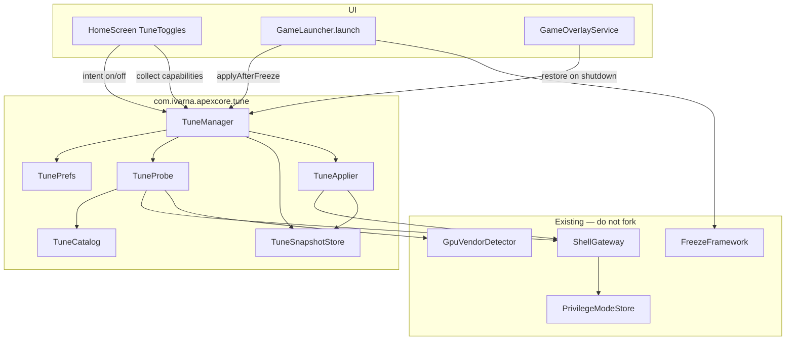
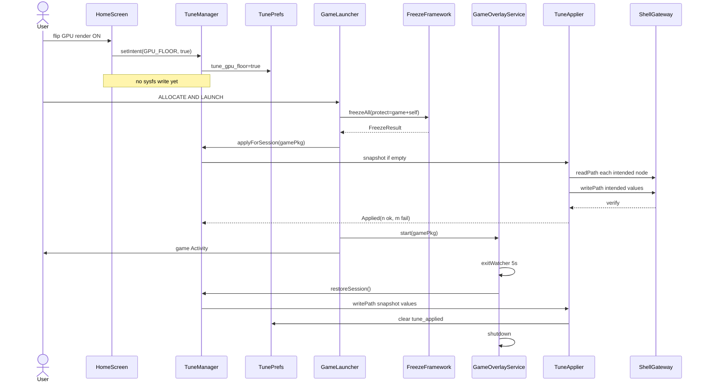
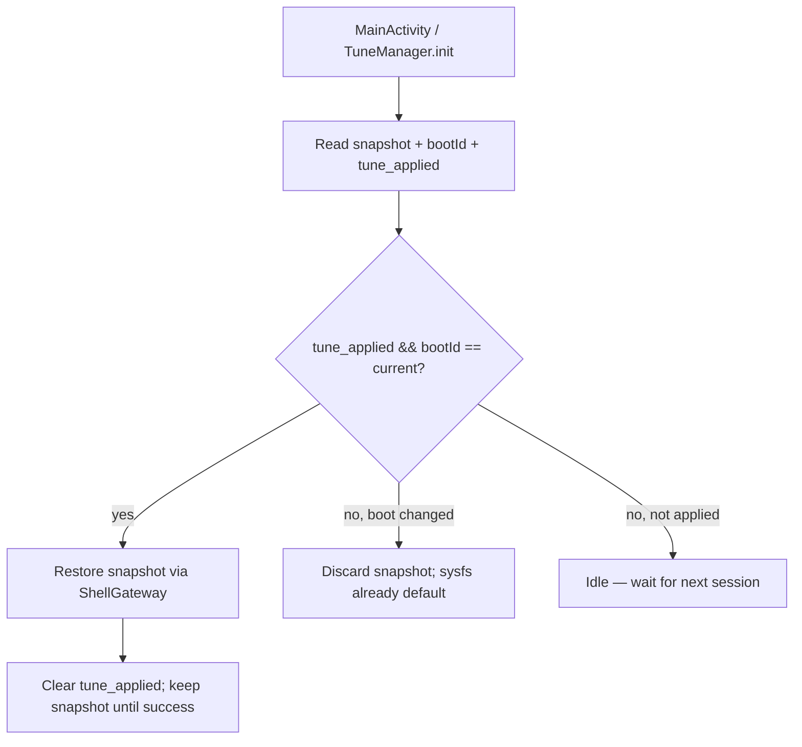

# T12 — Replace dummy Game Optimisation toggles with real kernel / game-boost logic

| Field | Value |
|-------|-------|
| **Document** | Design Spec — Real Game Optimisation |
| **ID** | T12 |
| **Type** | feature |
| **Priority** | P0 (Play policy — deceptive UI) |
| **Author** | TBD |
| **Date** | 2026-08-17 |
| **Status** | Draft |
| **Package** | `com.ivarna.apexcore` |
| **Workspace** | `/home/abhaybyte/repos/apexcore` |
| **Target** | Android 16 / compileSdk 36 / targetSdk 36 / minSdk 24 |
| **Audience** | Senior Android / systems engineers who know ApexCore |
| **Branch (proposed)** | `T12-real-game-optimisation` |
| **Does not overwrite** | `docs/plan/` (this lives in `docs/plans/`) |

---

## Overview

`GameOptimisationToggles` in [`HomeScreen.kt`](../../app/src/main/kotlin/com/ivarna/apexcore/ui/home/HomeScreen.kt) is Play-policy **P0 deceptive UI**. Four switches persist to `dummy_opt_*` under SharedPreferences file `"apexcore"` and do nothing. The comment on the composable admits this: *“Dummy game optimisation toggles… no system side effects yet.”* Unlock copy (“Connect Shizuku or Root”) implies elevation makes the toggles real. It does not.

This design replaces those dummies with a **capability-first, reversible, game-session kernel profile** implemented natively in ApexCore. It reuses ideas and **path catalogs** from three researched kernel-manager apps (Xtra Kernel Manager, RvKernel Manager, SmartPack Kernel Manager) but **does not copy their GPL Java**. Writes go through the existing [`ShellGateway`](../../app/src/main/kotlin/com/ivarna/apexcore/fps/privilege/ShellGateway.kt) / privilege model. ApexCore remains a game booster, not a kernel manager.

**Chosen path (Play P0 option 3):** implement real, user-disclosed, reversible effects. Do not remove the section. Do not relabel “coming soon”.

---

## Background & Motivation

### Current state (verified in tree)

| Piece | Location | Reality |
|-------|----------|---------|
| Dummy toggles | `ui/home/HomeScreen.kt` `GameOptimisationToggles` | Shown only when `backendName == "Shizuku" \|\| "Root"` |
| Prefs keys | same file | `dummy_opt_gpu_render`, `dummy_opt_cpu_thread`, `dummy_opt_opengl`, `dummy_opt_kernel` |
| Labels | same file | GPU render / CPU threading / OpenGL / Kernel — copy implies system effect |
| Home Purge (BOOST) | `ui/shell/MainScreen.kt` → `FreezeFramework.freezeAll` | Force-stop background apps. **Not** kernel boost. |
| Overlay BOOST | `games/GameOverlayService.kt` ~L424 | Same freeze, with protect set. **Not** kernel boost. |
| `BoostManager.kick` | `BoostManager.kt` | `killBackgroundProcesses` + `/proc/meminfo`. Dead-name collision. Unused by Home Purge. |
| Game launch | `games/GameLauncher.launch` | Freeze all except game + ApexCore, start overlay. No kernel writes. |
| Overlay end | `GameOverlayService.startExitWatcher` / `shutdown` | UsageStats poll 5 s; no restore hook today. |
| Privilege | `fps/privilege/{ShellGateway,PrivilegeTier,PrivilegePolicy,PrivilegeModeStore}` | T1 Root `su -c`, T2 Shizuku `newProcess`, T3 `sh -c`. Fail-closed when mode is forced. |
| GPU detect | `fps/util/GpuVendorDetector` | Adreno / Mali / Unknown. No Tensor/PowerVR enum yet. |
| Shell write | **missing** | `ShellGateway` has `readPath` / `execute` only. No `writePath`. |
| INTERNET | manifest | **None.** Keep it. No cloud profiles. |
| Tests | `app/src/test/java/…/freeze/` | JUnit4 + Mockito; `FreezeFramework.setResolverForTest` seam. |

Play policy source: [`docs/Play_Policy_Gaps_Not_Followed.md`](../Play_Policy_Gaps_Not_Followed.md) §1. Required fix chosen: implement real reversible effects.

### Pain points

1. Reviewers and users reasonably believe the four switches change GPU/CPU/kernel behaviour.
2. Elevation unlock implies capability that does not exist.
3. There is no probe, no apply, no restore, and no honest “not on this kernel” state.
4. Naming collision: product “BOOST” = freeze. Kernel “boost” = sysfs. Must not merge these.

### What the three research apps actually do (ideas only)

**Xtra Kernel Manager** (`/tmp/grok-1000/research/Xtra-Kernel-Manager`, GPL-incompatible to copy):

- `GameControlUseCase.performGameBoost()`: `setPerformanceMode("performance")` + thermal “Dynamic” + `enableMonsterMode()` + `drop_caches`/`am kill-all`.
- `enableMonsterMode()`: per-cpu `scaling_min_freq = cpuinfo_max_freq`, `scaling_governor=performance`, then kgsl `force_clk_on`, `gpuclk=max_gpuclk`, `throttling=0`, `force_bus_on`, `force_rail_on`.
- `disableMonsterMode()`: governor back to `schedutil`, force_* back to 0. **Does not restore original min/max freqs** — ApexCore must do better.
- `GPUControlUseCase.lockGPUFrequency` / `unlockGPUFrequency`: snapshot-less lock via devfreq min/max, governor `performance` when min==max, restore `msm-adreno-tz` or `simple_ondemand`.
- `ThermalControlUseCase`: Xiaomi-style `/sys/class/thermal/thermal_message/sconfig` with chmod 666 → write → chmod 444. Maps Dynamic=10, Extreme=2, Class 0=11.
- `SmartCPULocker`: snapshots `OriginalFreqConfig` then restores. **This is the restore pattern ApexCore should adopt.**
- `GameMonitorService` is an **AccessibilityService**. ApexCore **must not** copy this. Session lifecycle is GameLauncher + existing overlay exit watcher.
- `setGPURenderer` mutates `debug.hwui.renderer` and remounts `/vendor` / `/system`. **Out of scope.** That is HWUI for *this app*, not game GL, and is not portable or Play-safe.

**RvKernel Manager** (`/tmp/grok-1000/research/RvKernel-Manager`):

- `SoCUtils.kt`: canonical Snapdragon sysfs constants — `policyN/scaling_*`, kgsl `devfreq/governor`, `adrenoboost`, `min/max_pwrlevel`, `throttling`, `cpu_boost/input_boost_ms`.
- `BatteryUtils.THERMAL_SCONFIG` + `BatteryScreen.ThermalProfilesCard`: profile id **`"13"` = Gaming**. Also 0 default, 10 benchmark, 11 browser, 12 camera, 8 dialer, 14 streaming.
- `BatteryViewModel.updateThermalSconfig`: `Utils.setPermissions(644)` → write → `setPermissions(444)`.
- `kernel-profile-template/performance.sh`: CPU governor performance, GPU governor performance, `default_pwrlevel=0`, `throttling=0`, optional adrenoboost 3, sconfig **10** (benchmark, not gaming). ApexCore prefers **13**.
- Root-only (README). Snapdragon-focused. ApexCore must also probe Mali / Tensor / Samsung.

**SmartPack Kernel Manager** (Kernel Adiutor fork, GPL — **research only**):

- `CPUBoost`: `/sys/module/cpu_boost/parameters/{cpu_boost,cpuboost_enable,input_boost_enabled,boost_ms,input_boost_ms,input_boost_freq,sched_boost_on_input}` + `/sys/module/msm_performance/parameters/touchboost`.
- `CPUInputBoost` (Sultanxda): `/sys/kernel/cpu_input_boost` and `/sys/module/cpu_input_boost/parameters`.
- `StuneBoost`: `/dev/stune/top-app/schedtune.boost` + `dynamic_stune_boost`.
- `Adrenoboost`: `/sys/class/kgsl/kgsl-3d0/devfreq/adrenoboost` (0–3).
- `DevfreqBoost`: `/sys/module/devfreq_boost/parameters/{input_boost_duration,msm_cpubw_boost_freq}`.
- `GPUFreq`: multi-vendor path maps (kgsl class, kgsl platform, OMAP, Tegra, PowerVR).
- `GPUMisc`: `default_pwrlevel`, `throttling`.
- `MSMThermal`: `/sys/module/msm_thermal/parameters/enabled` — **full disable is dangerous; ApexCore will not write this as a default**.
- `Spectrum`: `persist.spectrum.profile` / ROM hijack. **Out of scope.**

### Platform notes (Android 16, verified / extended)

- AOSP Game Mode / `GAME` + `GAME_LOADING` ([source.android.com/docs/core/perf/boost](https://source.android.com/docs/core/perf/boost)): OEM Power HAL. No public Pixel reference that a 3P app can call to raise clocks. ApexCore is **not** a game (`android:appCategory` unused). We do **not** depend on GameManager interventions for *other* packages.
- Android 16 ADPF headroom APIs (`SystemHealthManager.getCpuHeadroom` / `getGpuHeadroom`) are for **the calling app**. Useless for boosting a launched game.
- Android 16 GPU syscall filtering ([source.android.com/docs/security/features/gpu-syscall-filtering](https://source.android.com/docs/security/features/gpu-syscall-filtering)): production SELinux blocks deprecated/dev Mali IOCTLs and restricts profiling IOCTLs. **Do not open `/dev/mali0` or issue Mali IOCTLs.** Sysfs `devfreq` / GED only when present and writable.
- MediaTek GED is typically mode `0440` (group system). [`PrivilegeTier.SHIZUKU`](../../app/src/main/kotlin/com/ivarna/apexcore/fps/privilege/PrivilegeTier.kt) already documents: Shizuku **cannot** write GED. Fail closed.
- Linux `cpufreq` boost file `/sys/devices/system/cpu/cpufreq/boost` exists on some kernels; treat as optional catalog node.
- Play targetSdk 36 already set. Keep Home/settings resizable; do not lock orientation.
- sw≥600dp Android 16 orientation/resizability: games with `appCategory` excluded; ApexCore is not a game.

---

## Goals & Non-Goals

### Goals

1. Close Play P0: every visible switch either applies a **named, documented, reversible** action bundle or is **disabled with an honest subtitle**.
2. Capability-first probe of a vendor catalog (Adreno, Mali/GED, Samsung, Tensor, generic cpufreq). Apply only to discovered **writable** nodes under the **active** privilege.
3. Snapshot-before-apply; restore on toggle OFF, session end, backend drop, process death (best-effort), and orphan-session recovery on next start.
4. Apply **during an ApexCore game session** (GameLauncher / overlay), not while the user sits on Home.
5. Privilege split: Root full sysfs (chmod-write-restore-perm); Shizuku only already-writable nodes; Standard no kernel writes.
6. Unit tests for probe, apply/restore invertibility, prefs migration, fail-closed privilege.
7. Preserve freeze, whitelist, HUD FPS, RAM Free, Zen Organic, no-INTERNET, targetSdk 36, resizability.

### Non-Goals

- Becoming a kernel manager (no undervolt, voltage tables, I/O scheduler UI, ZRAM resize, TCP congestion UI, Spectrum, Magisk module install, Xposed, wakelock blocker).
- Apply-on-boot in v1.
- Per-game profile editor in v1 (toggles are global; apply is session-scoped).
- AOSP Game Mode / Power HAL / ADPF headroom as a boost mechanism.
- `debug.hwui.renderer`, `persist.sys.*`, vendor remount, ANGLE force, Mali IOCTLs, `/proc/ged` ioctl.
- Accessibility for game detection (Xtra `GameMonitorService` pattern).
- Expanding `QUERY_ALL_PACKAGES` or adding INTERNET.
- Renaming Home Purge / overlay BOOST (freeze). Those stay freeze.
- Touching `BoostManager` except a comment pointing at `tune/` so future readers do not merge the names.

---

## Key Decisions

| # | Decision | Rationale |
|---|----------|-----------|
| **KD-1** | New package is **`com.ivarna.apexcore.tune`**, facade **`TuneManager`**. | `BoostManager` already means `killBackgroundProcesses` + meminfo. Product “BOOST” already means freeze. “Tune” is the kernel/session profile. Do not add a second `*Boost*` type. |
| **KD-2** | **No apply-on-boot in v1.** Toggles persist *intent*. Effects apply when a game session starts and restore when it ends. | Sitting on Home with min-freq locked cooks the SoC and drains battery. Overlay already has a session lifetime (`start` → `startExitWatcher` → `shutdown`). Safer default; matches “game booster not kernel manager”. |
| **KD-3** | **Apply-on-game-session**, not apply-on-Home-toggle. Flip ON on Home = persist intent + show “Applies when you launch a game”. Flip OFF = persist + restore immediately if a session is live. | Honesty: the switch is a *policy*, the session is the *effect window*. Avoids dirty sysfs in the launcher. |
| **KD-4** | **Replace OpenGL toggle** with **GPU keep-awake**. | No safe portable OpenGL hook on Android 16. `debug.hwui.renderer` is HWUI for ApexCore itself. Mali IOCTLs are blocked. GED GL hints are 0440 / ioctl. Adjacent real feature: kgsl `force_clk_on` / `force_bus_on` / `force_rail_on` / `idle_timer` (Xtra `enableMonsterMode` / `lockGPUFrequency`). User-facing title changes; dummy `dummy_opt_opengl` is **not** migrated (defaults off). |
| **KD-5** | Thermal: prefer OEM **gaming sconfig `13`** (RvKernel `BatteryScreen` `profile_gaming`). Fallback `10` (benchmark/dynamic) only if `13` write-verify fails. **Never** write `msm_thermal/.../enabled=N` or kgsl `throttling=0` as a default. | Constraint 8. Full thermal disable is advanced/dangerous. GPU throttling disable is a thermal disable in disguise — exclude from default bundles. |
| **KD-6** | **Raise floors, do not pin min=max and do not force `performance` governor as the only action.** Prefer: GPU `min_pwrlevel` toward 0 / `devfreq/min_freq` to ~60th percentile of available; CPU `scaling_min_freq` to ~50th percentile of that cluster; keep current governor unless it is `powersave` (then `schedutil` if listed). Adreno boost = `2` (medium), not `3`. | Pinning max + performance is Xtra Monster Mode. It works, but it is the “cook the phone” profile. Game booster wants fewer frame-time cliffs, not a 24/7 bench. Reversible and less thermally hostile. |
| **KD-7** | **Show the section only when the active backend is Shizuku or Root** (current gate). Inside the section, **each toggle is independently enabled** only if its bundle has ≥1 writable node. Disabled toggles stay visible with honest subtitle. | Matches existing Home density. Standard users already see the elevation banner. Per-toggle honesty is what Play needs. |
| **KD-8** | Probe is **async, cached, non-blocking**. Home first frame never waits on shell. Budget **2000 ms wall**, **120 ms per node**, max **16 nodes probed in parallel per vendor family**, then stop. Cache TTL **60 s** or until `PrivilegeMode` / backend changes. | `HomeScreen` already uses `LaunchedEffect` for meminfo. Shell storms must not jank composition. |
| **KD-9** | Snapshot is **per-session, persisted to `"apexcore"` prefs as JSON**, keyed by boot id. On next process start: if `tune_applied=true` and boot id matches → restore immediately (orphan session). If boot id differs → discard (sysfs already reset by reboot). | Satisfies “persist snapshots so reboot-without-apply-on-boot does not leave dirty state” without re-applying after reboot. |
| **KD-10** | Writes go through **new `ShellGateway.writePath`**. Root: read mode → `chmod 644` → write → verify → restore mode. Shizuku: write current-value test first; if EACCES, node is not writable. Standard: always fail. | Mirrors RvKernel `Utils.setPermissions` + `writeFile` without copying. Fail closed on T2. |
| **KD-11** | **Do not** use Accessibility, a new FGS, or a new privileged service. Hook `GameLauncher.launch` (apply after freeze, before `startActivity`) and `GameOverlayService.shutdown` / `onDestroy` (restore). | Overlay FGS already exists. A second specialUse FGS is unjustified. |
| **KD-12** | Home Purge and overlay BOOST remain **freeze-only**. Tune is orthogonal. Overlay BOOST does **not** re-apply tune. | Avoid double-apply and name confusion. |
| **KD-13** | Clean-room path catalog. **Zero files copied** from the three repos. Cite path + source symbol in this doc only. | SmartPack / Kernel Adiutor are GPL. Xtra and RvKernel are not inbound licenses we can take Java from. |
| **KD-14** | Prefs migrate `dummy_opt_gpu_render` → `tune_gpu_floor`, `dummy_opt_cpu_thread` → `tune_cpu_sched`, `dummy_opt_kernel` → `tune_kernel`. **Do not migrate `dummy_opt_opengl`.** Delete all four dummy keys after one-shot migrate. New key `tune_gpu_hold` defaults false. | OpenGL feature is replaced; migrating a “true” dummy would apply a different effect the user never consented to. |
| **KD-15** | Failure UX is **inline** on Home (subtitle + switch snaps back if apply-intent is impossible). Session-start apply failure is a **short overlay Toast** (existing overlay toast pattern). No Snackbar. No cryo/tech copy. | Zen Organic. Overlay already toasts freeze results. |

---

## Proposed Design

### Architecture



`TuneManager` is a process singleton obtained like `FpsStack.get(context)` (manual composition root, no Hilt). It holds `ShellGateway` from `FpsStack.get(context).shellGateway` so there is **one** privilege/shell stack.

### The four bundles (toggle mapping)

| # | Old dummy | New id | User title | User subtitle (available) | User subtitle (unavailable) | Bundle |
|---|-----------|--------|------------|---------------------------|-----------------------------|--------|
| 1 | GPU render optimisation | `GPU_FLOOR` | GPU render boost | Raise GPU frequency floor during games | Not available on this kernel | Raise GPU min freq / min power level; Adreno boost 2 if present; GPU governor only if current is `powersave` |
| 2 | CPU game threading priority | `CPU_SCHED` | CPU game-thread priority | Raise the scheduling floor for the game | Not available on this kernel / needs Root | Per-cluster `scaling_min_freq` to mid of available; `uclamp.min` on top-app if present; `schedtune.boost` on top-app if present. **Never** `persist.sys.*` |
| 3 | OpenGL GPU optimisation | `GPU_HOLD` | GPU keep-awake | Hold GPU clocks and bus during gameplay | Not available on this kernel / needs Root | kgsl `force_clk_on=1`, `force_bus_on=1`, `force_rail_on=1`, `idle_timer` raised (e.g. 10000). Mali: `devfreq` min raise + GED `gx_game_mode=1` **only if writable**. No IOCTL, no `debug.egl` |
| 4 | Kernel game optimisation | `KERNEL` | Kernel game profile | Use the kernel’s gaming thermal profile | Not available on this kernel / needs Root | `thermal_message/sconfig=13` (fallback 10); `cpufreq/boost=1`; input-boost enable + modest `input_boost_ms`; `devfreq_boost` duration only if present. **No** msm_thermal disable |

If a bundle probes **zero** writable nodes, the switch is disabled and the unavailable subtitle is used. A “on” value is **never** persisted for a bundle that just failed to apply.

### Apply / restore sequence



### Orphan recovery (process death mid-session)



`bootId` source (first that works): `sys.boot.session`, else `ro.boot.bootreason` + `SystemClock.elapsedRealtime()` captured at first `TuneManager.init` after process start is **not** stable across death. Prefer:

```
getprop sys.boot.session
getprop ro.runtime.firstboot
```

Fallback: `/proc/sys/kernel/random/boot_id` (world-readable on most kernels). Persist as `tune_boot_id`.

### Session definition (v1)

A **game session** starts when **either**:

1. `GameLauncher.launch` succeeds (`LaunchResult.success == true`), or
2. `GameOverlayService.onStartCommand` runs with a non-self `EXTRA_PKG` (covers overlay started without launcher in future).

A session **ends** when:

1. `GameOverlayService.shutdown()` or `onDestroy()`, or
2. `TuneManager` sees privilege drop to Standard / backend lost, or
3. User flips all intents OFF while a session is live (restore immediately), or
4. Orphan recovery on next process start.

If the user launches a game **without** overlay permission, `GameLauncher` still calls `GameOverlayService.start` (existing “silently if overlay permission not granted” path). Overlay `onStartCommand` still runs as FGS. Session restore still happens when the exit watcher fires (UsageStats) or the FGS is killed. If overlay start throws, `GameLauncher` must still call `TuneManager.restoreSession()` in a `finally` after a conservative timeout is **not** acceptable (game still running). Instead: `TuneManager.applyForSession` registers a `DefaultLifecycleObserver` on `ProcessLifecycleOwner` **only if overlay failed to start**, and restores when the ApexCore process reaches `ON_STOP` **and** the game is no longer top (UsageStats). Keep this as a narrow fallback in `TuneSessionWatchdog` — do not add Accessibility.

Home Purge does **not** start a tune session.

### Privilege write policy

| Tier | Detect | Read | Write |
|------|--------|------|-------|
| ROOT (T1) | `ShellGateway.canRoot()` | `cat` via `su -c` | `chmod 644` → `printf '%s\n' value > path` → verify → restore original mode |
| SHIZUKU (T2) | `canShizuku()` | `cat` via `newProcess` | Write **only** if a dry-run of the **current** value succeeds (node already shell-writable). No chmod. Fail closed. |
| STANDARD (T3) | always | java `File` if `canRead()` | **Never.** |

Forced `PrivilegeMode.ROOT` / `SHIZUKU` follows existing `PrivilegePolicy.chain` — no silent demotion. AUTO uses `DEFAULT_CHAIN` for **reads**; **writes** use the **active freeze backend** (the same string Home shows: Root / Shizuku), not AUTO fallback. Rationale: a write that silently happened as Root while the chip says Shizuku is dishonest. Implementation: `TuneApplier.writeTier()` = `ROOT` if `backendName=="Root"`, `SHIZUKU` if `"Shizuku"`, else abort.

### Probe algorithm (must not block composition)

```
TuneProbe.probe(now):
  if cache valid (age < 60s) and privilege fingerprint unchanged:
    return cache
  vendor = GpuVendorDetector.detect(shellExecutor)   // already cached
  candidates = TuneCatalog.nodesFor(vendor) ∪ TuneCatalog.GENERIC
  // GENERIC always includes cpufreq policies, sconfig, cpufreq/boost, stune, uclamp
  sort candidates so vendor-primary nodes go first
  deadline = now + 2000ms
  results = empty
  for each batch of up to 8 candidates:
    if now > deadline: break
    parallel(timeout 120ms each):
      exists?  test -e path   (or File.exists for world-visible)
      readable? ShellGateway.readPath
      writable? 
        ROOT: assume writable if exists (chmod path available)
        SHIZUKU: write-back current value; success ⇒ writable
        STANDARD: writable = false
    record TuneNodeState(path, exists, readable, writable, currentValue, vendorTag)
  group nodes by TuneId
  capability(id) = enabled iff any node in bundle is writable
  cache + emit StateFlow
```

Home:

```kotlin
LaunchedEffect(isElevatedBackend, backendName) {
    if (isElevatedBackend) TuneManager.get(context).refreshCapabilities()
}
val caps by TuneManager.get(context).capabilities.collectAsState()
```

Do **not** call `refreshCapabilities()` from `@Composable` without `LaunchedEffect`. First paint uses last cache or “probing…” subtitles (`enabled=false` until first result). “Probing…” must not look like the switch works.

### Value selection (concrete, not “boost a lot”)

All numeric writes pick from the node’s **available** list (or a documented constant). Never write a frequency that is not in `scaling_available_frequencies` / `gpu_available_frequencies` / `freq_table_mhz`.

| Node family | Apply value | Restore |
|-------------|-------------|---------|
| CPU `scaling_min_freq` | `available[size/2]` (median), clamped ≤ current `scaling_max_freq` | snapshot |
| CPU `scaling_governor` | only if current ∈ {`powersave`, `conservative`} → `schedutil` if listed else leave | snapshot |
| GPU `devfreq/min_freq` or `min_gpuclk` | available freq at ~60th percentile | snapshot |
| GPU `min_pwrlevel` | `max(0, currentMinPwr - 2)` — Adreno 0 is highest clk | snapshot |
| GPU `devfreq/governor` | only if current is `powersave` → `msm-adreno-tz` if listed else `simple_ondemand` | snapshot |
| `adrenoboost` | `2` (medium; SmartPack/flar2 range 0–3) | snapshot |
| `force_{clk,bus,rail}_on` | `1` | snapshot (usually `0`) |
| `idle_timer` | `10000` if current < 10000 | snapshot (Xtra unlock uses `80`) |
| `sconfig` | `13`, else `10` if verify of 13 fails | snapshot |
| `cpufreq/boost` | `1` | snapshot |
| `input_boost_enabled` / `cpu_boost` | `1` or `Y` matching the node’s existing alphabet | snapshot |
| `input_boost_ms` | `max(current, 64)` capped at `128` | snapshot |
| `/dev/stune/top-app/schedtune.boost` | `10` if current < 10, cap 20 | snapshot |
| `/dev/cpuctl/top-app/cpu.uclamp.min` | `10` (percent) if current < 10 | snapshot |
| GED `gx_game_mode` | `1` | snapshot |
| GED `gpu_dvfs_enable` | **do not write** (forces max clock; thermal risk) | — |

`printf` not `echo -n` for values that must not grow a newline-sensitive parser? Most sysfs accept `echo value`. Use `printf '%s\n' "$value"` via `su -c` to avoid dash-echo flags.

### ShellGateway additions

Add to [`ShellGateway.kt`](../../app/src/main/kotlin/com/ivarna/apexcore/fps/privilege/ShellGateway.kt) (same file, no second shell):

```kotlin
data class WriteResult(
    val ok: Boolean,
    val verified: Boolean,
    val readback: String?,
    val tier: PrivilegeTier?,
    val error: String? = null
)

fun writePath(
    path: String,
    value: String,
    tier: PrivilegeTier,
    restoreMode: Boolean = true
): WriteResult
```

Root script (single `su -c` to cut process spawn):

```sh
path="$1"; value="$2"
if [ ! -e "$path" ]; then echo "ENOENT"; exit 2; fi
mode=$(stat -c '%a' "$path" 2>/dev/null || echo "")
chmod 644 "$path" 2>/dev/null
printf '%s\n' "$value" > "$path"
rc=$?
readback=$(cat "$path" 2>/dev/null | tr -d '\n')
if [ -n "$mode" ]; then chmod "$mode" "$path" 2>/dev/null; fi
printf 'RC=%s READBACK=%s\n' "$rc" "$readback"
```

Pass `path`/`value` via env or positional args — **never** string-interpolate user-controlled values into `su -c` beyond the catalog (catalog paths are constants). Values are integers or short tokens (`schedutil`, `13`, `Y`). Reject any value matching `[^A-Za-z0-9_.:-]`.

Shizuku: same printf redirect **without** chmod. If `rc!=0`, `WriteResult(ok=false)`.

Also add `fun exists(path: String, tier: PrivilegeTier): Boolean` using `test -e`.

### Thermal safety interlock

During an applied session, `TuneManager` does **not** run a thermal polling loop in v1 (Xtra `SmartCPULocker` does; we skip to stay small). Rely on:

- Not disabling thermal.
- Floor raises, not max pins.
- Session-scoped lifetime.

Document as accepted residual risk (device can still get warm). v2 may add a 15 s thermal-zone poll that restores if `cpu` zone > 85 °C.

### Interaction with existing BOOST / overlay / RAM Free

| Surface | Tune interaction |
|---------|------------------|
| Home Purge pebble | Freeze only. Does not apply/restore tune. Toggles disabled while `State.BOOSTING` (already). |
| Overlay BOOST pebble | Freeze only (`FreezeFramework.freezeAll` + protect). Does not re-apply tune. |
| GameLauncher | Freeze, **then** `TuneManager.applyForSession`, then start Activity + overlay. |
| Overlay `shutdown`/`onDestroy` | `TuneManager.restoreSession()` **before** `stopSelf`. Must be best-effort and swallow errors. |
| RAM Free | Unchanged. May optionally run after a game session; restore already happened. |
| Whitelist / freeze filter | Unchanged. |
| FPS daemon | Unchanged. Tune writes do not touch tracing/GED ioctl. |
| Backend dropdown change mid-session | `PrivilegeModeStore` listener → if new mode cannot hold the writes, restore immediately and mark capabilities dirty. |

### UI (Zen Organic)

Keep the `GAME OPTIMISATION` header and glass card. Replace `DummyOptToggleRow` with `TuneToggleRow`:

- Available + intent on: switch on, subtitle = available copy.
- Available + intent off: switch off.
- Unavailable: switch off, `enabled=false`, subtitle = `"Not available on this kernel"` or `"Needs Root"` (when exists but Shizuku cannot write **and** Root is not the active backend).
- Probing: switch disabled, subtitle `"Checking this kernel…"`.
- Section footer (11.sp, `onSurfaceVariant`): `"Applies when you launch a game from ApexCore. Restored when the session ends."`

Copy lock (Play honesty):

- Never say “OpenGL”, “kernel-level hints”, “tune GL driver” unless that exact node applied.
- Never persist a visual ON when `setIntent` returns false.
- Standard / non-elevated: section stays hidden; existing `ShizukuConnectBanner` remains the honesty surface.

Do not reintroduce cryo/tech tokens, ASCII, or Material-extended icons.

### Failure UX

| Event | UX |
|-------|----|
| Probe timeout | Unavailable subtitle; log `ApexCore.Tune` warn |
| Flip ON, bundle empty | Switch refuses (enabled=false already) |
| Flip ON, then later session apply 0/N | Overlay Toast `"Game tune skipped — kernel nodes not writable"`; intents stay on (retry next session) |
| Session apply partial | Apply what worked; snapshot only nodes that changed; Toast only if 0 succeeded |
| Restore fail | Log error; leave `tune_applied=true` so next start retries restore |
| Backend drop | Restore; capabilities → all unavailable |

No Home Snackbar. No dialog.

---

## API / Interface Changes

### New types (`com.ivarna.apexcore.tune`)

```kotlin
enum class TuneId { GPU_FLOOR, CPU_SCHED, GPU_HOLD, KERNEL }

data class TuneCapability(
    val id: TuneId,
    val available: Boolean,
    val needsRoot: Boolean,          // exists but T2 cannot write
    val writablePaths: List<String>, // for debug / tests
    val subtitle: String
)

data class TuneNode(
    val path: String,
    val id: TuneId,
    val vendor: TuneVendor,          // ADRENO, MALI, SAMSUNG, TENSOR, GENERIC
    val privilege: TunePrivilege,    // ROOT_ONLY or SHELL_OK
    val valueKind: TuneValueKind     // RAW, FREQ_KHZ, FREQ_HZ, PWRLEVEL, ENUM
)

enum class TuneVendor { ADRENO, MALI, SAMSUNG, TENSOR, GENERIC }
enum class TunePrivilege { ROOT_ONLY, SHELL_OK }

data class TuneApplyReport(
    val applied: Int,
    val failed: Int,
    val skipped: Int,
    val sessionActive: Boolean
)

class TuneManager private constructor(...) {
    val capabilities: StateFlow<Map<TuneId, TuneCapability>>
    val sessionActive: StateFlow<Boolean>
    fun refreshCapabilities()
    fun intent(id: TuneId): Boolean
    fun setIntent(id: TuneId, on: Boolean): Boolean   // false ⇒ do not flip UI on
    suspend fun applyForSession(gamePkg: String): TuneApplyReport
    suspend fun restoreSession(): TuneApplyReport
    fun migratePrefsIfNeeded()

    companion object {
        fun get(context: Context): TuneManager
        fun setInstanceForTest(instance: TuneManager?)
    }
}
```

### Call sites (existing files)

| File | Change |
|------|--------|
| `ui/home/HomeScreen.kt` | Delete dummy keys, `GameOptimisationToggles` dummy persist, `DummyOptToggleRow`. New `TuneToggles` collecting `TuneManager`. |
| `games/GameLauncher.kt` | After successful freeze+intent resolve, `TuneManager.get(ctx).applyForSession(gamePkg)` before `startActivity`. |
| `games/GameOverlayService.kt` | `onStartCommand`: `applyForSession` if not already applied (idempotent). `shutdown`/`onDestroy`: `restoreSession()`. |
| `fps/privilege/ShellGateway.kt` | `writePath`, `exists`. |
| `fps/util/GpuVendorDetector.kt` | Add `TENSOR`, `POWERVR` to `GpuVendor` **only if** detect paths are cheap and existing `displayName` call sites are updated. Prefer detecting Tensor as `MALI` still (Pixel Mali) and adding a `isTensor(): Boolean` helper via `ro.soc.manufacturer=Google` to pick Tensor catalog extras — **do not break** `FpsStack.gpuVendor()` Adreno/Mali routing. **Safer: leave `GpuVendor` enum unchanged;** `TuneCatalog` uses `GpuVendor` + `ro.soc.manufacturer` / `ro.board.platform` separately. |
| `BoostManager.kt` | File-level KDoc: *“Process killer, not kernel tune. See `tune/TuneManager`.”* No behaviour change. |
| `ui/shell/MainScreen.kt` | After `FpsStack.get` / backend detect, `TuneManager.get(context).migratePrefsIfNeeded()` + orphan restore. |
| `fps/privilege/PrivilegeModeStore` | No API change. `TuneManager` already listens via `FpsStack.privilegeModeStore.addOnModeChangedListener`. |

### Idempotency

`applyForSession` is a no-op if `sessionActive` and snapshot already taken for this boot id. Re-entry from both GameLauncher **and** overlay `onStartCommand` is expected.

`restoreSession` is a no-op if not applied.

---

## Data Model Changes

Prefs file remains `"apexcore"` (`Context.MODE_PRIVATE`). No Room. No new files on external storage.

| Key | Type | Meaning |
|-----|------|---------|
| `tune_gpu_floor` | Boolean | Intent GPU_FLOOR |
| `tune_cpu_sched` | Boolean | Intent CPU_SCHED |
| `tune_gpu_hold` | Boolean | Intent GPU_HOLD (new; default false) |
| `tune_kernel` | Boolean | Intent KERNEL |
| `tune_migrated_v1` | Boolean | Migration guard |
| `tune_applied` | Boolean | Sysfs currently dirty from us |
| `tune_boot_id` | String | Boot id at apply time |
| `tune_snapshot_json` | String | `{"path":"value",...}` only nodes we wrote |
| `tune_session_pkg` | String | Last game pkg (debug) |

Migration (once):

```
if (!tune_migrated_v1):
  tune_gpu_floor = dummy_opt_gpu_render
  tune_cpu_sched = dummy_opt_cpu_thread
  tune_kernel    = dummy_opt_kernel
  // dummy_opt_opengl discarded
  remove dummy_opt_*
  tune_migrated_v1 = true
```

Uninstall clears prefs (no leftover apply-on-boot). Mid-session uninstall cannot restore — accepted; reboot resets sysfs.

No cloud. No INTERNET.

---

## Capability matrix

Privilege: **R** = typically Root-only (mode 0444/0440 or oem group). **S** = sometimes shell-writable on custom kernels. **Probe** decides. Reversible = we snapshot the node we write.

Sources: XKM = Xtra symbol, RV = RvKernel symbol, SP = SmartPack symbol. Paths are industry-standard sysfs; we reimplement.

### GPU_FLOOR

| Path | Vendor | Priv | Reversible | Android 16 | Source |
|------|--------|------|------------|------------|--------|
| `/sys/class/kgsl/kgsl-3d0/devfreq/min_freq` | Adreno | R/S | yes | OK | SP `GPUFreq.MIN_KGSL3D0_DEVFREQ_FREQ`; XKM `GPUControlUseCase.setGPUFrequency` |
| `/sys/class/kgsl/kgsl-3d0/min_gpuclk` | Adreno | R | yes | OK | XKM `setGPUFrequency` |
| `/sys/class/kgsl/kgsl-3d0/min_clock_mhz` | Adreno | R/S | yes | OK | RV `SoCUtils.MIN_FREQ_GPU` |
| `/sys/class/kgsl/kgsl-3d0/min_pwrlevel` | Adreno | R | yes | OK | RV `MIN_PWRLEVEL`; SP `GPUMisc` |
| `/sys/class/kgsl/kgsl-3d0/devfreq/adrenoboost` | Adreno (flar2) | R | yes | Custom kernels | RV `ADRENO_BOOST`; SP `Adrenoboost` |
| `/sys/class/kgsl/kgsl-3d0/devfreq/governor` | Adreno | R | yes | OK | RV `GOV_GPU`; XKM `getGPUGovernor` |
| `/sys/class/kgsl/kgsl-3d0/gpu_available_frequencies` | Adreno | read | n/a | OK | XKM / SP / RV |
| `/sys/class/kgsl/kgsl-3d0/freq_table_mhz` | Adreno | read | n/a | OK | RV `AVAILABLE_FREQ_GPU` |
| `/sys/class/devfreq/*mali*/min_freq` | Mali | R | yes | Prefer this; no IOCTL | XKM rust `gpu.rs` mali clock family; SP PowerVR-style devfreq |
| `/sys/class/misc/mali0/device/devfreq/*/min_freq` | Mali | R | yes | OK if present | XKM rust mali paths |
| `/sys/kernel/gpu/gpu_min_clock` | Samsung / generic | R | yes | Device-specific | SP `GPUFreq` style catalog |
| `/sys/kernel/gpu/gpu_governor` | Samsung | R | yes | Device-specific | SP / community |

### CPU_SCHED

| Path | Vendor | Priv | Reversible | Android 16 | Source |
|------|--------|------|------------|------------|--------|
| `/sys/devices/system/cpu/cpufreq/policyN/scaling_min_freq` | Generic | R/S | yes | OK | RV `MIN_FREQ_CPUx`; XKM `CPUControlUseCase.setClusterFrequency` |
| `/sys/devices/system/cpu/cpufreq/policyN/scaling_available_frequencies` | Generic | read | n/a | OK | RV / XKM |
| `/sys/devices/system/cpu/cpufreq/policyN/scaling_governor` | Generic | R/S | yes | OK | RV `GOV_CPUx`; XKM `setClusterGovernor` |
| `/sys/devices/system/cpu/cpuN/cpufreq/*` | Generic (no policy dir) | R/S | yes | Older kernels | XKM shell fallback |
| `/dev/stune/top-app/schedtune.boost` | EAS (older) | R | yes | Often absent on 5.10+ | SP `StuneBoost.STUNE` |
| `/dev/cpuctl/top-app/cpu.uclamp.min` | EAS (newer) | R | yes | Common | RV `KernelUtils.SCHED_UTIL_CLAMP_MIN` family; uclamp cgroup |
| `/proc/sys/kernel/sched_util_clamp_min` | Generic | R | yes | Global — use **only if** cgroup uclamp missing; write modest `64` | RV `SCHED_UTIL_CLAMP_MIN` |
| `/dev/stune/top-app/schedtune.prefer_idle` | EAS | R | yes | Optional, write `1` | SP `StuneBoost` |

Do **not** write `sched_util_clamp_max` (RV exposes it; we are a floor raiser).

Policy discovery: `ls /sys/devices/system/cpu/cpufreq/policy*` (0, 3, 4, 6, 7 as in `SoCUtils`, plus whatever exists up to 16). Grouping by `cpuinfo_max_freq` is XKM’s cluster heuristic — use policy dirs first (one write per cluster).

### GPU_HOLD (replaces OpenGL)

| Path | Vendor | Priv | Reversible | Android 16 | Source |
|------|--------|------|------------|------------|--------|
| `/sys/class/kgsl/kgsl-3d0/force_clk_on` | Adreno | R | yes | OK | XKM `enableMonsterMode` / `lockGPUFrequency` |
| `/sys/class/kgsl/kgsl-3d0/force_bus_on` | Adreno | R | yes | OK | same |
| `/sys/class/kgsl/kgsl-3d0/force_rail_on` | Adreno | R | yes | OK | same |
| `/sys/class/kgsl/kgsl-3d0/idle_timer` | Adreno | R | yes | OK | XKM lock=`0`, unlock=`80`; we write `10000` not `0` |
| `/sys/module/ged/parameters/gx_game_mode` | MTK Mali | R (0440) | yes | Root only | Community / Project Zero GED; XDA `gpu_dvfs_enable` sibling |
| `/sys/module/ged/parameters/gx_force_cpu_boost` | MTK Mali | R | yes | Root only | GED parameters family |
| `/sys/module/ged/parameters/boost_gpu_enable` | MTK Mali | R | yes | Root only | GED |
| `/proc/ged` | MTK | ioctl | **do not use** | Hardened | Project Zero 2024 |
| `/dev/mali0` | Mali | ioctl | **do not use** | Blocked on Pixel/A16 | AOSP GPU syscall filtering |

Explicitly **rejected** for this toggle: `debug.hwui.renderer`, `debug.egl.force_msaa`, `debug.egl.swapinterval`, `persist.sys.gpu*`, vendor remount (XKM `setGPURenderer`).

### KERNEL

| Path | Vendor | Priv | Reversible | Android 16 | Source |
|------|--------|------|------------|------------|--------|
| `/sys/class/thermal/thermal_message/sconfig` | Xiaomi / some OEM | R | yes | Write via chmod dance | RV `BatteryUtils.THERMAL_SCONFIG` value **13**; XKM `ThermalControlUseCase.sconfigPath`; `performance.sh` uses 10 |
| `/sys/devices/system/cpu/cpufreq/boost` | Generic | R/S | yes | If present | Linux cpufreq |
| `/sys/module/cpu_boost/parameters/input_boost_enabled` | QCOM custom | R | yes | Custom | SP `CPUBoost.sEnable` |
| `/sys/module/cpu_boost/parameters/cpuboost_enable` | QCOM custom | R | yes | Custom | SP |
| `/sys/module/cpu_boost/parameters/cpu_boost` | QCOM custom | R | yes | Custom | SP |
| `/sys/module/cpu_boost/parameters/input_boost_ms` | QCOM custom | R | yes | Custom | SP `CPU_BOOST_INPUT_MS` |
| `/sys/devices/system/cpu/cpu_boost/input_boost_ms` | QCOM | R | yes | Custom | RV `CPU_INPUT_BOOST_MS` |
| `/sys/devices/system/cpu/cpu_boost/sched_boost_on_input` | QCOM | R | yes | Custom | RV `CPU_SCHED_BOOST_ON_INPUT` |
| `/sys/kernel/cpu_input_boost/enabled` | Sultanxda | R | yes | Custom | SP `CPUInputBoost` |
| `/sys/module/cpu_input_boost/parameters/input_boost_duration` | Sultanxda | R | yes | Custom | SP |
| `/sys/module/devfreq_boost/parameters/input_boost_duration` | Sultanxda | R | yes | Custom | SP `DevfreqBoost` |
| `/sys/module/msm_performance/parameters/touchboost` | QCOM | R | yes | Custom | SP `CPU_TOUCH_BOOST` |
| `/sys/module/msm_thermal/parameters/enabled` | QCOM | R | yes | **DO NOT WRITE** | SP `MSMThermal` — thermal disable |
| `/sys/class/kgsl/kgsl-3d0/throttling` | Adreno | R | yes | **DO NOT WRITE in v1** | RV `GPU_THROTTLING`; XKM monster sets 0 |

`sconfig` known ids (RV `BatteryScreen.thermalProfilesOptions`): `0` default, `8` dialer, `10` benchmark, `11` browser, `12` camera, **`13` gaming**, `14` streaming. XKM aliases 10=Dynamic, 2=Extreme — we never write `2`.

### Catalog implementation note

`TuneCatalog` is a Kotlin `object` of `List<TuneNode>` constants plus:

```kotlin
fun discoverPolicies(): List<String>  // /sys/devices/system/cpu/cpufreq/policy*
fun discoverMaliDevfreq(): List<String> // /sys/class/devfreq/*mali* and misc/mali0
```

Discovery uses `ls` via `ShellGateway.execute` once per probe, not a hardcoded 0/3/4/6/7-only table (RvKernel’s Snapdragon assumption). Always include policy0 if present.

---

## Alternatives Considered

### A. Remove the section until features exist

Play P0 option 1. Fastest compliance. Rejects the user’s chosen path (implement real effects). Also deletes a useful Home surface we can make honest.

**Trade-off:** zero fragmentation risk, zero thermal risk, loses the product hook.

### B. Relabel “Coming soon” and disable switches

Play P0 option 2. Honest but dead UI. Zen would still show four inert rows. Reviewers may still ask why elevation unlocks a coming-soon card.

**Trade-off:** cheap; does not close the “why is this here” product question.

### C. Full kernel manager (Xtra/RvKernel/SmartPack clone)

Per-cluster sliders, apply-on-boot, Spectrum, thermal disable, renderer remount.

**Trade-off:** huge scope, GPL risk if we copy, Play Device & Network Abuse exposure, fights ApexCore’s game-booster identity. Rejected by constraint 6.

### D. Apply immediately when the Home switch flips (global, until OFF)

Simpler mental model. Device stays boosted in the launcher.

**Trade-off:** heat, battery, Play “interferes with other apps” optics. Rejected in favor of KD-2/KD-3.

### E. Depend on AOSP Game Mode / Power HAL

No 3P API to put *another* app into `GAME`/`GAME_LOADING`. ADPF headroom is self-only. OEM-specific.

**Trade-off:** would be the “clean” Android 16 path if it existed for boosters. It does not.

### F. Chosen: session-scoped capability bundles (this doc)

Implements P0 option 3, stays a game booster, fail-closed, reversible. Cost: fragmentation (some devices will show 0–2 live toggles). Honesty makes that OK.

---

## Security & Privacy Considerations

| Topic | Handling |
|-------|----------|
| Threat: arbitrary sysfs write | Catalog allow-list only. Values charset-validated. No user-typed paths. |
| Threat: command injection via `su -c` | Paths are constants or `policy\d+` / `devfreq/[A-Za-z0-9:._-]+`. Values charset-restricted. Prefer argv-style `su -c` script with positional params. |
| Threat: thermal runaway | No thermal disable; floors not pins; session-scoped; no apply-on-boot. |
| Threat: privilege confusion | Writes follow the **visible** backend, not AUTO silent Root. |
| Shizuku surface | No chmod. Cannot write GED 0440. Documented in `PrivilegeTier`. |
| Accessibility | Not used. |
| Overlay | Existing FGS only; no new overlay abuse. |
| Package visibility | No QAP expansion. |
| Data | Local prefs only. Snapshot is path→value of **our** nodes, not PII. |
| INTERNET | Still none. No cloud profile download. |
| Uninstall | Prefs gone; kernel state lasts until reboot if we died dirty. Orphan restore covers process death, not uninstall. Accepted. |
| Licensing | Research-only use of cloned repos. No GPL Java in `app/`. |

---

## Observability

Tag: `ApexCore.Tune`.

| Event | Level | Fields |
|-------|-------|--------|
| probe start/end | I | vendor, backend, ms, nExists, nWritable, budgetHit |
| capability | D | TuneId, available, needsRoot, paths |
| apply | I | pkg, id, path, from, to, verified |
| apply fail | W | path, error, tier |
| restore | I | nRestored, nFail |
| orphan restore | W | bootId match/mismatch |
| privilege drop restore | W | fromMode, toMode |

No analytics network. Optional in-memory last `TuneApplyReport` for a future Settings debug row — **not** in v1 Settings UI (avoid kernel-manager creep). `adb logcat -s ApexCore.Tune` is the field tool.

Metrics (local only, if we add a debug build overlay later): apply latency, % sessions with 0 writes, % restore failures. Not shipped as user-visible stats in v1.

Alerting: none (no backend).

---

## Rollout Plan

1. Feature is the four toggles. No remote flag (no INTERNET). Ship in the same APK as the rest of ApexCore.
2. Staged by **privilege and capability**: Standard users see no change except the dummy section stays gone (still hidden). Elevated users on stock Pixel Mali will likely see 0–1 toggles live (cpufreq min if Root). Snapdragon + Root will see 3–4.
3. Internal dogfood: one Adreno Root, one Mali Root, one Shizuku-only Snapdragon. Confirm restore after overlay exit and after `am force-stop com.ivarna.apexcore` mid-game.
4. Play listing: only mention Game Optimisation **after** this ships, and only as “optional kernel tuning when your device exposes it; restored after the game”.
5. Rollback: revert the `tune/` package and restore dummy UI? **No** — rollback must not resurrect dummies. Rollback = hide the section entirely (`if (false && isElevatedBackend)` or a local `tune_ui_enabled` pref default true that we can set false in a hotfix). Prefer hide over dummy.

---

## Test Plan

### Unit (`app/src/test/java/com/ivarna/apexcore/tune/`)

Mirror freeze tests: JUnit4, no Robolectric required if `ShellGateway` is an interface **or** we inject a `TuneShell` seam.

**Seam:** extract `interface TuneShell { fun read(path): String?; fun write(path, value, tier): WriteResult; fun exists(path): Boolean }` implemented by `ShellGatewayTuneShell`. Tests use a `FakeTuneShell` map.

| Test | Assert |
|------|--------|
| `TuneCatalogTest` | Every node path is absolute, unique, charset-safe |
| `TuneProbeTest` | Writable node ⇒ capability true; exists-not-writable + Shizuku ⇒ `needsRoot`; empty map ⇒ all false |
| `TuneProbeTimeoutTest` | Fake shell sleeps >2000 ms ⇒ probe returns partial, does not throw |
| `TuneApplierInvertTest` | apply then restore returns fake shell to original map |
| `TuneApplierSkipsUnlistedFreq` | available `100 200 300`, apply writes `200` not `999` |
| `TuneApplierRejectsBadValue` | value with `;` or space rejected |
| `TuneApplierNoThermalDisable` | catalog for KERNEL / GPU_HOLD does not contain `msm_thermal/.../enabled` or `throttling` |
| `TunePrefsMigrationTest` | dummy true/false migrate; opengl ignored; keys deleted; second call no-op |
| `TuneSnapshotBootIdTest` | different boot id ⇒ discard, no write |
| `TuneSnapshotOrphanTest` | same boot id + applied ⇒ restore writes snapshot |
| `TuneIntentFailClosed` | `setIntent(true)` when capability false returns false and pref stays false |
| `TuneSessionIdempotent` | double `applyForSession` writes once |
| `GpuVendorRoutingTest` | Adreno catalog includes kgsl; Mali includes ged/devfreq; neither includes `/dev/mali0` |

`TuneManager.setInstanceForTest` for Home-less manager tests.

### Instrumented / adb (manual matrix, not CI-blocking)

On a rooted Snapdragon:

```sh
# before
adb shell su -c 'cat /sys/class/kgsl/kgsl-3d0/devfreq/min_freq'
adb shell su -c 'cat /sys/class/thermal/thermal_message/sconfig'

# launch a game from ApexCore with all four intents on
# during
adb shell su -c 'cat /sys/class/kgsl/kgsl-3d0/force_clk_on'   # expect 1 if GPU_HOLD
adb logcat -s ApexCore.Tune

# after overlay gone
adb shell su -c 'cat /sys/class/kgsl/kgsl-3d0/force_clk_on'   # expect snapshot (0)
```

On Shizuku-only: confirm GED / sconfig stay untouched; Home shows “Needs Root” not a live switch.

On stock Pixel (Tensor/Mali, no Root): section hidden (Standard) or all disabled if they elevated via Shizuku with nothing writable.

### Regression (must stay green)

Existing `app/src/test/java/com/ivarna/apexcore/freeze/*` — no behaviour change.

Manual: Home Purge, RAM Free, Pin Apps, Games launch, overlay FPS, backend dropdown, Zen theme, no INTERNET in merged manifest.

---

## Device / kernel fragmentation risks

| Risk | Sev | Mitigation |
|------|-----|------------|
| 0 writable nodes on stock OEM | Med | Honest disabled subtitles. Product still has freeze + RAM Free. |
| Shizuku users think they “unlocked” tune | Med | Per-toggle “Needs Root”; do not persist ON. |
| sconfig 13 meaning differs by OEM | Med | Write-verify; fallback 10; snapshot restore. |
| Writing min_freq > max_freq rejected | Low | Clamp to current max; skip node on verify fail. |
| OEM thermal daemon overwrites sconfig mid-game | Med | Accept; next apply on next session. Do not fight in a loop (v1). |
| `force_*_on=1` raises idle power a lot | Med | Session-scoped; idle_timer 10000 not 0; restore on exit. |
| Process killed without restore | Med | Orphan restore on next start; reboot resets sysfs. |
| Dual apply GameLauncher + overlay | Low | Idempotent session flag. |
| Cpu cluster offlining | Low | Skip offline policy; do not write `online`. |
| Mali IOCTL temptation on Tensor | High if done | Catalog excludes `/dev/mali0` / `/proc/ged`; unit test guards. |
| GPL copy-paste during impl | High | Reviewers reject any file that looks like SmartPack `Control.write`. |
| Name collision in reviews (“boost”) | Low | Package `tune`; comments on `BoostManager` and overlay BOOST. |
| Cooking device if overlay exit watcher false-positive stays in game | Low | Existing watcher already tears overlay down; restore is correct even if game still running (user left ApexCore session). If watcher is sticky-true (`isPackageOnTop` returns true on UsageStats failure), restore is delayed — **change `isPackageOnTop` fail-open?** Today it returns `true` on error (keeps overlay). That also keeps tune applied. Acceptable. |

---

## Exact file plan

```
app/src/main/kotlin/com/ivarna/apexcore/tune/
  TuneId.kt
  TuneModels.kt          // TuneCapability, TuneNode, TuneApplyReport, enums
  TuneCatalog.kt         // path constants + discovery
  TuneShell.kt           // interface + ShellGatewayTuneShell
  TuneProbe.kt
  TuneSnapshotStore.kt
  TuneApplier.kt
  TunePrefs.kt           // keys + migration
  TuneManager.kt
  TuneSessionWatchdog.kt // overlay-failed fallback only

app/src/test/java/com/ivarna/apexcore/tune/
  FakeTuneShell.kt
  TuneCatalogTest.kt
  TuneProbeTest.kt
  TuneApplierTest.kt
  TunePrefsTest.kt
  TuneSnapshotStoreTest.kt
  TuneManagerTest.kt
```

Touched existing:

- `fps/privilege/ShellGateway.kt`
- `ui/home/HomeScreen.kt`
- `games/GameLauncher.kt`
- `games/GameOverlayService.kt`
- `ui/shell/MainScreen.kt` (init/migrate/orphan)
- `BoostManager.kt` (KDoc only)

No new manifest permissions. No new services.

---

## Implementation notes for the engineer (no further research required)

1. Start PR1 (shell + catalog + probe + tests) without UI. You can dogfood probe with a debug log.
2. `FpsStack.get(context).shellGateway` is the only shell. Do not instantiate a second `ShellExecutor` for writes.
3. `HomeScreen` currently reads prefs on the composition thread. `TunePrefs` may do the same for booleans; probe/apply stay on `Dispatchers.IO`.
4. `GameLauncher` is an `object` — call `TuneManager.get(context)` inside `launch` after freeze. If apply throws, still launch the game (tune is best-effort).
5. `GameOverlayService.shutdown` is the restore chokepoint. Also call restore from `onDestroy` (idempotent) because `shutdown` is not the only death path.
6. Do not import anything from `/tmp/grok-1000/research/*`.
7. Do not add `libsu`. ApexCore already uses raw `su -c` via `ShellExecutor`.
8. When adding `GpuVendor` values, grep `when (vendor)` first (`DmaFenceFpsDataSource`, HUD labels). Prefer not touching that enum.
9. Settings screen: no new kernel page in v1.
10. Copy review: if a subtitle still says “hints” or “OpenGL”, it is a bug.

---

## Open Questions

None blocking v1. Deferred:

1. v2 per-game profile overlay (Xtra `AppProfileService` without Accessibility — UsageStats poll). Not needed to close P0.
2. v2 thermal abort at 85 °C.
3. Whether to surface a one-line Home status “3 of 4 tunings available on this kernel” — nice, not required.

---

## References

- ApexCore P0: [`docs/Play_Policy_Gaps_Not_Followed.md`](../Play_Policy_Gaps_Not_Followed.md) §1
- Privilege: [`fps/privilege/PrivilegeTier.kt`](../../app/src/main/kotlin/com/ivarna/apexcore/fps/privilege/PrivilegeTier.kt), [`ShellGateway.kt`](../../app/src/main/kotlin/com/ivarna/apexcore/fps/privilege/ShellGateway.kt)
- Dummy UI: [`ui/home/HomeScreen.kt`](../../app/src/main/kotlin/com/ivarna/apexcore/ui/home/HomeScreen.kt) `GameOptimisationToggles`
- Plan style: [`docs/plan/T9-ram-filler.md`](../plan/T9-ram-filler.md), [`docs/plan/T11-zen-organic-ui-redesign.md`](../plan/T11-zen-organic-ui-redesign.md)
- AOSP game boost: https://source.android.com/docs/core/perf/boost
- AOSP GPU syscall filtering (Android 16): https://source.android.com/docs/security/features/gpu-syscall-filtering
- Game Mode interventions (OEM, not used): https://developer.android.com/games/optimize/adpf/gamemode/gamemode-interventions
- Project Zero on MediaTek GED `/proc/ged`: https://projectzero.google/2024/06/driving-forward-in-android-drivers.html
- Research clones (do not vendor): Xtra `GameControlUseCase`, `GPUControlUseCase`, `CPUControlUseCase`, `ThermalControlUseCase`, `SmartCPULocker`; RvKernel `SoCUtils`, `BatteryUtils`, `KernelUtils`, `BatteryViewModel.updateThermalSconfig`, `kernel-profile-template/performance.sh`; SmartPack `CPUBoost`, `CPUInputBoost`, `StuneBoost`, `Adrenoboost`, `DevfreqBoost`, `GPUFreq`, `GPUMisc`, `MSMThermal`

---

## PR Plan

### PR 1 — Tune shell seam, catalog, probe

- **Title:** `T12: add TuneCatalog + ShellGateway.writePath + capability probe`
- **Files:** `fps/privilege/ShellGateway.kt`; new `tune/TuneId.kt`, `TuneModels.kt`, `TuneCatalog.kt`, `TuneShell.kt`, `TuneProbe.kt`; tests `TuneCatalogTest`, `TuneProbeTest`
- **Dependencies:** none
- **Description:** Add charset-safe `writePath`/`exists` on `ShellGateway`. Check in the path catalog (no GPL). Probe with 2 s budget and FakeTuneShell tests. No UI. No apply.

### PR 2 — Snapshot store, applier, prefs migration

- **Title:** `T12: TuneApplier snapshot/restore + dummy_opt_* migration`
- **Files:** `tune/TuneSnapshotStore.kt`, `TuneApplier.kt`, `TunePrefs.kt`, `TuneManager.kt` (intents + apply/restore, no call sites yet); tests `TuneApplierTest`, `TunePrefsTest`, `TuneSnapshotStoreTest`, `TuneManagerTest`
- **Dependencies:** PR 1
- **Description:** Persist intents under `tune_*`. One-shot migrate from dummy keys (skip OpenGL). Snapshot JSON + boot id. Invertible apply/restore. Fail closed if capability missing. `BoostManager` KDoc only.

### PR 3 — Session hooks (GameLauncher + overlay)

- **Title:** `T12: apply tune on game session, restore on overlay exit`
- **Files:** `games/GameLauncher.kt`, `games/GameOverlayService.kt`, `ui/shell/MainScreen.kt` (init migrate + orphan restore), `tune/TuneSessionWatchdog.kt` if overlay start fails
- **Dependencies:** PR 2
- **Description:** `applyForSession` after freeze, before launch. Idempotent apply from overlay `onStartCommand`. `restoreSession` from `shutdown`/`onDestroy`. Orphan restore on process start. Privilege-drop restore. No Home UI yet — dogfood via adb prefs.

### PR 4 — Honest Home toggles (closes Play P0)

- **Title:** `T12: replace dummy Game Optimisation switches with capability-gated TuneToggles`
- **Files:** `ui/home/HomeScreen.kt` (delete dummy keys/composables; add `TuneToggles` / `TuneToggleRow`)
- **Dependencies:** PR 3
- **Description:** Section still elevation-gated. Per-toggle enable from `TuneManager.capabilities`. New copy (GPU keep-awake replaces OpenGL). Footer explains session apply. Switch cannot sit ON without a successful `setIntent`. Zen tokens only.

### PR 5 — Device matrix notes + listing honesty

- **Title:** `T12: document field probe results and Play listing copy for real tune`
- **Files:** `docs/Play_Policy_Gaps_Not_Followed.md` (mark §1 fixed **only after** PR 4 + one device proof); `fastlane/metadata/android/en-US/full_description.txt` (mention tune only if real); optional `docs/plans/T12-field-matrix.md` filled from dogfood
- **Dependencies:** PR 4 + at least one Adreno-Root and one Shizuku-only run
- **Description:** Do not claim “kernel optimisation on all devices”. Close P0 in the gaps doc with evidence (logcat snippet paths). No screenshot work unless store assets still show dummy OpenGL label.

Each PR is independently reviewable: PR 1 has no user-visible change; PR 2 no call sites; PR 3 is behaviour behind prefs (defaults off except migrated dummy trues — **ship PR 3 and PR 4 together onto the release branch** so migrated `true` intents cannot apply with dummy labels still showing). Integration note: land PR 3+4 in one release cut even if they review separately.
